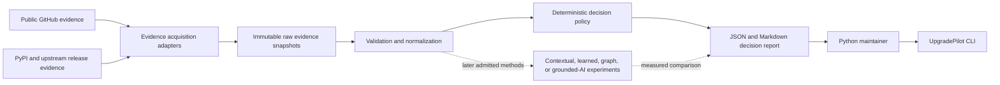

# Retained Prior AI Architecture Proposal

**Status:** Retained historical proposal — unreviewed, non-controlling, and not accepted  
**Originally recorded:** 2026-07-19  
**Origin:** AI-generated during the premature scaffold creation  
**Ownership:** Not Ali-directed, not Ali-verified, and not Ali-owned  
**Current authority:** None; canonical Career controls, the active tracker, and bounded session decisions control  
**Audit disposition:** Preserve for later teaching and evidence-based review; do not restore or implement automatically

## Interpretation rule

Everything below this section is preserved technical proposal content from the prior AI-generated scaffold. Declarative or mandatory wording such as “is,” “must,” “default,” or “remains” describes what that proposal recommended; it does **not** establish a current UpgradePilot decision.

No architecture, package structure, interface, data contract, decision policy, database, adapter, test strategy, or technology named here is accepted merely because it appears in this document. Each responsibility must be reintroduced under an authorized M2 or later session, taught to the required depth, materially directed or modified by Ali, tested against real evidence, and explicitly adopted, retained as a pilot, rejected, or deferred.

The active repository contains no accepted implementation. The removed source code, tests, package metadata, executable example, and CI must not be restored from Git history as a shortcut.

## Audit classification

| Proposal area | Current classification |
|---|---|
| Product objective and evidence-integrity concerns | Retained context consistent with the charter, but not an architecture decision |
| CLI-first modular monolith and `src/` layout | Unreviewed proposal |
| JSON and Markdown contracts | Unreviewed proposal |
| Deterministic precedence policy | Unreviewed proposal; M1 report must inform any future rule design |
| SQLite and persistence evolution | Unreviewed later-stage proposal |
| GitHub/PyPI adapters | Unreviewed later-stage proposal |
| Test strategy and CI choices | Unreviewed proposal |
| Former bootstrap integration sequence | Superseded and unauthorized |

## 1. Architectural objective

UpgradePilot turns a public Python Dependabot pull request and its surrounding evidence into a provenance-backed, uncertainty-aware next-action report.

The architecture must make the project's thesis testable:

> Does repository-specific usage context, dependency-path evidence, upstream behavioral evidence, and available CI history improve a maintainer decision over a transparent baseline using only version category, CI conclusion, directness, and release-note signals?

The system therefore optimizes first for evidence integrity, reproducibility, inspectable decisions, changed-evidence comparison, and honest uncertainty—not throughput, service count, or infrastructure novelty.

## 2. Architectural drivers

1. Every material factual claim must resolve to preserved evidence and source context.
2. Observed evidence, inference, and unavailable or conflicting evidence must remain distinct.
3. A deterministic baseline must exist before learned, graph, LLM, or agentic methods.
4. The same preserved input must be replayable through changed rules and versions.
5. Untrusted public content is data; the supported core never executes repository code.
6. Ali must be able to locate, modify, test, and explain the central path.
7. The core must remain useful if every advanced experiment is rejected.
8. Complexity enters only after a simpler implementation exposes a measured limitation.

## 3. System context



The bootstrap begins after the evidence-acquisition boundary: it accepts a bounded JSON evidence package produced manually. Live GitHub and PyPI acquisition belong to a later adapter and do not change the domain model.

## 4. Architectural style

UpgradePilot is a **modular monolith** with a CLI-first interface.

```text
interfaces (CLI)
    ↓
application (use-case orchestration)
    ↓
domain (contracts and deterministic policy)

adapters (JSON input and report files) are composed at the interface boundary.
```

Dependency direction is inward:

- `domain/` imports only the Python standard library;
- `application/` may import `domain/` but not CLI or concrete storage/network code;
- `adapters/` translate external formats to and from domain contracts;
- `cli.py` composes adapters and the application use case;
- tests may import every layer but production modules do not import tests or examples.

Do not add abstract interfaces merely to mirror a diagram. Introduce a port only when two real implementations or a meaningful test boundary require it.

## 5. Repository structure

```text
src/upgradepilot/
├── __init__.py
├── __main__.py
├── cli.py
├── application/
│   └── analyze.py
├── domain/
│   ├── models.py
│   └── policy.py
└── adapters/
    ├── json_input.py
    └── report_files.py

tests/
├── test_cli.py
├── test_json_input.py
└── test_policy.py
```

Later evidence may add bounded modules such as `acquisition/`, `persistence/`, `evaluation/`, or `experiments/`. Names are added when behavior exists, not in anticipation.

## 6. Canonical data contracts

### Case identity

- repository owner and name;
- pull-request number and URL;
- base and head revisions;
- dependency name and old/new versions;
- changed files.

### Source reference

- source locator;
- retrieval timestamp;
- revision, snapshot, or version when available.

### Evidence item

- stable evidence identifier;
- material claim or question;
- evidence state;
- decision effect;
- source reference when the state requires one;
- interpretation boundary;
- smallest suggested check when further evidence is required.

### Evidence states

`observed`, `inferred`, `missing`, `inaccessible`, `stale`, `conflicting`, `invalid`, `accepted`, and `rejected` are preserved as first-class values. They are not collapsed into truthy/falsy fields.

### Decision effects

- `neutral`;
- `targeted_check`;
- `block`;
- `defer`.

An evidence item may affect the action while still remaining limited to its declared claim.

### Action classes

- `merge_after_normal_review`;
- `run_targeted_checks`;
- `investigate_or_block`;
- `defer`;
- `abstain`.

The bootstrap policy is intentionally conservative and transparent. It is a baseline to test, not product truth.

## 7. Bootstrap decision policy

The initial precedence is:

1. a material observed or accepted `block` signal → investigate or block;
2. a material observed or accepted `defer` signal → defer;
3. material conflicting or invalid evidence → abstain;
4. material missing, inaccessible, stale, inferred-only, or `targeted_check` evidence → run targeted checks;
5. no material evidence → abstain;
6. otherwise → merge after normal review.

This policy must expose which evidence IDs caused the result. It must never describe the result as a safety determination.

## 8. Data and persistence evolution

### Bootstrap

- input: versioned JSON evidence package;
- output: canonical JSON report plus Markdown projection;
- no network and no database;
- deterministic behavior for a fixed input and explicit analysis time.

### Reliable evidence stage

- preserve raw HTTP responses and relevant headers immutably or content-addressed;
- store normalized runs, sources, evidence, claims, decisions, and versions in one SQLite database;
- store large raw payloads as files with hashes and database references;
- add schema migrations, replay, duplicate handling, and central traceability queries.

SQLite is the default because it supplies real relational and SQL behavior with minimal operating cost. PostgreSQL requires evidence that concurrency, deployment, or query behavior exceeds SQLite's boundary.

## 9. External-source boundaries

### GitHub

Use read-only public REST endpoints for pull-request identity, changed files, commits, repository content at explicit revisions, and check metadata. Capture API version, response status, retrieval time, pagination, rate-limit context, and raw response identity.

### PyPI and upstream releases

Use PyPI's public JSON interfaces for package and release metadata. Preserve cache validators such as ETag when supplied, identify the requested package/version, and do not treat metadata completeness as guaranteed.

### Untrusted repositories

Static public files may be acquired as evidence. Repository code, hooks, workflows, build scripts, and changed dependencies are not executed by the supported core.

## 10. Report contract

JSON is the canonical machine-readable report. Markdown is a deterministic projection for the maintainer.

Each report includes:

- schema and policy version;
- case and revision identity;
- analysis timestamp;
- selected action;
- triggering evidence IDs;
- supporting evidence and uncertainty;
- targeted checks;
- limitations and claim boundary.

Repeated reports remain comparable because schema, policy, input revisions, and evidence identities are explicit.

## 11. Security and reliability

- Optional GitHub credentials come only from environment/configuration boundaries and are never serialized into evidence.
- Logs and errors must not contain authorization headers or private responses.
- Network adapters use bounded timeouts, a declared user agent, pagination limits, conditional requests where supported, and explicit partial failure.
- File writes use temporary files and atomic replacement.
- Live-network tests are separate from deterministic unit and replay tests.
- CI and local tests never execute analyzed repository content.
- Every external write action is out of scope for the core.

## 12. Test strategy

1. **Domain unit tests:** every decision branch, precedence collision, and changed-evidence variant.
2. **Contract tests:** valid and malformed JSON, duplicate IDs, missing provenance, unknown enum values, and schema versions.
3. **Application tests:** stable report content with an injected clock.
4. **CLI tests:** exit codes, atomic outputs, and human-readable errors.
5. **Replay/integration tests later:** preserved GitHub/PyPI snapshots without live network.
6. **Live-source probes later:** explicitly marked, bounded, and never required for ordinary unit tests.

## 13. Evolution rules

- CLI remains the supported interface until a real user or deployment need justifies an API.
- SQLite remains the only database until measured evidence justifies replacement.
- A microservice experiment extracts one real responsibility and compares it with this monolith; it does not redefine the core.
- A queue pilot wraps a proven idempotent job and measures retry, duplication, backpressure, and operating burden.
- Kubernetes and multi-cloud packages deploy a representative workload after a containerized baseline exists.
- Learned, graph, LLM, and multi-agent methods consume the same evidence contracts and compare with the deterministic report.
- Experimental dependencies remain outside the core until an adopt decision is recorded.

## 14. Superseded bootstrap integration proposal

The prior version of this document instructed the project to map the completed UP-S01 report into `examples/pydantic-13432.bootstrap.json`, run a generated CLI, and compare its output with the manual decision.

That sequence is **superseded and unauthorized** because the JSON contract, CLI, policy, tests, package structure, and executable example were generated before Ali learned, directed, reviewed, or owned those responsibilities. The active scaffold was removed.

M2 may use the same Pydantic case, but the first automated responsibility must be rederived through the active learning contract. Nothing in this document authorizes restoring the old JSON example, CLI, or policy.

## 15. Primary technical references

- [Python Packaging User Guide: `src` layout versus flat layout](https://packaging.python.org/en/latest/discussions/src-layout-vs-flat-layout/)
- [Python Packaging User Guide: creating command-line tools](https://packaging.python.org/en/latest/guides/creating-command-line-tools/)
- [GitHub REST API: pull-request endpoints](https://docs.github.com/en/rest/pulls/pulls)
- [PyPI JSON API](https://docs.pypi.org/api/json/)
- [Python `sqlite3` documentation](https://docs.python.org/3/library/sqlite3.html)
- [GitHub Actions: building and testing Python](https://docs.github.com/en/actions/how-tos/use-cases-and-examples/building-and-testing/building-and-testing-python)
