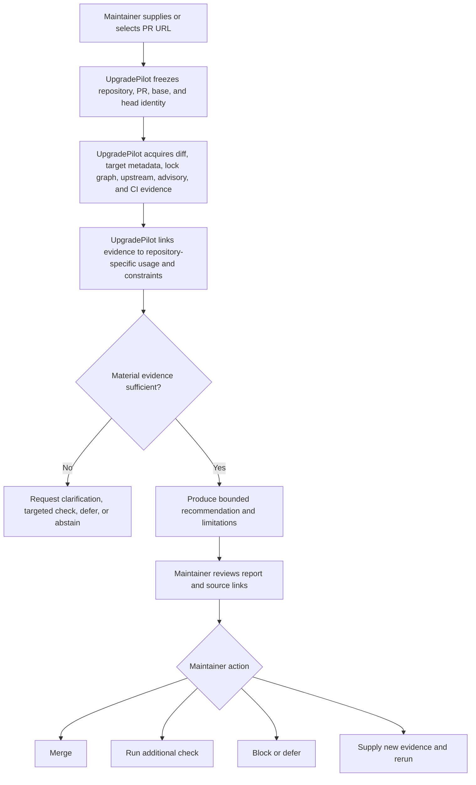
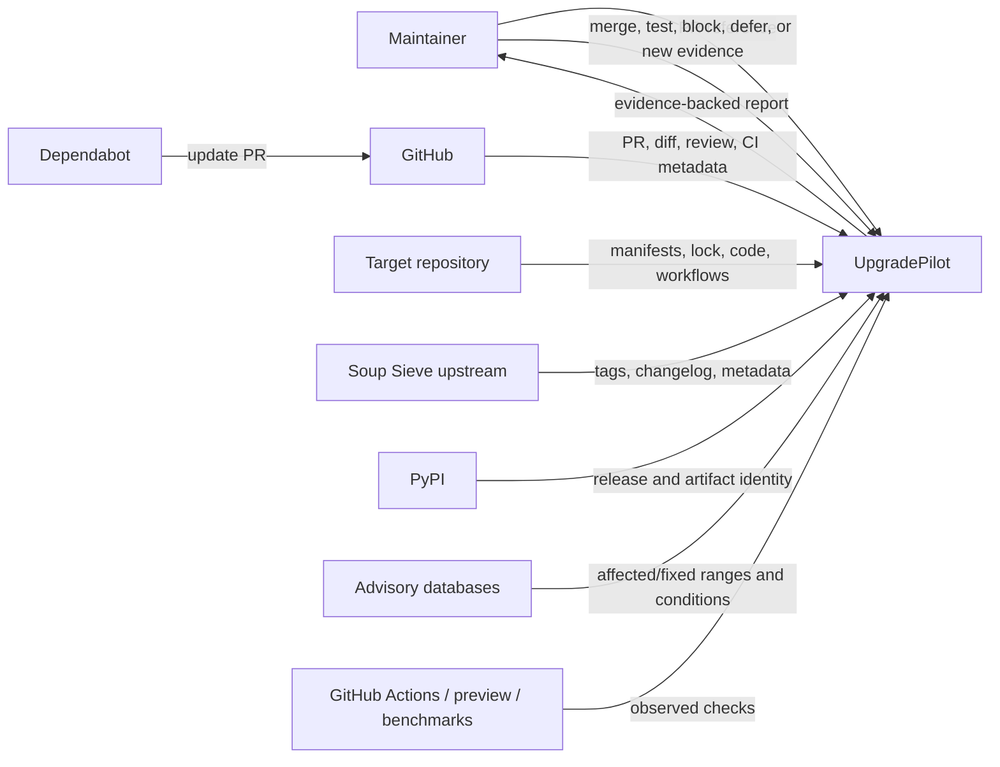
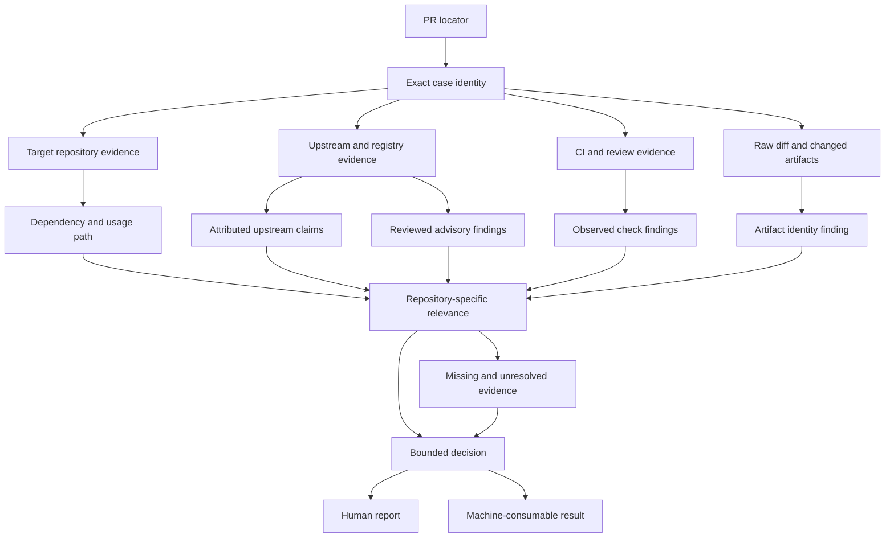

# Scenario S001 — Pydantic Soup Sieve 2.6 → 2.8.4

**Status:** Complete manual end-to-end runtime simulation  
**Repository:** `pydantic/pydantic`  
**Pull request:** [`pydantic/pydantic#13432`](https://github.com/pydantic/pydantic/pull/13432)  
**Dependency transition:** `soupsieve` `2.6` → `2.8.4`  
**Change producer:** `dependabot[bot]`  
**Base revision:** `652a61ce4f9d7d76eaada31535807a485ece0e21`  
**Head revision:** `aa2dc024d33f61cdef50bf1973ab5adf0a974f5a`  
**Merge revision:** `ce12fb88380b7038ab8e20d121c7e8b4064de547`  
**Historical decision boundary:** the proposed head before merge on 2026-07-15  
**Investigation date:** 2026-07-22  
**Investigators:** Ali and AI assistant  
**Execution mode:** retrospective manual simulation using lawful public evidence; no target-repository mutation and no local execution of target code

> This case record follows the scenario template but adapts it where the evidence requires. It describes a manual product investigation, not implemented UpgradePilot behavior, a frozen schema, or proof that the update was safe.

## Executive result

The most justified pre-merge recommendation was:

> **Merge after normal maintainer review.**

This was not based on the version number or passing CI alone. The combined evidence showed:

- the PR changed only the resolved Soup Sieve artifact in `uv.lock`;
- Soup Sieve was a transitive documentation-tooling dependency, not a Pydantic runtime dependency;
- the target repository required Python `>=3.10`, while Soup Sieve 2.8.4 required Python `>=3.9`;
- two high-severity denial-of-service advisories published before the PR identified 2.8.4 as the fixed version;
- the target code inspected did not directly call the vulnerable CSS selector APIs;
- the PR's required CI completed successfully, including the documentation build;
- the documentation build's resolved dependency path did include Beautiful Soup and Soup Sieve;
- upstream release, package metadata, artifact identity, target-repository context, and CI evidence agreed materially.

The report still preserves limitations: the precise Dependabot trigger mode was not exposed, repository search cannot prove absence of every indirect selector call, the secret-bearing post-merge documentation upload path was not replayed, and this investigation did not execute untrusted target code locally.

## 1. Why this case was selected

This was selected as the first foundational case because it is small enough to trace completely but not trivial:

- it is a real public Python Dependabot PR;
- it is a lockfile-only update;
- the updated package is transitive rather than directly declared for Pydantic runtime;
- the update crosses multiple upstream releases;
- upstream changes include interpreter support, behavior changes, ordinary fixes, and security-relevant fixes;
- target-repository relevance is not visible from the PR title;
- CI passed, but the meaning of that passing result required workflow and dependency-path analysis;
- the PR was already merged, allowing a stable historical revision boundary.

The case tests whether the product can move beyond:

```text
version changed + CI green
→ merge
```

and instead construct:

```text
exact change
+ dependency path
+ target usage
+ upstream meaning
+ security evidence
+ compatibility
+ CI coverage
+ explicit limitations
→ bounded maintainer recommendation
```

The case would no longer have been worth continuing once additional public evidence stopped changing the dependency classification, security relevance, CI interpretation, or recommendation.

## 2. Initial real-world event

On 2026-07-10, `dependabot[bot]` opened PR #13432 in `pydantic/pydantic` proposing to update Soup Sieve from 2.6 to 2.8.4.

A maintainer initially saw:

- a dependency-update title;
- release notes copied from the upstream project;
- a commit list;
- a compatibility-score badge;
- a six-line lockfile diff;
- automated CI, coverage, performance, and documentation-preview results;
- repository labels identifying a Python/uv dependency update.

The pull request did not directly explain:

- why Soup Sieve existed in Pydantic;
- whether it was direct or transitive;
- whether it affected Pydantic users or only project tooling;
- whether the Python 3.8 support removal mattered;
- whether the 2.8.4 fixes corresponded to public security advisories;
- whether the passing jobs exercised the relevant dependency path.

Those became UpgradePilot investigation questions rather than assumptions.

## 3. Intended invocation

For this scenario, the smallest credible invocation is one stable public change reference:

| Item | Value | Supplied by | Why supplied | Status | Missing or wrong consequence |
|---|---|---|---|---|---|
| Public PR reference | `https://github.com/pydantic/pydantic/pull/13432` | Maintainer or caller | Locates the proposed update and provides a discovery root | Required for this invocation mode | The system cannot identify which update to investigate |
| Observation time | 2026-07-22 | UpgradePilot runtime | Separates current observations from the historical decision boundary | Generated | Later source changes could be mistaken for pre-merge evidence |
| Requested task | dependency-update decision support | Maintainer or product workflow | Determines the output responsibility | Implicit in this product mode | The system might produce an unrelated summary instead of a decision report |

The following were **discovered**, not required from the caller:

- repository identity;
- PR number;
- base and head SHAs;
- dependency name and versions;
- update producer;
- changed files;
- upstream source;
- security advisories;
- target dependency path;
- CI runs and review state.

### Invocation lesson

A PR URL may be sufficient as an invocation locator when public acquisition is available. Exact base/head identities remain mandatory for a reproducible result, but they can be discovered and then frozen rather than always supplied by the user.

This is a product-model finding, not a final API contract.

## 4. Case identity and reproducibility boundary

### Authoritative identity

| Element | Value | Authority |
|---|---|---|
| Repository | `pydantic/pydantic` | GitHub PR metadata |
| PR | `#13432` | GitHub |
| Base branch | `main` | GitHub PR metadata |
| Base SHA | `652a61ce4f9d7d76eaada31535807a485ece0e21` | GitHub PR metadata |
| Head branch | `dependabot/uv/soupsieve-2.8.4` | GitHub PR metadata |
| Head SHA | `aa2dc024d33f61cdef50bf1973ab5adf0a974f5a` | GitHub PR metadata |
| Merge SHA | `ce12fb88380b7038ab8e20d121c7e8b4064de547` | GitHub PR metadata |
| Dependency | `soupsieve` | PR body and lockfile diff |
| Old version | `2.6` | base `uv.lock` and diff |
| New version | `2.8.4` | head diff and upstream/PyPI evidence |
| PR creator | `dependabot[bot]` | GitHub PR metadata |
| PR created | 2026-07-10T22:24:03Z | GitHub issue metadata |
| PR merged | 2026-07-15T13:32:06Z | GitHub issue metadata |

### Historical versus later evidence

The decision is reconstructed at the pre-merge head. Evidence observed on 2026-07-22 is used only when its publication or repository identity shows that it existed at or before the decision boundary.

The security advisories were published on 2026-07-09, before the PR was opened. They are therefore admissible as pre-merge public evidence even though this simulation discovered them later.

The current state of Pydantic or Soup Sieve after the fixed revisions is not treated as proof of what the PR head contained.

### Reproduction needs

Another investigator needs:

1. the PR URL;
2. the exact base and head SHAs;
3. the target files at the base SHA;
4. the PR diff and workflow results for the head SHA;
5. upstream tag/release evidence for 2.6 and 2.8.4;
6. advisory publication and affected-range records;
7. the investigation date.

The secret-bearing post-merge documentation upload cannot be fully reproduced from public evidence alone.

## 5. Actors and systems

| Actor or system | Role | Data produced or consumed | Authority and limits | Interaction with UpgradePilot |
|---|---|---|---|---|
| Pydantic maintainer | Decision maker | Reviews evidence and chooses whether to merge | Final human authority; review does not prove technical correctness | Receives report and acts |
| Dependabot | Change producer | PR metadata, release-note copy, commit list, lockfile update | Useful proposal source; not a source of truth for safety or target relevance | Creates investigation trigger |
| GitHub | Change/evidence platform | PR identity, diff, review, comments, workflow metadata | Authoritative for hosted revision and PR state; not proof of package semantics | Primary acquisition surface |
| Target repository | Repository-context source | `pyproject.toml`, `uv.lock`, workflows, docs plugin, configuration | Authoritative for the examined revisions; static files do not prove runtime behavior | Supplies target context |
| PyPI | Package registry | artifact metadata, hashes, release time, Python requirement, attestations | Strong package-distribution identity; does not prove behavior or absence of malware | Corroborates resolved artifact |
| Soup Sieve upstream repository | Upstream source | changelog, tags, package metadata, source history | Authoritative for upstream claims and tagged files; claims still require relevance analysis | Supplies upstream evidence |
| GitHub Advisory Database / OSV | Security evidence source | advisory publication time, severity, affected/fixed range, attack conditions | Strong reviewed vulnerability evidence; target exploitability still needs repository context | Adds security findings |
| GitHub Actions | CI executor | job status and workflow outputs for the head | Demonstrates configured jobs at a revision; only covers what workflows execute | Supplies observed checks |
| Cloudflare Pages bot | Preview reporter | docs-preview deployment status | Demonstrates preview deployment result; not general product correctness | Adds user-visible build evidence |
| CodSpeed | Performance reporter | benchmark comparison | Covers configured Pydantic benchmarks; not Soup Sieve security or all performance paths | Adds bounded performance evidence |
| AI assistant | Manual investigator/documenter | Search, synthesis, and this record | Derived interpretation; can be wrong and has no maintainer authority | Performs simulated UpgradePilot work |
| Ali | Product owner and learner | Direction, challenge, review, future acceptance | Controls UpgradePilot project decisions, not the target PR | Reviews simulation and model changes |

## 6. Initial maintainer-decision questions

| Question | Why it matters | Evidence needed | Consequence if unresolved |
|---|---|---|---|
| What exactly changed? | Bounds the investigation and detects unexpected source changes | PR diff, base/head identities | Abstain or investigate |
| Why is Soup Sieve in Pydantic? | Determines runtime versus tooling impact | manifest, lock graph, source usage | Cannot calibrate relevance |
| Is it direct or transitive? | Changes ownership and likely effect paths | dependency groups and lock graph | Report remains degraded |
| Which upstream changes occurred from 2.6 to 2.8.4? | Identifies compatibility, behavior, and security implications | changelog, tags, advisories | Version-only reasoning would be inadequate |
| Does Python 3.8 removal matter? | Could make the update un-installable in supported environments | target Python policy, CI matrix, upstream metadata | Investigate/block if incompatible |
| Are known vulnerabilities fixed? | May materially increase urgency and benefit | reviewed advisories and fixed range | Security rationale unresolved |
| Is the target exposed to the vulnerable APIs? | Distinguishes package vulnerability from target exploitability | code/config usage and data origin | Avoid claiming exploitability |
| Did CI exercise the changed dependency path? | “CI passed” is useful only if coverage is relevant | workflow definitions, lock graph, job results | May require targeted checks |
| Are package artifacts the intended official release? | Detects identity mismatch in lock resolution | PyPI metadata and hashes | Investigate/block |
| What action is justified? | Converts evidence into bounded decision support | all material findings and limitations | Abstain |

## 7. Evidence discovery map

| Potential source | Question | Expected authority | Acquired? | Reason |
|---|---|---|---|---|
| GitHub PR metadata/body | trigger, identity, proposed version, copied notes | High for PR state; medium for upstream meaning | Yes | Primary root |
| PR diff | exact changed files and artifacts | High for proposed change | Yes | Defines change scope |
| Target `pyproject.toml` | supported Python and dependency groups | High at base revision | Yes | Compatibility and relationship |
| Target `uv.lock` | resolved dependency path and artifact identity | High at base/head revisions | Yes | Transitive-path evidence |
| Target source/config | actual usage path | High for static references | Yes | Repository relevance |
| Target workflows | what CI and publish paths execute | High for configured behavior | Yes | Interpret CI |
| Workflow runs/comments/review | observed results | High for reported run state | Yes | Behavioral evidence |
| Upstream changelog | upstream change claims | High as attributed upstream claim | Yes | Semantic evidence |
| Upstream tagged metadata | Python support and package identity | High at tags | Yes | Corroborate support change |
| PyPI | distributed artifact identity | High for registry metadata | Yes | Corroborate lock artifacts |
| Security advisories | vulnerability and fixed version | High when reviewed | Yes | Security decision input |
| Target Dependabot config | update-generation configuration | High at revision | Yes | Trigger-mode analysis |
| Upstream full source diff | implementation-level change audit | High but costly | No | Not required after current evidence converged |
| Local execution | independent behavior check | Potentially strong but environment-dependent | No | Existing public CI was sufficient; avoids unnecessary untrusted-code execution |
| Private deployment/log data | real production exposure | Potentially decisive | Inaccessible/outside boundary | Public project cannot rely on it |

## 8. Evidence inventory

### E01 — Pull-request record

- **Source:** [`pydantic/pydantic#13432`](https://github.com/pydantic/pydantic/pull/13432)
- **Observation:** Dependabot proposed Soup Sieve 2.6 → 2.8.4; PR opened 2026-07-10 and merged 2026-07-15.
- **Purpose:** trigger, case identity, release-note copy, review and outcome.
- **Authority:** authoritative for GitHub PR state.
- **Cannot establish:** upstream truth, target relevance, safety, or exploitability.
- **State:** accepted.

### E02 — Exact PR diff

- **Source:** [`uv.lock` at base](https://github.com/pydantic/pydantic/blob/652a61ce4f9d7d76eaada31535807a485ece0e21/uv.lock) and the PR diff.
- **Observation:** only the Soup Sieve version, source-distribution record, wheel record, hashes, sizes, and upload times changed.
- **Purpose:** bound the proposed mutation.
- **Authority:** authoritative for the GitHub change.
- **Cannot establish:** whether the new artifact behaves correctly.
- **State:** accepted.

### E03 — Target project metadata

- **Source:** [`pyproject.toml` at base](https://github.com/pydantic/pydantic/blob/652a61ce4f9d7d76eaada31535807a485ece0e21/pyproject.toml)
- **Observations:**
  - Pydantic requires Python `>=3.10`;
  - published runtime dependencies do not include Beautiful Soup or Soup Sieve;
  - `beautifulsoup4>=4.13.3` is explicitly listed under `docs-upload`;
  - `mkdocs-llmstxt` is listed under `docs`.
- **Purpose:** target support and dependency ownership.
- **Authority:** authoritative at the base revision.
- **State:** accepted.

### E04 — Resolved dependency graph

- **Source:** [`uv.lock` at base](https://github.com/pydantic/pydantic/blob/652a61ce4f9d7d76eaada31535807a485ece0e21/uv.lock)
- **Observations:**
  - Beautiful Soup 4.14.2 depends on Soup Sieve;
  - `mkdocs-llmstxt` depends on Beautiful Soup and `markdownify`;
  - `markdownify` also depends on Beautiful Soup.
- **Purpose:** prove that the `docs` group, not only `docs-upload`, resolves the changed package.
- **Authority:** authoritative for the locked resolution.
- **Cannot establish:** which runtime functions are exercised.
- **State:** accepted.

### E05 — Target usage code

- **Source:** [`docs/plugins/algolia.py` at base](https://github.com/pydantic/pydantic/blob/652a61ce4f9d7d76eaada31535807a485ece0e21/docs/plugins/algolia.py)
- **Observations:**
  - imports `Tag` and `BeautifulSoup` from `bs4`;
  - parses generated documentation HTML;
  - uses `find`, `find_all`, `find_next_sibling`, and DOM transformations;
  - no direct `.select()`, `.select_one()`, or `soupsieve.compile()` call was found in the inspected plugin.
- **Purpose:** determine target relevance and advisory attack-surface intersection.
- **Authority:** strong static evidence for this file.
- **Cannot establish:** absence of every indirect selector call in all transitive dependencies or runtime paths.
- **State:** accepted with limitation.

### E06 — Documentation hook configuration

- **Source:** [`mkdocs.yml` at base](https://github.com/pydantic/pydantic/blob/652a61ce4f9d7d76eaada31535807a485ece0e21/mkdocs.yml)
- **Observation:** `docs/plugins/algolia.py` is configured as an MkDocs hook.
- **Purpose:** connect the code to the docs build.
- **Authority:** authoritative configuration at base.
- **State:** accepted.

### E07 — PR CI definition

- **Source:** [`.github/workflows/ci.yml` at base](https://github.com/pydantic/pydantic/blob/652a61ce4f9d7d76eaada31535807a485ece0e21/.github/workflows/ci.yml)
- **Observations:**
  - runs for pull requests;
  - `docs-build` installs the `docs` group and runs `mkdocs build`;
  - the aggregate protected `check` depends on `docs-build` and central tests;
  - tests and lint cover supported Python versions beginning at 3.10.
- **Purpose:** interpret what a successful CI result demonstrates.
- **Authority:** authoritative workflow definition.
- **State:** accepted.

### E08 — Documentation publish workflow

- **Source:** [`.github/workflows/docs-update.yml` at base](https://github.com/pydantic/pydantic/blob/652a61ce4f9d7d76eaada31535807a485ece0e21/.github/workflows/docs-update.yml)
- **Observations:**
  - runs on pushes to `main`, `docs-update`, and tags;
  - installs both `docs` and `docs-upload`;
  - builds/deploys docs and uploads Algolia records.
- **Purpose:** identify the owning operational path beyond PR CI.
- **Authority:** authoritative configuration.
- **Limitation:** the exact post-merge secret-bearing run was not retrieved through the available connector.
- **State:** accepted configuration; execution result unavailable.

### E09 — PR workflow and review evidence

- **Sources:** PR checks, workflow run metadata, PR comments, and review.
- **Observations:**
  - main CI completed successfully at the head SHA;
  - CodSpeed completed successfully and reported no altered configured benchmarks;
  - third-party tests were skipped;
  - Cloudflare Pages reported a successful docs preview;
  - coverage reported no coverable code change;
  - one maintainer approved before merge.
- **Purpose:** observed behavior and human review.
- **Authority:** strong for the reported run/review state.
- **Cannot establish:** universal correctness, exploitability, or safe production operation.
- **State:** accepted.

### E10 — Upstream changelog

- **Source:** [Soup Sieve 2.8.4 changelog](https://github.com/facelessuser/soupsieve/blob/2.8.4/docs/src/markdown/about/changelog.md)
- **Observations:** between 2.6 and 2.8.4 the upstream project reports:
  - Python 3.8 support dropped;
  - Python 3.14 support added;
  - new recognized pseudo-selectors;
  - several correctness fixes;
  - inefficient attribute-pattern fixes;
  - a limit on total selectors processed;
  - a potential pretty-print infinite-loop fix.
- **Purpose:** identify upstream claims.
- **Authority:** attributed upstream claim.
- **Cannot establish:** target relevance by itself.
- **State:** accepted observation.

### E11 — Tagged upstream package metadata

- **Sources:**
  - [2.6 `pyproject.toml`](https://github.com/facelessuser/soupsieve/blob/2.6/pyproject.toml)
  - [2.8.4 `pyproject.toml`](https://github.com/facelessuser/soupsieve/blob/2.8.4/pyproject.toml)
- **Observation:** minimum Python changed from `>=3.8` to `>=3.9`; 2.8.4's test matrix includes Python 3.9–3.14.
- **Purpose:** corroborate the release-note support claim.
- **Authority:** tagged repository metadata.
- **State:** accepted and corroborating.

### E12 — PyPI distribution evidence

- **Source:** [Soup Sieve 2.8.4 on PyPI](https://pypi.org/project/soupsieve/2.8.4/)
- **Observations:**
  - release published 2026-05-24;
  - requires Python `>=3.9`;
  - provides a universal `py3-none-any` wheel and source distribution;
  - published artifacts and hashes correspond to the lockfile records;
  - PyPI displays publish attestation information.
- **Purpose:** corroborate distributed package identity.
- **Authority:** registry metadata and artifact identity.
- **Cannot establish:** absence of malicious or incorrect behavior.
- **State:** accepted.

### E13 — Reviewed security advisories

- **Sources:**
  - [`GHSA-836r-79rf-4m37`](https://github.com/facelessuser/soupsieve/security/advisories/GHSA-836r-79rf-4m37)
  - [`GHSA-2wc2-fm75-p42x`](https://github.com/facelessuser/soupsieve/security/advisories/GHSA-2wc2-fm75-p42x)
- **Observations:**
  - both were published 2026-07-09;
  - both are high-severity denial-of-service issues;
  - one concerns regular-expression catastrophic backtracking;
  - one concerns memory exhaustion from very large selector lists;
  - both affect versions through 2.8.3 and identify 2.8.4 as fixed;
  - the attack condition requires untrusted CSS selectors reaching Soup Sieve compilation or Beautiful Soup `.select()` / `.select_one()`.
- **Purpose:** security urgency, affected range, and exposure preconditions.
- **Authority:** reviewed advisory evidence.
- **State:** accepted.

### E14 — Dependabot configuration

- **Source:** [`.github/dependabot.yml` at base](https://github.com/pydantic/pydantic/blob/652a61ce4f9d7d76eaada31535807a485ece0e21/.github/dependabot.yml)
- **Observation:** configured periodic updates cover GitHub Actions and Cargo, not uv/Python.
- **Purpose:** reason about why a uv PR appeared.
- **Interpretation:** together with advisory timing and the fixed version, this strongly suggests a security-update trigger.
- **Authority limit:** it does not directly label this PR as a security update; repository/global settings unavailable publicly may also matter.
- **State:** accepted observation; trigger classification remains an inference.

### E15 — Actual merge

- **Source:** PR state and merge SHA.
- **Observation:** a maintainer approved and merged the PR.
- **Purpose:** historical outcome and later evaluation input.
- **Authority limit:** actual merge is not used as proof that the recommendation was correct.
- **State:** accepted but excluded from pre-merge decision justification.

## 9. Full manual investigation log

### Step 1 — Freeze the change

- **Question:** What exact update is under review?
- **Evidence:** E01, E02.
- **Observation:** one `uv.lock` package record changed from Soup Sieve 2.6 to 2.8.4, including artifact URLs and hashes.
- **Reasoning:** no target source, manifest, workflow, or configuration file changed.
- **Conclusion:** the proposed mutation is a lockfile-only resolved dependency update.
- **Downstream effect:** investigation can focus on artifact identity, dependency path, upstream changes, target compatibility, and CI.
- **Candidate automation:** GitHub PR acquisition, diff classification, lockfile parsing.
- **Limit:** a small diff does not imply a small behavioral effect.

### Step 2 — Classify the dependency relationship

- **Question:** Is Soup Sieve a Pydantic runtime dependency?
- **Evidence:** E03, E04.
- **Observation:** Pydantic's published dependencies exclude Soup Sieve and Beautiful Soup. Beautiful Soup depends on Soup Sieve. The target docs groups resolve Beautiful Soup through explicit `docs-upload` declaration and through `mkdocs-llmstxt`.
- **Reasoning:** Soup Sieve belongs to documentation tooling and is transitive from the target project's perspective.
- **Conclusion:** no direct Pydantic package-runtime dependency was changed.
- **Downstream effect:** user-runtime risk is lower than a direct runtime update, but documentation tooling still matters.
- **Candidate automation:** PEP 621 group parsing plus lock-graph traversal.
- **Limit:** dependency groups alone were initially misleading; the resolved graph was necessary.

### Step 3 — Identify actual target usage

- **Question:** Where does the dependency matter?
- **Evidence:** E05, E06.
- **Observation:** the Algolia docs plugin imports and uses Beautiful Soup to parse and transform generated HTML. The plugin is an MkDocs hook.
- **Reasoning:** Soup Sieve is available through Beautiful Soup, but the inspected target code uses tree-search APIs rather than CSS selector APIs.
- **Conclusion:** the package is relevant to documentation generation/indexing, while direct use of the vulnerable selector entry points was not found.
- **Downstream effect:** retain the security benefit but do not claim confirmed target exploitability.
- **Candidate automation:** repository search, import graph, call-site analysis, configuration-to-code linkage.
- **Limit:** static search can miss dynamic and transitive calls.

### Step 4 — Interpret upstream changes

- **Question:** What changed semantically between 2.6 and 2.8.4?
- **Evidence:** E10, E11.
- **Observation:** interpreter floor changed, selectors and support expanded, and multiple bug/security-relevant fixes landed.
- **Reasoning:** not every release-note item matters equally to this target. Python support and selector-parser fixes are material candidates; browser-state selector additions appear low relevance.
- **Conclusion:** upstream information must be decomposed into claims and tested against target context.
- **Downstream effect:** Python compatibility and security evidence become explicit branches.
- **Candidate automation:** version-range changelog retrieval, claim extraction, cross-source comparison.
- **Limit:** release-note text remains attributed upstream evidence, not target impact.

### Step 5 — Check interpreter compatibility

- **Question:** Does dropping Python 3.8 break a supported target environment?
- **Evidence:** E03, E07, E11, E12.
- **Observation:** target requires Python `>=3.10`; CI starts at 3.10; Soup Sieve 2.8.4 requires `>=3.9`.
- **Reasoning:** every supported target interpreter satisfies the new dependency floor.
- **Conclusion:** Python 3.8 removal is real but irrelevant to the supported target boundary.
- **Downstream effect:** no compatibility block.
- **Candidate automation:** constraint intersection.
- **Limit:** undocumented environments outside the declared support policy are not protected by this conclusion.

### Step 6 — Investigate security relevance

- **Question:** Is this update related to known vulnerabilities, and is the target exposed?
- **Evidence:** E10, E13, E14.
- **Observation:** two reviewed high-severity advisories were published one day before the PR, affect 2.6, and are fixed by 2.8.4. The target's periodic Dependabot config does not include uv. The vulnerable APIs require attacker-controlled CSS selector strings.
- **Reasoning:** advisory timing, fixed version, and absent periodic uv configuration strongly indicate a security-update motivation. However, the target plugin does not directly accept selector strings or call the named APIs.
- **Conclusion:** the update removes a known vulnerable transitive version; confirmed target exploitability is not established and appears limited by inspected usage.
- **Downstream effect:** updating is positively justified, but the report must distinguish vulnerable-package presence from exploitable target behavior.
- **Candidate automation:** advisory matching, affected/fixed range evaluation, call-site and data-flow analysis.
- **Limit:** exact Dependabot trigger and production data flows are not public.

### Step 7 — Verify package and artifact identity

- **Question:** Does the lockfile point to the official fixed release?
- **Evidence:** E02, E11, E12.
- **Observation:** version, Python requirement, release date, artifact names, and hashes align with PyPI/upstream evidence.
- **Reasoning:** the proposed artifact is consistent with the official 2.8.4 release.
- **Conclusion:** no identity mismatch was found.
- **Downstream effect:** artifact mismatch does not block the recommendation.
- **Candidate automation:** registry metadata acquisition and exact hash comparison.
- **Limit:** matching official artifacts does not prove the artifact is benign.

### Step 8 — Interpret CI coverage

- **Question:** Did the PR checks exercise the changed dependency path?
- **Evidence:** E04, E06, E07, E09.
- **Observation:** PR CI's `docs-build` installs the `docs` group; `mkdocs-llmstxt` in that group resolves Beautiful Soup and Soup Sieve; MkDocs loads the Algolia hook; the aggregate CI completed successfully.
- **Reasoning:** the changed version was installed in the docs job and the documentation build completed. This gives relevant install/import/build evidence, not merely unrelated green tests.
- **Conclusion:** PR CI materially covers the owning documentation path.
- **Downstream effect:** no additional targeted pre-merge compatibility check is necessary for this case.
- **Candidate automation:** workflow parsing, dependency-group-to-job mapping, result correlation.
- **Limit:** CI success does not exercise malicious selector payloads or the secret-bearing upload operation.

### Step 9 — Inspect the operational path beyond PR CI

- **Question:** Is there a separate workflow whose risk is hidden by PR CI?
- **Evidence:** E08.
- **Observation:** the publish workflow installs `docs` and `docs-upload`, builds/deploys docs, and uploads Algolia records after pushes/tags.
- **Reasoning:** PR CI covers docs generation with the changed dependency; the final external upload uses secrets and cannot run on ordinary PRs.
- **Conclusion:** absence of a PR-time production upload is expected and not a reason to execute external mutation during review.
- **Downstream effect:** report the limitation; do not demand a credentialed preview merely for ceremony.
- **Candidate automation:** workflow-stage comparison and side-effect classification.
- **Limit:** no public post-merge run was retrieved to verify the exact upload.

### Step 10 — Construct the bounded decision

- **Question:** Which maintainer action is proportionate to the evidence?
- **Evidence:** E01–E14.
- **Observation:** security benefit, compatible interpreter constraints, official artifact identity, tooling-only transitive scope, relevant green CI, and no material contradiction.
- **Reasoning:** targeted checks would duplicate already relevant PR CI; blocking or deferring would retain a known vulnerable version without a target-specific reason; abstention would ignore sufficient evidence.
- **Conclusion:** merge after normal review.
- **Downstream effect:** produce report with explicit limits and no safety claim.
- **Candidate automation:** deterministic policy over validated findings.
- **Limit:** outcome vocabulary and policy remain conceptual in this simulation.

## 10. Observation → interpretation → finding lineage

| Chain | Source observation | Interpretation | Finding state | Corroboration or contradiction | Permitted decision effect |
|---|---|---|---|---|---|
| C01 | PR changes only Soup Sieve's lock entry | Proposed mutation is narrow | Corroborated | PR diff and base lock | Reduces required investigation breadth, not risk to zero |
| C02 | Beautiful Soup depends on Soup Sieve | Soup Sieve is transitive | Corroborated | target pyproject and lock graph | Classify as tooling-transitive |
| C03 | `mkdocs-llmstxt` depends on Beautiful Soup | `docs` CI resolves Soup Sieve | Corroborated | lock graph plus workflow | Makes docs-build result relevant |
| C04 | target uses Beautiful Soup in Algolia hook | package matters to docs pipeline | Corroborated | hook configuration | Include docs-specific relevance |
| C05 | upstream says Python 3.8 dropped | new package floor may rise | Corroborated | tagged metadata and PyPI show `>=3.9` | Compare with target support |
| C06 | target requires Python `>=3.10` | new floor is compatible | Corroborated | target metadata and CI matrix | No interpreter block |
| C07 | advisories affect `<=2.8.3`, fixed 2.8.4 | old lock is vulnerable; proposed version remediates | Corroborated | two reviewed advisories | Positive update rationale |
| C08 | advisories require untrusted selector input to selector APIs | package vulnerability may not be exploitable in target | Partially resolved | no direct target call found | Prevent exploitability claim |
| C09 | CI and docs preview succeeded at head | proposed version installs and docs build completes | Corroborated | workflow definitions and run state | Supports normal review |
| C10 | uv periodic updates absent from target config | PR may be security-triggered | Strong inference, unresolved | timing and fixed version support it | Context only; not required for decision |
| C11 | maintainer approved and merged | project accepted the update | Historical observation | GitHub state | Evaluation context only, not decision proof |

## 11. Repository-specific relevance

### Relationship

```text
Pydantic repository
└── docs dependency group
    └── mkdocs-llmstxt
        └── beautifulsoup4
            └── soupsieve
```

A second declaration exists:

```text
Pydantic repository
└── docs-upload dependency group
    └── beautifulsoup4
        └── soupsieve
```

Therefore Soup Sieve is:

- transitive;
- documentation/tooling scoped;
- resolved in PR docs CI through `mkdocs-llmstxt`;
- also explicitly reachable from the publication group;
- not a published Pydantic runtime dependency.

### Usage

The target Algolia plugin parses generated documentation HTML with Beautiful Soup. It does not directly call the advisory-named selector APIs in the inspected code.

This supports:

> The package is operationally relevant to docs generation, but target exposure to attacker-controlled CSS selector compilation is not demonstrated.

It does not support:

> Pydantic is definitely unaffected.

### Compatibility

- Pydantic supported floor: Python 3.10.
- Soup Sieve 2.6 floor: Python 3.8.
- Soup Sieve 2.8.4 floor: Python 3.9.
- Result: compatible within the declared target support boundary.

### Security

The old resolved version was in both advisory affected ranges. The new version is the fixed release. The target appears not to expose the named input path, but removing the vulnerable version is still a concrete benefit and lowers latent/tooling risk.

## 12. Checks, comparisons, and observed behavior

| Check or comparison | Revision/input | Result | Demonstrates | Does not demonstrate |
|---|---|---|---|---|
| PR diff classification | base → head | one lockfile package record | Exact mutation scope | Behavioral safety |
| Lock graph traversal | base lock | Soup Sieve reached through docs tooling | Real dependency ownership/path | Runtime call path |
| Python constraint intersection | target `>=3.10`, new `>=3.9` | compatible | Declared interpreter compatibility | Undocumented environment compatibility |
| Artifact hash comparison | head lock vs PyPI 2.8.4 | aligned | Official distribution identity | Benign behavior |
| Upstream claim comparison | changelog vs tag/PyPI | Python floor corroborated | Claim consistency | Target relevance |
| Advisory range evaluation | 2.6 → 2.8.4 | affected → fixed | Vulnerability remediation | Target exploitability |
| Repository usage inspection | Algolia plugin/config | docs parsing use; no direct selector API found | Bounded static relevance | Absence of all indirect use |
| PR CI | head SHA | success | Configured checks passed | Universal correctness |
| Docs build coverage mapping | workflow + lock graph | relevant path exercised | Install/import/docs-generation compatibility | Secret-bearing production upload |
| Docs preview | head SHA | deploy successful | Preview pipeline accepted output | Production deployment safety |
| CodSpeed | head SHA | no configured benchmark change | No measured Pydantic benchmark regression | Soup Sieve selector worst cases |
| Maintainer review | PR | approved | Human acceptance | Technical proof |

### No local execution

No target code was executed locally during this simulation because:

- the repository's public CI already exercised the relevant install and docs-build path;
- executing third-party code would add environment and supply-chain risk;
- no unresolved question remained whose answer justified that cost;
- the manual-simulation plan does not require redundant proof for appearance.

This absence is explicit rather than presented as an executed check.

## 13. Missing, inaccessible, conflicting, and uncertain evidence

| Item or question | State | Reason | Consequence | Possible recovery |
|---|---|---|---|---|
| Exact Dependabot trigger classification | Unresolved, strong security inference | PR is not explicitly labelled “security”; uv periodic config absent | Do not state trigger as fact | Authorized Dependabot alert metadata or maintainer confirmation |
| Target production exploitability | Unresolved/appears limited | no public production inputs or complete dynamic data flow | Do not claim vulnerable or safe target | Maintainer architecture knowledge and runtime input tracing |
| Every indirect selector call | Unsupported to prove absent | repository search/static inspection is incomplete | Keep attack-surface limitation | deeper static/dynamic tracing if decision depended on it |
| Post-merge docs-upload run | Unavailable through inspected public connector path | PR workflow endpoint does not expose the push run | Report operational evidence limit | inspect Actions UI/API with run-level access |
| Private Cloudflare logs | Inaccessible and unnecessary | dashboard requires external access | Preview comment only | maintainer access if deployment failed |
| Full upstream source audit | Not performed | current evidence already resolved decision | no code-level correctness claim | compare/audit source if contradiction arises |
| Local clean-room execution | Not performed | redundant to relevant public CI | no independent local reproduction claim | sandboxed checkout and frozen commands |
| Compatibility-score value | Unavailable/not relied upon | badge value not acquired | no effect | retrieve badge endpoint, still non-authoritative |
| Upstream authenticity beyond platform identities | Not independently proven | public GitHub/PyPI identities used | no compromise-proof claim | signatures/attestations/source-build comparison if needed |

No material contradiction was found among the acquired evidence. Missing evidence limits claims but does not force abstention in this case.

## 14. Changed-evidence variants

### Variant A — Target still supports Python 3.8

**Change:** Assume the target project declares Python `>=3.8` and runs a supported docs workflow on Python 3.8.

**Why realistic:** many public Python projects retain older interpreter support.

**Changed findings:**

- Soup Sieve 2.8.4 requires Python `>=3.9`;
- dependency resolution or installation can fail for a supported target environment;
- the upstream “drop Python 3.8” claim becomes directly relevant.

**Stable findings:**

- 2.8.4 fixes the advisories;
- artifact identity remains valid;
- package remains transitive tooling.

**Changed recommendation:**

> **Investigate or block the direct update until the project either drops Python 3.8 for the owning dependency path, constrains Soup Sieve conditionally, or identifies another supported remediation.**

This shows that an identical upstream release note and package update can produce a different decision when repository constraints change.

### Variant B — Relevant docs CI is unavailable

**Change:** Assume the docs-build job was skipped, stale, or failed for an unrelated infrastructure reason.

**Changed finding:** install/import/docs-generation compatibility at the exact head is unresolved.

**Changed recommendation:**

> **Run a targeted documentation build using the head lock before normal review.**

Suggested bounded check:

```bash
uv sync --all-packages --group docs
CI=1 uv run mkdocs build
```

No external upload or secret access is required.

### Variant lesson

A required changed-case proof should not demand an arbitrary outcome change. Here, variants change the outcome because they alter a material repository constraint or remove decision-relevant evidence.

## 15. Manual decision construction

- **Candidate outcome:** merge after normal review.
- **Decision reasons:**
  1. 2.8.4 is the reviewed fixed version for two high-severity denial-of-service advisories affecting 2.6.
  2. The new Python floor remains below Pydantic's supported floor.
  3. The change is limited to the official resolved artifact record.
  4. Soup Sieve is transitive documentation tooling rather than Pydantic runtime.
  5. Relevant PR docs CI installed the dependency path and built the documentation successfully.
  6. No direct target call to the advisory-named selector APIs was found.
  7. No material evidence conflict was found.
- **Material limitations:**
  - exact Dependabot trigger not directly exposed;
  - no proof of absence of every indirect selector call;
  - no private production exposure data;
  - no independent local execution;
  - no retrieved post-merge publish run.
- **Why a stronger outcome is not justified:** the report cannot call the update safe, non-exploitable, or production-proven.
- **Why a weaker outcome is not justified:** targeted checks would duplicate a relevant successful docs build, and retaining 2.6 preserves known vulnerability exposure without a target-specific compatibility reason.
- **Suggested next action:** maintainer performs normal diff/release review and merges.
- **Human judgment retained:** maintainer may know undocumented Python constraints, deployment inputs, or operational policies not visible publicly.

## 16. Human-readable maintainer report

### UpgradePilot manual report — Pydantic PR #13432

**Proposed update:** Soup Sieve 2.6 → 2.8.4  
**Exact change:** one `uv.lock` package record; no Pydantic source or manifest change  
**Recommended action:** **merge after normal review**

#### Why

Soup Sieve is not a Pydantic runtime dependency. It is a transitive documentation-tooling dependency reached through Beautiful Soup, including the `docs` path used by PR documentation CI.

The update is compatible with Pydantic's declared Python support: Pydantic requires Python 3.10 or newer, while Soup Sieve 2.8.4 requires Python 3.9 or newer. The upstream Python 3.8 support removal therefore does not affect the declared target boundary.

Two reviewed high-severity denial-of-service advisories published before this PR affect Soup Sieve 2.6 and identify 2.8.4 as the fixed version:

- regular-expression denial of service in selector parsing;
- memory exhaustion from very large selector lists.

The inspected Pydantic documentation plugin uses Beautiful Soup for HTML parsing and tree traversal but does not directly call `.select()`, `.select_one()`, or `soupsieve.compile()`. Confirmed target exploitability is therefore not established, but replacing the affected version is still a concrete security improvement.

The proposed lockfile artifact identity aligns with the official PyPI 2.8.4 release. PR CI completed successfully, including the documentation build that resolves and loads the relevant dependency path. Documentation preview and configured Pydantic performance checks also succeeded.

#### Limitations

This report does not prove the update safe. It did not prove the absence of every indirect selector call, did not inspect private production inputs, did not run target code locally, and did not reproduce the credentialed post-merge Algolia upload. The exact Dependabot trigger mode is inferred from advisory timing and repository configuration rather than directly exposed.

#### Provenance

- [PR #13432](https://github.com/pydantic/pydantic/pull/13432)
- [target `pyproject.toml` at base](https://github.com/pydantic/pydantic/blob/652a61ce4f9d7d76eaada31535807a485ece0e21/pyproject.toml)
- [target `uv.lock` at base](https://github.com/pydantic/pydantic/blob/652a61ce4f9d7d76eaada31535807a485ece0e21/uv.lock)
- [target docs plugin](https://github.com/pydantic/pydantic/blob/652a61ce4f9d7d76eaada31535807a485ece0e21/docs/plugins/algolia.py)
- [upstream changelog](https://github.com/facelessuser/soupsieve/blob/2.8.4/docs/src/markdown/about/changelog.md)
- [PyPI 2.8.4](https://pypi.org/project/soupsieve/2.8.4/)
- [ReDoS advisory](https://github.com/facelessuser/soupsieve/security/advisories/GHSA-836r-79rf-4m37)
- [memory-exhaustion advisory](https://github.com/facelessuser/soupsieve/security/advisories/GHSA-2wc2-fm75-p42x)

## 17. Conceptual machine-consumable result

The following YAML is illustrative and non-binding. It identifies information required by this case without freezing names, nesting, enums, or a serialization contract.

```yaml
case:
  repository: pydantic/pydantic
  change_reference: pull/13432
  base_revision: 652a61ce4f9d7d76eaada31535807a485ece0e21
  head_revision: aa2dc024d33f61cdef50bf1973ab5adf0a974f5a
  observed_at: 2026-07-22
  historical_decision_boundary: 2026-07-15T13:32:06Z

update:
  ecosystem: python-uv
  dependency: soupsieve
  old_version: "2.6"
  new_version: "2.8.4"
  change_shape: lockfile_only
  relationship:
    directness: transitive
    owning_context: documentation_tooling
    paths:
      - docs -> mkdocs-llmstxt -> beautifulsoup4 -> soupsieve
      - docs-upload -> beautifulsoup4 -> soupsieve

material_findings:
  - id: python_compatibility
    state: corroborated
    result: compatible_with_declared_target
    evidence: [E03, E07, E11, E12]
  - id: advisory_remediation
    state: corroborated
    result: old_affected_new_fixed
    evidence: [E13]
  - id: target_selector_exposure
    state: unresolved_appears_limited
    result: no_direct_selector_api_call_found
    evidence: [E05, E13]
  - id: ci_relevance
    state: corroborated
    result: docs_dependency_path_exercised_successfully
    evidence: [E04, E06, E07, E09]
  - id: artifact_identity
    state: corroborated
    result: lock_matches_official_release
    evidence: [E02, E12]

decision:
  outcome: merge_after_normal_review
  reasons:
    - fixed_release_for_reviewed_high_severity_advisories
    - declared_python_constraints_compatible
    - transitive_docs_tooling_scope
    - relevant_ci_success
    - no_material_evidence_conflict
  limitations:
    - exact_dependabot_trigger_unresolved
    - complete_indirect_selector_usage_not_proven
    - private_production_exposure_unavailable
    - post_merge_publish_run_not_retrieved
    - no_local_execution
  human_authority_required: true

provenance:
  evidence_record: product-simulation/scenarios/S001-pydantic-soupsieve-2.6-to-2.8.4/CASE.md
  generated_by: manual_simulation_with_ai_assistance
  implemented_product_output: false
```

## 18. User interaction and follow-up flow



For this case:

- **User supplied:** conceptually, only the PR reference and the request for decision support.
- **UpgradePilot discovered:** exact revisions, dependency path, target usage, Python constraints, advisories, artifact identity, CI coverage, review state.
- **Clarification required:** none for the public-evidence recommendation.
- **User sees:** exact case, recommendation, reasons, limitations, and provenance.
- **Possible follow-up:** merge, or provide private operational evidence if it contradicts the public model.
- **Rerun trigger:** head revision changes, CI changes, new contradictory advisory/package evidence, or maintainer supplies a hidden target constraint.

## 19. Candidate methods by responsibility

| Responsibility | Manual method | Simplest credible automation | Other candidates | Main failure modes | Required adoption evidence |
|---|---|---|---|---|---|
| Freeze case identity | inspect PR metadata | GitHub API acquisition and immutable revision contract | webhook/event input | moving head, wrong repo/PR | replay tests across rebases |
| Classify diff | inspect patch | deterministic file/diff parser | LLM summary after parsing | hidden semantic impact | representative file-change corpus |
| Resolve dependency path | inspect PEP 621 groups and uv lock | deterministic uv-lock graph traversal | package-manager adapters | extras/groups/markers misread | direct/transitive/conditional fixtures |
| Identify usage | code/config search | bounded import/call/config analysis | LLM-assisted search, static graph | dynamic calls, false absence | labeled repository cases |
| Interpret release changes | human read and categorize | source preservation plus bounded extraction with unresolved state | LLM extraction, cross-source retrieval | negation, missing versions, overclaim | responsibility-level evaluation |
| Match advisories | inspect reviewed records | deterministic package/version range matching | OSV/GitHub adapters | aliases, ranges, stale database | frozen advisory cases |
| Assess exploitability | manual usage/precondition reasoning | explicit precondition-to-data-flow checks | static taint, dynamic tests, human review | inaccessible production paths | target-labeled exposure cases |
| Check Python compatibility | compare constraints | deterministic version-specifier intersection | resolver simulation | environment markers, hidden policy | matrix of marker/constraint cases |
| Verify artifacts | compare lock and registry | exact name/version/hash matching | attestations, source-build comparison | registry compromise, mutable references | mismatch and missing-artifact cases |
| Interpret CI | inspect workflow and graph | map changed dependency path to jobs and exact run | dynamic coverage metadata | green but irrelevant CI | cases with relevant/irrelevant/skipped jobs |
| Construct decision | evidence-weighted reasoning | deterministic bounded policy with abstention | ranking/LLM synthesis under policy | hidden authority, certainty inflation | cross-case decision rubric |
| Render report | manual structured prose | deterministic renderer from one result | grounded LLM wording | unsupported claims | claim-lineage tests |

No permanent architecture is selected by this table.

## 20. Data flow and evidence lineage

### System context



### Evidence data flow



### Evidence authority progression

```text
Dependabot release-note copy
→ attributed upstream observation
→ checked against upstream tag/changelog and PyPI
→ combined with advisory evidence
→ combined with target dependency/usage context
→ combined with exact CI coverage
→ repository-specific finding
→ bounded recommendation

No individual source jumps directly to “safe” or “merge.”
```

## 21. Product-model changes revealed

This case adds or sharpens the following runtime responsibilities.

### A. Invocation locator versus frozen identity

A user may supply one PR URL, while the system must discover and freeze repository, PR, base SHA, head SHA, dependency, and version transition before investigation.

### B. Declared dependency group is insufficient

The first reading suggested Beautiful Soup belonged only to `docs-upload`. Lock-graph inspection showed `mkdocs-llmstxt` also brought it into `docs`, changing the interpretation of PR CI.

Therefore:

> dependency relationship must be resolved from the actual lock graph and selected environment, not inferred from one manifest line.

### C. CI relevance requires path alignment

“CI passed” became meaningful only after connecting:

```text
changed package
→ lock dependency path
→ selected workflow group
→ configured hook
→ successful exact-head job
```

### D. Release notes are one evidence source, not the investigation

The PR release notes disclosed fixes and Python support changes but did not expose the reviewed advisory identities, target dependency path, or target relevance.

### E. Security updates require two separate findings

```text
package version is affected
≠
target is demonstrably exploitable
```

Both matter. The first can justify remediation; the second calibrates urgency and report language.

### F. Update-generation cause may remain uncertain

The system can make a recommendation without pretending to know whether Dependabot used a security alert, periodic job, or another repository setting.

### G. Relevant missing evidence does not always require more ceremony

The post-merge credentialed upload was not replayed because PR CI already exercised the dependency during docs generation and no material contradiction remained.

## 22. Scenario retrospective

### What became clearer

- The true product input can be smaller than the complete case contract.
- Exact identity is acquired and frozen after invocation.
- Dependency path is a first-class evidence object.
- CI interpretation is an investigation responsibility, not a boolean lookup.
- Security advisories can materially change the meaning of an otherwise ordinary release-note update.
- Exploitability and remediation value must remain separate.

### Which initial assumption was corrected

The initial assumption that Soup Sieve was only in `docs-upload` was wrong. `mkdocs-llmstxt` brought Beautiful Soup and Soup Sieve into the normal `docs` group, so PR docs CI was more relevant than first believed.

### Which evidence was not needed

- a compatibility-score number;
- full upstream source audit;
- private deployment logs;
- a local target-repository run;
- an LLM release-note extractor.

Manual retrieval and cross-source reasoning were sufficient for this case.

### Which stage is conditional

Deep exploitability analysis is conditional. It becomes central when target code accepts untrusted selectors or when the decision would differ based on exposure. Here, bounded static inspection was enough to prevent overclaiming.

### What remains outside UpgradePilot

- declaring the update objectively safe;
- proving the upstream accounts or artifacts uncompromised;
- replacing maintainer judgment;
- executing a credentialed production docs upload during review;
- generic vulnerability discovery.

### Potential conflict with current M2-S03

The current M2 decision vocabulary only supports `run_targeted_checks` or `abstain`. This real case supports a stronger bounded outcome—`merge after normal review`—using evidence types not yet activated in M2.

That does **not** authorize immediate implementation expansion. It is evidence for later cross-case synthesis and milestone mapping.

### Most valuable contrasting future case

A direct runtime dependency update with an API/behavior change and failing or conflicting CI would test:

- source-level relevance;
- failure attribution;
- whether targeted checks are sufficient;
- when to investigate/block;
- how conflicting evidence changes the report.

### Stop assessment

Investigation stopped when:

- dependency ownership and usage were understood;
- Python compatibility was resolved;
- advisory and artifact identity were corroborated;
- CI relevance was established;
- remaining missing evidence did not alter the recommendation.

Continuing into full source audit or local replay would have added cost without a currently identified decision-changing question.

## 23. Coverage update produced by this case

Scenario S001 genuinely covers:

- real merged public Dependabot PR;
- stable historical base/head boundary;
- lockfile-only change;
- transitive documentation/tooling dependency;
- minor-version update crossing multiple releases;
- complete upstream changelog plus independent advisory evidence;
- interpreter-support change that is irrelevant after target-context comparison;
- high-severity security remediation with apparently limited target attack surface;
- pure-Python universal wheel;
- passing relevant CI;
- skipped third-party test workflow;
- evidence agreement with explicit unresolved trigger/exploitability questions;
- `merge after normal review` decision;
- changed variants producing targeted-check and investigate/block outcomes.

It does not cover:

- direct runtime dependency updates;
- native/compiled packages;
- failing CI;
- conflicting upstream/registry evidence;
- missing release notes;
- open/moving PR heads;
- user clarification or paid/credential authorization;
- full acquisition failure and recovery.

## 24. Completion statement

This scenario is complete because the full manual runtime was executed from real trigger through exact identity, evidence acquisition, dependency-path analysis, upstream/security interpretation, repository relevance, CI interpretation, decision construction, human report, conceptual machine result, user flow, method candidates, diagrams, variants, and retrospective.

### Produced

- one complete case record;
- evidence inventory and provenance links;
- full investigation log;
- observation-to-finding lineage;
- repository-specific dependency and usage analysis;
- security and compatibility analysis;
- bounded recommendation;
- human-readable report;
- non-binding machine-consumable result;
- system, data, and user-flow diagrams;
- candidate-method analysis;
- changed-evidence variants;
- cross-case product insights.

### Supported conclusions

- exact proposed change was Soup Sieve 2.6 → 2.8.4 in `uv.lock`;
- package was transitive documentation tooling;
- new Python requirement was compatible with declared target support;
- 2.8.4 fixed two reviewed high-severity advisories affecting 2.6;
- relevant PR docs CI succeeded;
- merge after normal review was justified at the public evidence level.

### Unsupported conclusions

- the target was definitely exploitable;
- the target was definitely not exploitable;
- the update was objectively safe;
- the exact Dependabot trigger was proven;
- the post-merge production upload succeeded;
- the method used here is already automated or generally reliable.

### Most important product-model change

> UpgradePilot must connect dependency graph, target usage, upstream/advisory meaning, and exact CI coverage before assigning decision authority; none of those evidence sources is sufficient alone.

### Next contrasting scenario

Select a direct runtime dependency update with an API or behavior change and failing or conflicting CI.
