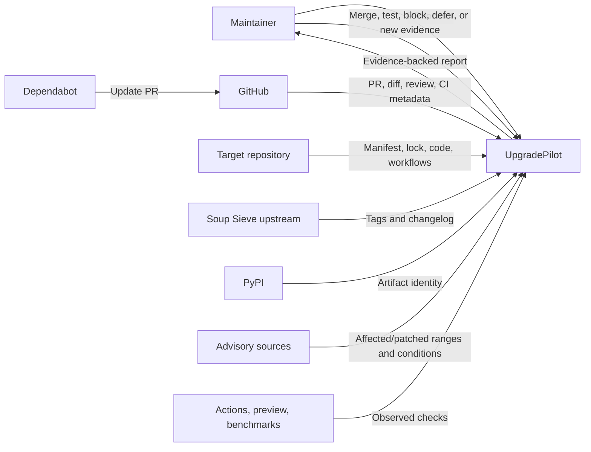
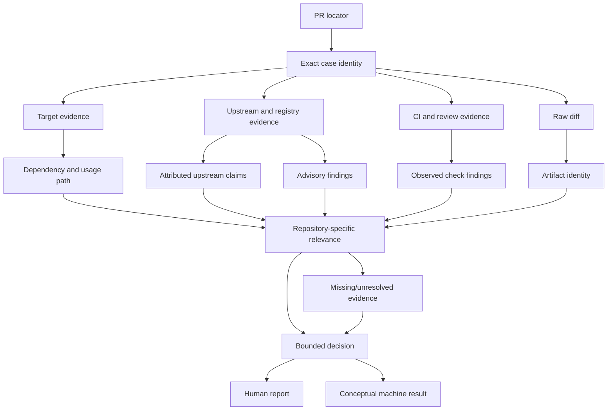
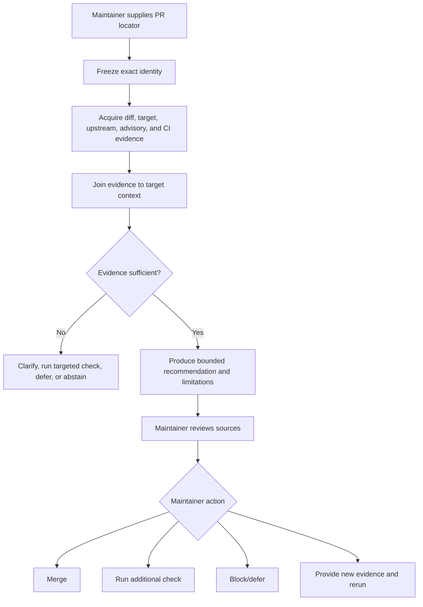

# Scenario S001 — Pydantic Soup Sieve 2.6 → 2.8.4

**Status:** Complete unified manual end-to-end runtime record  
**Repository:** `pydantic/pydantic`  
**Pull request:** [`pydantic/pydantic#13432`](https://github.com/pydantic/pydantic/pull/13432)  
**Dependency transition:** `soupsieve` `2.6` → `2.8.4`  
**Change producer:** `dependabot[bot]`  
**Base revision:** `652a61ce4f9d7d76eaada31535807a485ece0e21`  
**Head revision:** `aa2dc024d33f61cdef50bf1973ab5adf0a974f5a`  
**Merge revision:** `ce12fb88380b7038ab8e20d121c7e8b4064de547`  
**Historical decision boundary:** proposed head before merge on 2026-07-15  
**Original investigation date:** 2026-07-22  
**Execution retrofit and correction date:** 2026-07-22  
**Unified-record date:** 2026-07-22  
**Investigators:** Ali and AI assistant  
**Execution mode:** connector-backed public-source investigation; no target-repository mutation and no target-code execution

> This is the sole authoritative S001 record. It combines how the investigation was performed with what the completed result means. It preserves failed and superseded paths, marks retrospective reconstruction honestly, embeds factual corrections directly, and does not claim that S001 was logged progressively from its first lookup.

## 0. Reading model

This file is ordered so the reader can understand the complete chain without moving between files:

```text
scope and honesty boundary
→ executive result and corrections
→ actual tools and methods
→ real event, invocation, identity, actors, and questions
→ chronological operational execution
→ evidence inventory and authority
→ repository-specific findings and checks
→ limitations and changed-evidence behavior
→ bounded decision and maintainer report
→ conceptual machine output and flows
→ candidate automation methods
→ product-model changes, retrospective, and completion audit
```

## 1. Reconstruction and honesty boundary

S001 was originally investigated and then documented as a completed case. It was not maintained as a live progressive journal from the first search.

The operational sections below are therefore a **best-effort retrospective reconstruction** based on:

- retained assistant tool-call history;
- retained tool names and arguments where available;
- exact repository revisions and source links preserved during the case;
- GitHub commit history for the UpgradePilot records;
- fresh official-source verification performed during the retrofit;
- concise professional rationale reconstructed from the visible sequence.

This record does not invent:

- per-call timestamps that were not retained;
- exact search-result ranking or complete raw responses that were not preserved;
- exact reasoning wording that was never written;
- successful execution of commands that were only proposed;
- a cleaner or more linear path than the actual investigation.

### Reconstruction labels

| Label | Meaning |
|---|---|
| **Exact retained operation** | Tool/function and material arguments are visible in retained history |
| **Exact retained result** | Material returned value is visible in retained history |
| **Grouped retained operations** | Repetitive or mechanically related calls are combined to avoid ceremony |
| **Reconstructed rationale** | Reason for a method choice is inferred from visible sequence and outcomes |
| **Not reconstructable exactly** | Missing query, payload, result detail, or transition is not guessed |
| **Retrofit verification** | Operation occurred during correction, not during original S001 execution |

## 2. Executive result

The most justified pre-merge recommendation was:

> **Merge after normal maintainer review.**

The result was based on joined evidence rather than the version number or a green status alone:

- only the resolved Soup Sieve record changed in `uv.lock`;
- Soup Sieve was transitive documentation tooling, not a Pydantic runtime dependency;
- Pydantic required Python `>=3.10`, while Soup Sieve 2.8.4 required Python `>=3.9`;
- two reviewed high-severity denial-of-service advisories affected 2.6 and identified 2.8.4 as patched;
- inspected target code did not directly call the advisory-named selector APIs;
- exact-head documentation CI installed the relevant dependency path and completed successfully;
- upstream release, package metadata, artifact identity, target context, and CI evidence materially agreed.

The decision remains bounded. It does not prove that the target was safe, non-exploitable, production-verified, or free of undocumented constraints.

## 3. Embedded factual correction

Fresh verification of the official advisory pages during the execution retrofit corrected the original timing statements.

| Topic | Superseded original statement | Current corrected statement |
|---|---|---|
| Advisory publication date | July 9, 2026 | June 1, 2026 |
| Timing relative to PR | One day before the July 10 PR | More than one month before the PR |
| Dependabot trigger inference | Strongly suggested security-triggered update | Security trigger is plausible but unresolved from public evidence |

The official pages still identify:

- affected versions: `<=2.8.3`;
- patched versions: `>=2.8.4`;
- severity: High;
- attack paths involving user-supplied selector strings reaching Soup Sieve compilation or Beautiful Soup selector APIs.

The correction does not change the primary recommendation because the recommendation does not depend on proving why Dependabot opened the pull request.

## 4. Toolchain actually used

### 4.1 Used during the investigation

| Tool or mechanism | Practical use |
|---|---|
| ChatGPT reasoning | Question selection, comparison, interpretation, decision construction, writing |
| GitHub connector — PR search and inspection | Candidate selection, PR identity, changed files, patch, comments, review, labels, merge state |
| GitHub connector — repository search and file retrieval | Manifest, lock graph, source use, workflows, upstream tags, changelog |
| GitHub connector — Actions inspection | Commit status, workflow runs, jobs, and step summaries |
| Web retrieval/search | Official PyPI release details and official GitHub advisory pages |
| GitHub contents writes | Creation and later consolidation of scenario and shared records |

### 4.2 Not used

The following were not run during the target investigation:

- no local Git clone of Pydantic or Soup Sieve;
- no shell command against the target repository;
- no Python script;
- no `uv`, `pip`, `pytest`, `mypy`, `ruff`, MkDocs, or target build command;
- no package installation;
- no container or sandbox execution of target code;
- no exploit proof of concept;
- no LLM release-note extraction service;
- no agent framework;
- no database, queue, or service framework;
- no mutation in `pydantic/pydantic`;
- no credentialed Cloudflare or Algolia operation.

Commands shown later for a changed-evidence variant were proposed targeted checks and were not executed.

### 4.3 Why connector-first inspection was chosen

The case was public and historical. Exact GitHub revisions, workflows, registry metadata, and advisory records could answer the material decision questions without executing third-party code.

Connector inspection was preferred because it could:

- freeze exact case identity;
- retrieve historical source revisions;
- inspect files without executing them;
- preserve URLs and SHAs;
- avoid local environment drift;
- avoid unnecessary supply-chain and execution risk.

The method would have switched to sandboxed local execution if public CI could not answer a decision-relevant compatibility question and a bounded reproduction was justified.

## 5. Why this real case was selected

S001 was selected because it was small enough to trace but not trivial:

- real public Python Dependabot pull request;
- stable merged historical revision boundary;
- one-file lock update;
- transitive rather than direct dependency;
- several upstream releases crossed;
- interpreter support, behavior, bug fixes, and security fixes present;
- target relevance not visible from the title;
- completed CI and review state available.

The selection aimed to test whether UpgradePilot could move beyond:

```text
version changed + CI green
→ merge
```

and instead produce:

```text
exact change
+ dependency path
+ target use
+ upstream meaning
+ security evidence
+ compatibility
+ exact CI responsibility coverage
+ explicit limitations
→ bounded maintainer action
```

## 6. Initial real-world event and intended invocation

On 2026-07-10, `dependabot[bot]` opened PR #13432 proposing Soup Sieve 2.6 → 2.8.4.

A maintainer initially saw the title, copied upstream release notes, commit list, compatibility badge, lockfile diff, CI results, preview comments, and dependency labels. The pull request did not directly explain why Soup Sieve existed, its dependency role, whether the Python support change mattered, whether public advisories existed, or whether green CI exercised the relevant path.

### Smallest credible invocation for this case

| Item | Value | Producer | Why needed | Missing/wrong consequence |
|---|---|---|---|---|
| Public change locator | PR URL | Maintainer or event source | Locates the update | No case can be resolved |
| Requested responsibility | Dependency-update decision support | Maintainer/product mode | Defines expected result | Could produce an irrelevant summary |
| Observation time | 2026-07-22 | UpgradePilot | Separates historical evidence from later state | Later evidence could be misapplied |

The repository, PR number, base/head SHAs, dependency, versions, producer, changed files, upstream source, advisories, dependency path, and CI runs were discovered after invocation and then frozen.

## 7. Exact case identity

| Element | Value | Authority |
|---|---|---|
| Repository | `pydantic/pydantic` | GitHub PR metadata |
| PR | `#13432` | GitHub |
| Base branch | `main` | GitHub PR metadata |
| Base SHA | `652a61ce4f9d7d76eaada31535807a485ece0e21` | GitHub PR metadata |
| Head branch | `dependabot/uv/soupsieve-2.8.4` | GitHub PR metadata |
| Head SHA | `aa2dc024d33f61cdef50bf1973ab5adf0a974f5a` | GitHub PR metadata |
| Merge SHA | `ce12fb88380b7038ab8e20d121c7e8b4064de547` | GitHub PR metadata |
| Dependency | `soupsieve` | PR body and lock diff |
| Old version | `2.6` | Base lock and patch |
| New version | `2.8.4` | Head patch, upstream, PyPI |
| Creator | `dependabot[bot]` | GitHub PR metadata |
| Created | 2026-07-10T22:24:03Z | GitHub issue/PR record |
| Merged | 2026-07-15T13:32:06Z | GitHub issue/PR record |

Evidence from later observation was admitted only when its publication or revision identity showed that it existed before the historical decision boundary.

## 8. Actors and material decision questions

### Actors

| Actor/system | Role | Authority and limit |
|---|---|---|
| Maintainer | Final decision maker | Human authority; approval is not technical proof |
| Dependabot | Change producer | Proposal source, not truth or safety authority |
| GitHub | PR/revision/workflow platform | Authoritative for hosted state, not package semantics |
| Target repository | Target context | Authoritative at examined revision; static files do not prove runtime behavior |
| Soup Sieve upstream | Upstream claims and tagged files | Strong attributed source; target relevance still required |
| PyPI | Distribution identity | Strong artifact metadata; not behavioral safety proof |
| Advisory database | Affected/fixed range and attack conditions | Strong vulnerability evidence; target exploitability still separate |
| GitHub Actions | Configured check execution | Proves only what exact jobs and commands exercised |
| Cloudflare Pages/CodSpeed | Preview/performance reporters | Bounded evidence only |
| AI assistant | Manual investigator and writer | Derived interpretation; can be wrong; no merge authority |
| Ali | UpgradePilot product owner | Directs and reviews this project; not target-repository maintainer |

### Initial decision questions

1. What exactly changed?
2. Why is Soup Sieve in Pydantic?
3. Is it direct, transitive, runtime, or tooling?
4. What changed upstream from 2.6 to 2.8.4?
5. Does dropping Python 3.8 matter to the target?
6. Do reviewed vulnerabilities affect the old version and does the new version remediate them?
7. Does target code reach the vulnerable selector entry points?
8. Did exact-head CI install and exercise the changed dependency path?
9. Do the lock artifacts match the official distribution?
10. Which bounded maintainer action is justified?

## 9. Unified chronological execution record

Each entry records the material chain:

```text
current state/question
→ selected method and reason
→ exact or grouped operation
→ expected output
→ actual output
→ interpretation/outcome
→ next action and reason
```

### X00 — Load repository operating rules

- **State/question:** The simulation setup existed, but the correct GitHub operating method had to be confirmed.
- **Selected method:** Read the installed GitHub skill; connector-first inspection was expected to fit a public historical PR.
- **Why:** Exact revisions mattered, product code was unauthorized, and local execution was not yet justified.
- **Exact retained operation:**

```text
api_tool.read_resource(
  uri="skills://plugins/github/github/skill.md",
  start_line=1,
  num_lines=100
)
```

- **Expected output:** Correct repository/PR inspection workflow and routing constraints.
- **Actual output:** Connector-first PR and repository inspection; local `git`/`gh` reserved for connector gaps.
- **Outcome:** Use GitHub connector and public sources; do not execute target code by default.
- **Next:** Search for a stable real Python Dependabot case.

### X01 — Broad candidate search

- **State/question:** No case selected.
- **Selected method:** Search recent closed Python Dependabot PRs.
- **Why:** Closed/merged cases provide stable revisions and completed CI/review evidence.
- **Exact retained operation:**

```text
GitHub.search_prs(
  query="dependabot bump in:title language:Python",
  topn=20,
  sort="updated",
  order="desc",
  state="closed"
)
```

- **Expected output:** Candidate set of accessible dependency-update PRs.
- **Actual output:** Candidate list returned; complete ordering was not preserved.
- **Failure/limit:** Query was too broad to justify a selection.
- **Outcome:** Narrow the search and inspect candidate metadata.

### X02 — Candidate refinement and rejected candidates

- **State/question:** Broad results existed, but no candidate was yet sufficiently useful.
- **Selected method:** Search package-specific wording, inspect candidates, then search within Pydantic.
- **Exact retained operations:**

```text
GitHub.search_prs(
  query="\"Bump pydantic from\" dependabot",
  topn=15,
  sort="updated",
  order="desc",
  state="closed"
)

GitHub.get_pr_info(
  repository_full_name="google-marketing-solutions/adspace_agent",
  pr_number=48
)

GitHub.get_pr_info(
  repository_full_name="he0119/smart-home",
  pr_number=681
)

GitHub.search_prs(
  query="dependabot",
  repository_full_name="pydantic/pydantic",
  topn=20,
  sort="updated",
  order="desc",
  state="closed"
)
```

- **Expected output:** Real, reproducible, bounded but non-trivial case.
- **Actual output:** Selected `pydantic/pydantic#13432`.
- **Not reconstructable exactly:** Candidate-by-candidate rejection reasons were not recorded contemporaneously.
- **Retained selection reason:** One-file lock update plus multiple releases, interpreter change, security-relevant fixes, transitive path, and completed CI.
- **Outcome:** Freeze the selected PR identity.

### X03 — Freeze PR identity

- **State/question:** Candidate selected; exact revision boundary unknown.
- **Selected method:** Structured PR metadata before semantic analysis.
- **Why:** Files and CI must be interpreted at exact base/head revisions.
- **Exact retained operation:**

```text
GitHub.get_pr_info(
  repository_full_name="pydantic/pydantic",
  pr_number=13432
)
```

The operation was repeated later to refresh/confirm metadata.

- **Expected output:** Base/head branches and SHAs, creator, merge state, merge SHA.
- **Actual output:** Exact identity listed in section 7.
- **Outcome:** Historical case boundary frozen.
- **Next:** Inspect review state and exact diff.

### X04 — Review-thread retries and method switch

- **State/question:** Review discussion might expose maintainer concerns or blockers.
- **Initial method:** Retrieve normalized review threads and reviews.
- **Grouped retained operations:** Nine visible invocations of `GitHub.list_pull_request_review_threads` for PR #13432 and one related `GitHub.list_pull_request_reviews` attempt.
- **Expected output:** Unresolved inline comments, requested changes, approval state.
- **Actual output:** No useful material thread record from repeated specialized calls.
- **Why stopped:** Further repetition produced no new evidence and became ceremony.
- **Replacement operations:**

```text
GitHub.fetch_pr_comments(
  repo_full_name="pydantic/pydantic",
  pr_number=13432
)

GitHub.fetch_pr(
  repo_full_name="pydantic/pydantic",
  pr_number=13432
)

GitHub.fetch_issue(
  repository_full_name="pydantic/pydantic",
  issue_number=13432
)
```

- **Useful output after switch:** PR body, labels, automated comments, merged state, and maintainer approval evidence.
- **Outcome:** Preserve the failed specialized method; use broader authoritative PR representations.
- **Next:** Bound changed files.

### X05 — Changed-file and patch inspection

- **State/question:** Exact mutation unknown.
- **Selected method:** List validated changed paths, then fetch per-file patch.
- **Why:** Avoid guessing files and missing extra changes.
- **Exact retained operations:**

```text
GitHub.list_pr_changed_filenames(
  repo_full_name="pydantic/pydantic",
  pr_number=13432
)

GitHub.fetch_pr_file_patch(
  repo_full_name="pydantic/pydantic",
  pr_number=13432,
  path="uv.lock"
)
```

- **Expected output:** Complete changed-file set and old/new artifact record.
- **Actual output:** Only `uv.lock` changed; version and sdist/wheel URLs, hashes, sizes, and upload times changed from 2.6 to 2.8.4.
- **Outcome:** Lockfile-only update; no target source or manifest mutation.
- **What remained unresolved:** Dependency role, relevance, compatibility, advisories, and CI coverage.
- **Next:** Inspect exact-head CI and target dependency ownership.

### X06 — Discover exact-head CI runs

- **State/question:** Determine whether dynamic evidence already existed for the exact head.
- **Selected method:** Query both combined status and Actions runs because they are separate GitHub surfaces.
- **Exact retained operations:**

```text
GitHub.get_commit_combined_status(
  repo_full_name="pydantic/pydantic",
  commit_sha="aa2dc024d33f61cdef50bf1973ab5adf0a974f5a"
)

GitHub.fetch_commit_workflow_runs(
  repo_full_name="pydantic/pydantic",
  commit_sha="aa2dc024d33f61cdef50bf1973ab5adf0a974f5a"
)
```

- **Expected output:** All visible status/check surfaces and run identifiers.
- **Actual output:** Successful primary CI and performance workflows were available; run `29127613659` became the job-inspection target.
- **Outcome:** Green CI existed, but its authority remained unresolved until commands and dependency path were mapped.
- **Next:** Inspect jobs and workflow definitions.

### X07 — Inspect workflow jobs

- **State/question:** Which jobs actually ran, and what did they exercise?
- **Selected method:** Fetch jobs for the identified exact-head workflow run.
- **Exact retained operation:**

```text
GitHub.fetch_workflow_run_jobs(
  repo_full_name="pydantic/pydantic",
  run_id=29127613659
)
```

- **Expected output:** Job names, conclusions, and step summaries.
- **Actual output:** Main CI succeeded; documentation build succeeded; performance workflow succeeded; third-party tests were skipped; docs preview and coverage comments existed.
- **Outcome:** Preserve observed results, but do not yet call them relevant to Soup Sieve.
- **Next:** Read target dependency declarations, usage, and workflow commands.

### X08 — Consolidate PR comments, labels, and review evidence

- **State/question:** Understand bot outputs and human review without overvaluing them.
- **Selected method:** Use full PR/issue/comment records after specialized thread retrieval failed.
- **Operations:** `GitHub.fetch_pr_comments`, `GitHub.fetch_pr`, `GitHub.fetch_issue`, and repeated `GitHub.get_pr_info` confirmation.
- **Actual observations:** Dependabot release-note copy, compatibility badge link, dependency labels, Cloudflare preview comment, CodSpeed result, coverage result, approval, and merge.
- **Interpretation:** These establish proposal, visible checks, and historical human acceptance; they do not prove compatibility or safety.
- **Outcome:** Review and bot evidence retained as bounded context.
- **Next:** Classify dependency ownership and use.

### X09 — Inspect target manifest and direct dependency declarations

- **State/question:** Is Soup Sieve a direct Pydantic runtime dependency?
- **Selected method:** Repository searches followed by exact base-revision `pyproject.toml` retrieval.
- **Grouped retained operations:**

```text
GitHub.search(query="soupsieve", repository_name="pydantic/pydantic", topn=20)
GitHub.search(query="beautifulsoup4", repository_name="pydantic/pydantic", topn=20)

GitHub.fetch_file(
  repository_full_name="pydantic/pydantic",
  path="pyproject.toml",
  ref="652a61ce4f9d7d76eaada31535807a485ece0e21",
  encoding="utf-8",
  start_line=1,
  end_line=260
)
```

- **Expected output:** Published dependencies, project Python support, documentation groups.
- **Actual output:** Pydantic required Python `>=3.10`; published runtime dependencies did not include Beautiful Soup or Soup Sieve; `beautifulsoup4` appeared under `docs-upload`; `mkdocs-llmstxt` appeared under `docs`.
- **Provisional interpretation:** Soup Sieve was documentation tooling, but the exact `docs` path remained unresolved.
- **Next:** Inspect target code and lock graph.

### X10 — Locate target functional usage

- **State/question:** Where does Beautiful Soup/Soup Sieve matter in the target?
- **Selected method:** Search source symbols, then fetch the exact file.
- **Exact retained operations:**

```text
GitHub.search(query="BeautifulSoup", repository_name="pydantic/pydantic", topn=20)

GitHub.fetch_file(
  repository_full_name="pydantic/pydantic",
  path="docs/plugins/algolia.py",
  ref="652a61ce4f9d7d76eaada31535807a485ece0e21",
  encoding="utf-8",
  start_line=1,
  end_line=260
)
```

- **Expected output:** Concrete imports and call sites.
- **Actual output:** Algolia docs plugin imported Beautiful Soup and parsed/generated documentation HTML using tree-search operations.
- **Outcome:** Documentation pipeline relevance established; direct Soup Sieve selector API exposure still unresolved.
- **Next:** Link the file to MkDocs configuration and workflows.

### X11 — Inspect PR CI and documentation publish workflows

- **State/question:** Which environments install the dependency, and which commands execute?
- **Selected method:** Read exact base-revision workflow definitions.
- **Exact retained operations:**

```text
GitHub.fetch_file(
  repository_full_name="pydantic/pydantic",
  path=".github/workflows/docs-update.yml",
  ref="652a61ce4f9d7d76eaada31535807a485ece0e21",
  encoding="utf-8",
  start_line=1,
  end_line=240
)

GitHub.fetch_file(
  repository_full_name="pydantic/pydantic",
  path=".github/workflows/ci.yml",
  ref="652a61ce4f9d7d76eaada31535807a485ece0e21",
  encoding="utf-8",
  start_line=1,
  end_line=1150
)
```

Several bounded ranges were used because the workflow file was large.

- **Actual output:** PR `docs-build` installed the `docs` group and ran `mkdocs build`; the push/tag publication workflow installed `docs` and `docs-upload`, built/deployed docs, and uploaded Algolia records.
- **Outcome:** Relevant job candidate identified, but the `docs` group had to be proven to resolve Soup Sieve.
- **Next:** Inspect MkDocs hook configuration and lock graph.

### X12 — Link target plugin to MkDocs execution

- **State/question:** Does the docs build load the Beautiful Soup-using plugin?
- **Selected method:** Read exact `mkdocs.yml` at the base SHA.
- **Exact retained operation:**

```text
GitHub.fetch_file(
  repository_full_name="pydantic/pydantic",
  path="mkdocs.yml",
  ref="652a61ce4f9d7d76eaada31535807a485ece0e21",
  encoding="utf-8",
  start_line=1,
  end_line=360
)
```

- **Actual output:** `docs/plugins/algolia.py` was configured as an MkDocs hook.
- **Outcome:** Successful docs build could exercise plugin import and docs-generation path if Soup Sieve was installed in the `docs` environment.
- **Next:** Search selector API use and resolve the lock path.

### X13 — Bounded selector-exposure search

- **State/question:** Does target code directly use the advisory-named selector APIs?
- **Selected method:** Repository searches for `.select(` and `select_one` plus inspection of the known plugin.
- **Retained operations:**

```text
GitHub.search(query="select(", repository_name="pydantic/pydantic", topn=50)
GitHub.search(query="select_one", repository_name="pydantic/pydantic", topn=20)
```

- **Expected output:** Direct CSS-selector call sites.
- **Actual output:** No direct target call to `.select()`, `.select_one()`, or `soupsieve.compile()` was found in the inspected path.
- **What it establishes:** No direct call was found within the bounded static search.
- **What it does not establish:** Absence of every dynamic, indirect, or transitive call.
- **Outcome:** Target exploitability remains unresolved and appears limited; do not claim definite non-exposure.
- **Next:** Inspect upstream changes and Python constraints.

### X14 — Inspect upstream tags and changelog

- **State/question:** What changed from 2.6 to 2.8.4, and is the support change real?
- **Selected method:** Fetch tagged metadata and upstream changelog rather than relying only on Dependabot's transformed copy.
- **Exact retained operations:**

```text
GitHub.get_repo(repository_full_name="facelessuser/soupsieve")

GitHub.fetch_file(
  repository_full_name="facelessuser/soupsieve",
  path="pyproject.toml",
  ref="2.8.4",
  encoding="utf-8",
  start_line=1,
  end_line=220
)

GitHub.fetch_file(
  repository_full_name="facelessuser/soupsieve",
  path="pyproject.toml",
  ref="2.6",
  encoding="utf-8",
  start_line=1,
  end_line=80
)

GitHub.search(
  query="Drop support for Python 3.8",
  repository_name="facelessuser/soupsieve",
  topn=20
)

GitHub.fetch_file(
  repository_full_name="facelessuser/soupsieve",
  path="docs/src/markdown/about/changelog.md",
  ref="2.8.4",
  encoding="utf-8",
  start_line=1,
  end_line=180
)
```

- **Actual output:** 2.6 required Python `>=3.8`; 2.8.4 required `>=3.9`; changelog reported dropping Python 3.8, adding 3.14, selector additions, correctness fixes, inefficient-pattern fixes, selector-count limiting, and a debug-loop fix.
- **Comparison:** Target floor `>=3.10` remained above new dependency floor `>=3.9`.
- **Outcome:** Python support claim corroborated but irrelevant to declared target support.
- **Next:** Resolve exact dependency path and security evidence.

### X15 — Initial lockfile inspection produced an incomplete hypothesis

- **State/question:** How does the selected docs environment reach Soup Sieve?
- **Selected method:** Fetch bounded lockfile regions.
- **Example exact operation:**

```text
GitHub.fetch_file(
  repository_full_name="pydantic/pydantic",
  path="uv.lock",
  ref="652a61ce4f9d7d76eaada31535807a485ece0e21",
  encoding="utf-8",
  start_line=300,
  end_line=500
)
```

- **Expected output:** Dependency graph from target groups to Beautiful Soup and Soup Sieve.
- **Actual output:** Early ranges did not expose the complete chain.
- **Provisional interpretation:** Beautiful Soup might be only a `docs-upload` dependency.
- **Why incomplete:** Package records and group metadata were distributed across a large lockfile.
- **Outcome:** Do not finalize dependency role from one manifest line or arbitrary lock range.
- **Next:** Switch retrieval strategy.

### X16 — Failed lockfile response-search approaches

- **State/question:** Locate relevant package records efficiently in large connector responses.
- **Attempted operations:**

```text
api_tool.find_in_resource(
  uri="/response/turn67",
  query="docs-build",
  start_line=1
)

api_tool.find_in_resource(
  uri="/response/turn73",
  query="beautifulsoup4",
  start_line=1
)

api_tool.find_in_resource(
  uri="/response/turn75",
  query="name = \"mkdocs-llmstxt\"",
  start_line=1
)
```

- **Exact retained result:** `ResourceNotReadable` for these resource searches.
- **Additional attempt:**

```text
GitHub.fetch_blob(
  repository_full_name="pydantic/pydantic",
  blob_sha="b4a68ab725de337889d50d5374ac0f05db7fb484"
)
```

- **Actual result:** Full blob display was truncated.
- **Why methods failed:** Non-readable response resources and display limits for large blobs.
- **Replacement:** Direct bounded file retrieval around package records.
- **Outcome:** Preserve failed approaches; switch rather than retry indefinitely.

### X17 — Resolve the actual dependency path

- **State/question:** Prove why the normal `docs` group installs Soup Sieve.
- **Selected method:** Multiple exact bounded `uv.lock` ranges at the base SHA.
- **Grouped retained operations:**

```text
GitHub.fetch_file(path="uv.lock", ref=<base>, start_line=2500, end_line=2750)
GitHub.fetch_file(path="uv.lock", ref=<base>, start_line=2180, end_line=2520)
GitHub.fetch_file(path="uv.lock", ref=<base>, start_line=1450, end_line=1850)
GitHub.fetch_file(path="uv.lock", ref=<base>, start_line=1360, end_line=1450)
GitHub.fetch_file(path="uv.lock", ref=<base>, start_line=1120, end_line=1250)
GitHub.fetch_file(path="uv.lock", ref=<base>, start_line=1940, end_line=2180)
GitHub.fetch_file(path="uv.lock", ref=<base>, start_line=1770, end_line=1945)
GitHub.fetch_file(path="uv.lock", ref=<base>, start_line=1580, end_line=1775)
GitHub.fetch_file(path="uv.lock", ref=<base>, start_line=1530, end_line=1600)
```

All used `pydantic/pydantic`, base SHA `652a61ce4f9d7d76eaada31535807a485ece0e21`, UTF-8.

- **Decisive observations:** `mkdocs-llmstxt` depends on `beautifulsoup4`; `markdownify` also depends on Beautiful Soup; Beautiful Soup depends on Soup Sieve; `mkdocs-llmstxt` belongs to `docs`.
- **Superseded interpretation:**

```text
Old provisional view:
Soup Sieve is only in docs-upload.

Corrected view:
docs → mkdocs-llmstxt → beautifulsoup4 → soupsieve
and
docs-upload → beautifulsoup4 → soupsieve
```

- **Outcome:** PR docs CI installed the changed package and could receive decision relevance.
- **Next:** Verify official artifacts and advisories.

### X18 — Acquire PyPI and advisory evidence

- **State/question:** Do official distribution and vulnerability sources corroborate the update meaning?
- **Selected method:** Public official PyPI and GitHub advisory pages because the repository connector had no dedicated PyPI/advisory action.
- **Original exact web queries:** Not reconstructable exactly.
- **Preserved official sources:**
  - `https://pypi.org/project/soupsieve/2.8.4/`
  - `https://github.com/facelessuser/soupsieve/security/advisories/GHSA-836r-79rf-4m37`
  - `https://github.com/facelessuser/soupsieve/security/advisories/GHSA-2wc2-fm75-p42x`
- **Material output:** Official 2.8.4 artifact identity aligned with the lock patch; both advisories affected versions through 2.8.3 and patched in 2.8.4; attack preconditions involved user-supplied selector strings and selector-compilation entry points.
- **Original error:** Advisory dates were first recorded incorrectly as July 9.
- **Outcome:** Security remediation established; publication timing required later correction.
- **Next:** Inspect Dependabot configuration without turning trigger inference into decision authority.

### X19 — Inspect Dependabot configuration and trigger hypothesis

- **State/question:** Could ordinary configured uv updates explain the PR?
- **Selected method:** Search and fetch target Dependabot configuration.
- **Exact retained operations:**

```text
GitHub.search(
  query="package-ecosystem",
  repository_name="pydantic/pydantic",
  topn=20
)

GitHub.fetch_file(
  repository_full_name="pydantic/pydantic",
  path=".github/dependabot.yml",
  ref="652a61ce4f9d7d76eaada31535807a485ece0e21",
  encoding="utf-8",
  start_line=1,
  end_line=220
)
```

- **Actual output:** Checked file configured periodic GitHub Actions and Cargo updates, not uv/Python updates.
- **Original interpretation:** Combined with the incorrect one-day advisory timing, this was described as strong security-trigger evidence.
- **Corrected interpretation:** Security trigger is plausible but unresolved; repository/global settings not visible publicly may matter.
- **Decision effect:** None. Affected/fixed evidence is sufficient without trigger classification.
- **Next:** Attempt to inspect post-merge operational evidence and then decide.

### X20 — Attempt post-merge workflow retrieval

- **State/question:** Did the separate push workflow complete deployment and Algolia upload after merge?
- **Selected method:** Query workflow runs and statuses for merge SHA.
- **Exact retained operations:**

```text
GitHub.fetch_commit_workflow_runs(
  repo_full_name="pydantic/pydantic",
  commit_sha="ce12fb88380b7038ab8e20d121c7e8b4064de547"
)
```

- **Exact retained result:** `workflow_runs: []`.

```text
GitHub.get_commit_combined_status(
  repo_full_name="pydantic/pydantic",
  commit_sha="ce12fb88380b7038ab8e20d121c7e8b4064de547"
)
```

- **Exact retained result:** `statuses: []`.
- **Why empty:** The workflow-run connector path filtered to pull-request-triggered runs and did not expose the push workflow.
- **Why no privileged alternative was forced:** PR docs CI already covered installation/build; production upload required secrets and did not change the decision; private logs were unnecessary.
- **Outcome:** Post-merge upload result unavailable, not passed or failed.
- **Next:** Construct bounded action from sufficient public evidence.

### X21 — Manual decision construction

- **State/question:** Which action is proportionate to the evidence and limitations?
- **Method:** Manual evidence synthesis; no decision library or model endpoint.
- **Rule selected:** Choose the least strong maintainer action justified by joined evidence; no source directly becomes “safe” or “merge.”
- **Alternatives:**
  - **Abstain:** rejected because identity, compatibility, remediation, dependency scope, artifact identity, and relevant CI were sufficient.
  - **Run targeted checks:** rejected for the primary case because exact-head docs CI installed and built the relevant path.
  - **Investigate/block:** rejected because target Python constraints were compatible and no target-specific conflict was found; blocking retained an advisory-affected version.
  - **Automatic merge / declare safe:** rejected because public evidence could not prove non-exploitability, production safety, or absence of hidden constraints.
- **Outcome:** `merge after normal maintainer review`.
- **Why bounded:** Human authority and limitations remain explicit.
- **Next:** Test changed-evidence behavior.

### X22 — Changed-evidence variants

No code was run; manual counterfactual reasoning was used.

#### Variant A — Target supports Python 3.8

- **Changed input:** Target support becomes `>=3.8`.
- **Why selected:** Tests whether the upstream Python-floor claim becomes decision-relevant under different target context.
- **Result:** New Soup Sieve `>=3.9` floor conflicts with a supported target environment.
- **Changed outcome:** Investigate/block until support policy, conditional constraint, or alternate remediation is resolved.

#### Variant B — Relevant docs CI is unavailable

- **Changed evidence:** Exact-head docs build skipped, stale, or unavailable.
- **Why selected:** Tests whether CI-path alignment was material rather than decorative.
- **Result:** Install/import/docs-generation compatibility unresolved.
- **Changed outcome:** Run a targeted docs build before normal review.
- **Proposed commands, explicitly not run:**

```bash
uv sync --all-packages --group docs
CI=1 uv run mkdocs build
```

- **Why these commands:** Mirror the owning workflow responsibility without credentials, deployment, or broad unrelated tests.

### X23 — Write and validate original UpgradePilot records

- **Method:** GitHub contents operations on `main`.
- **Original exact commits:**
  - `9b8e2e5e0a699894e4533efe693f78932c045c23` — complete primary case;
  - `af72c6c7902122177eb0622520bb6c7657aa4ef4` — scenario coverage;
  - `a02f86e26ff30f8ecd128b43de91771a386e6963` — workspace link;
  - `edb9bd62483e3c8cd4f8b87fa3a465f7d91705cb` — continuation.
- **Validation operation:**

```text
GitHub.compare_commits(
  repo_full_name="motafegh/UpgradePilot",
  base="82e67118fde80000be1844cbff9ca8d9c8a45f57",
  head="edb9bd62483e3c8cd4f8b87fa3a465f7d91705cb"
)
```

- **Actual result:** Four documentation files changed; no source or test file.
- **Later repository change noticed:** Progressive execution requirements were added after S001, exposing S001's operation-lineage gap.
- **Outcome:** Retrospective execution retrofit became necessary.

### X24 — Retrofit verification and factual correction

- **State/question:** Before preserving a detailed execution record, recheck cited official sources.
- **Selected method:** Official-source search, then direct official URL opens when search indexing was incomplete.
- **Retrofit search terms:** Official advisory IDs and PyPI 2.8.4.
- **Search issue:** Search did not reliably return both advisory pages.
- **Replacement:** Direct opens of the exact advisory URLs already preserved in the case.
- **Focused page checks:** publication, affected versions, patched versions, and attack-condition wording.
- **Correct observations:** Both official advisory pages currently state June 1, 2026; affected `<=2.8.3`; patched `>=2.8.4`; High severity.
- **Superseded claims:** July 9 date, one-day timing, and strong trigger inference.
- **What remained unchanged:** Affected/fixed conclusion, compatibility, dependency role, CI result, and primary recommendation.
- **Outcome:** Correction had to be embedded transparently, not silently rewritten.

### X25 — Unify the scenario record

- **State/question:** Split `README.md`, `EXECUTION_TRACE.md`, and `CASE.md` made the case harder to read as one end-to-end system execution.
- **Selected method:** Rewrite `CASE.md` as the sole authoritative record, deduplicate overlapping content, embed corrections, retain failed/superseded paths, remove split files, and update shared links.
- **Why selected:** One coherent file places each operation directly before the evidence and outcome it produced and avoids navigation overhead.
- **Alternative rejected:** Mechanical concatenation, because it would retain duplicate explanations and conflicting superseded statements.
- **Output:** This unified file.
- **Outcome:** S001 can be read end to end without cross-file authority routing.

## 10. Evidence inventory and authority

| ID | Evidence | Direct observation | Authority | Cannot establish alone | State |
|---|---|---|---|---|---|
| E01 | PR #13432 | Dependabot proposed 2.6 → 2.8.4; dates and merge state | High for PR state | Upstream truth, relevance, safety | Accepted |
| E02 | PR `uv.lock` patch | Only Soup Sieve artifact record changed | High for proposed mutation | Behavior | Accepted |
| E03 | Target `pyproject.toml` | Python `>=3.10`; no runtime Beautiful Soup/Soup Sieve; docs groups | High at base revision | Resolved transitive path | Accepted |
| E04 | Target `uv.lock` | `docs → mkdocs-llmstxt → beautifulsoup4 → soupsieve`; second docs-upload path | High for locked resolution | Runtime call behavior | Accepted |
| E05 | `docs/plugins/algolia.py` | Beautiful Soup parses docs HTML; no direct selector call found | Strong bounded static evidence | Absence of all indirect use | Accepted with limit |
| E06 | `mkdocs.yml` | Algolia plugin configured as hook | High for configuration | Successful execution | Accepted |
| E07 | `.github/workflows/ci.yml` | PR docs job installs `docs` and runs MkDocs build | High for configured commands | Job success | Accepted |
| E08 | `.github/workflows/docs-update.yml` | Push/tag path installs docs/docs-upload and performs external publication | High for configured operation | Actual post-merge completion | Accepted configuration; run unavailable |
| E09 | Head workflows/comments/review | CI/docs/performance success; third-party tests skipped; approval | High for reported states | Universal correctness | Accepted |
| E10 | Upstream changelog | Python and selector/fix claims across versions | Attributed upstream claim | Target impact | Accepted observation |
| E11 | Tagged upstream metadata | Python floor changed `>=3.8` → `>=3.9` | High at tags | Target compatibility | Accepted/corroborating |
| E12 | PyPI 2.8.4 | Official release/artifact metadata and hashes align | Strong distribution identity | Benign behavior | Accepted |
| E13 | Two reviewed advisories | Old version affected; 2.8.4 patched; attack preconditions | Strong vulnerability evidence | Target exploitability | Accepted |
| E14 | Target Dependabot config | No periodic uv entry in checked file | High at revision | Exact trigger cause | Accepted observation; trigger unresolved |
| E15 | Historical merge | Maintainer approved/merged | High for historical action | Technical correctness | Accepted as outcome history only |

### Evidence lineage rule used

```text
raw source at exact revision/time
→ direct observation
→ attributed claim or tool output
→ target-specific interpretation
→ corroborated / contradicted / irrelevant / unresolved finding
→ bounded decision reason
→ maintainer-facing recommendation
```

No individual source jumped directly to “safe” or “merge.”

## 11. Repository-specific findings

### 11.1 Dependency relationship

```text
Pydantic repository
└── docs
    └── mkdocs-llmstxt
        └── beautifulsoup4
            └── soupsieve

Pydantic repository
└── docs-upload
    └── beautifulsoup4
        └── soupsieve
```

Finding: Soup Sieve was transitive documentation tooling, not a published Pydantic runtime dependency.

### 11.2 Target use

The target Algolia plugin used Beautiful Soup for generated documentation parsing and tree traversal. No direct target call to `.select()`, `.select_one()`, or `soupsieve.compile()` was found in the bounded search.

Finding: Operational relevance to docs generation was established; demonstrable exposure to attacker-controlled selector compilation was not.

### 11.3 Python compatibility

| Boundary | Requirement |
|---|---|
| Pydantic | Python `>=3.10` |
| Soup Sieve 2.6 | Python `>=3.8` |
| Soup Sieve 2.8.4 | Python `>=3.9` |

Finding: Dropping Python 3.8 was real but irrelevant to Pydantic's declared supported boundary.

### 11.4 Security

The old version fell within both reviewed advisory affected ranges, and 2.8.4 was the patched release.

Finding:

```text
advisory-affected dependency present
≠
proven exploitable target
```

Updating removed an affected version and was positively justified, while exploitability language remained limited.

### 11.5 CI relevance

CI received decision authority only after the following chain was proven:

```text
changed Soup Sieve record
→ lock graph into docs group
→ docs workflow installs that group
→ MkDocs loads configured plugin
→ exact-head docs job succeeds
```

Finding: Exact-head docs CI materially covered install/import/docs-generation compatibility for the changed path. It did not prove malicious-selector resilience or credentialed production upload.

## 12. Checks and what each proves

| Check/comparison | Result | Demonstrates | Does not demonstrate |
|---|---|---|---|
| PR diff classification | One lock package record | Exact mutation scope | Behavioral safety |
| Lock graph traversal | Docs path reaches Soup Sieve | Dependency ownership/path | Runtime call path |
| Python constraint intersection | Compatible | Declared interpreter compatibility | Undocumented environments |
| Artifact comparison | Lock aligns with PyPI | Official distribution identity | Benign behavior |
| Changelog/tag comparison | Python floor corroborated | Source consistency | Target impact |
| Advisory range evaluation | 2.6 affected; 2.8.4 patched | Remediation | Target exploitability |
| Static target use inspection | Docs use; no direct selector call found | Bounded relevance | Complete absence of indirect use |
| Exact-head CI | Success | Configured jobs passed | Universal correctness |
| Docs-path alignment | Relevant path installed/built | Owning path compatibility | Secret-bearing publication |
| Docs preview | Success | Preview accepted generated output | Production safety |
| CodSpeed | No configured regression | Bounded Pydantic benchmark result | Soup Sieve worst cases |
| Maintainer review | Approved/merged | Human acceptance | Technical proof |

## 13. Missing, inaccessible, and unresolved evidence

| Item | State | Consequence | Possible recovery |
|---|---|---|---|
| Exact Dependabot trigger | Unresolved; security plausible | Do not state trigger as fact | Alert metadata or maintainer confirmation |
| Production exploitability | Unresolved/appears limited | Do not claim target vulnerable or safe | Maintainer architecture and input tracing |
| Every indirect selector call | Not provably absent | Preserve static-analysis limitation | Deeper static/dynamic tracing if decision-changing |
| Post-merge docs upload | Unavailable via inspected connector path | No execution claim | Authorized Actions/run access |
| Private Cloudflare/Algolia logs | Inaccessible/unnecessary | Preview evidence only | Maintainer access if failure occurs |
| Full upstream source audit | Not performed | No implementation-correctness claim | Audit if contradiction appears |
| Local clean-room replay | Not performed | No independent local reproduction claim | Sandboxed exact-revision execution |
| Compatibility badge value | Not acquired/not relied upon | No decision effect | Retrieve badge, still bounded authority |
| Absolute upstream authenticity | Not independently proven | No compromise-proof claim | Signatures/attestations/source build if required |
| Original complete search result ordering | Not preserved | Candidate-selection trace incomplete | Progressive logging in future cases |

Missing evidence limited claim strength but did not require abstention.

## 14. Observation-to-decision lineage

| Finding | Observations and interpretation | State | Decision effect |
|---|---|---|---|
| Narrow lockfile mutation | E02 | Corroborated | Bounds investigation; does not remove behavioral risk |
| Transitive docs dependency | E03 + E04 | Corroborated | Lowers application-runtime scope |
| Docs pipeline use | E05 + E06 | Corroborated | Establishes target relevance |
| Python floor compatible | E03 + E11 + E12 | Corroborated | No interpreter block |
| Old affected/new patched | E13 | Corroborated | Positive remediation reason |
| Target selector exposure | E05 + E13 | Unresolved/appears limited | Prevent exploitability claim |
| Artifact identity aligned | E02 + E12 | Corroborated | No identity mismatch block |
| Relevant docs CI succeeded | E04 + E06 + E07 + E09 | Corroborated | Supports normal review instead of targeted check |
| Security trigger | E14 plus corrected timing | Plausible/unresolved | Context only; no decision effect |
| Historical merge | E15 | Historical observation | Evaluation context only |

## 15. Changed-evidence behavior

### Variant A — Target supports Python 3.8

Changed target context makes the new package floor incompatible.

> **Outcome:** Investigate or block until the project changes its supported boundary, applies a compatible conditional constraint, or finds another remediation.

### Variant B — Relevant docs CI unavailable

Changed evidence removes install/import/docs-generation proof at the head.

> **Outcome:** Run a targeted documentation build before normal review.

Proposed commands, not executed:

```bash
uv sync --all-packages --group docs
CI=1 uv run mkdocs build
```

These commands were chosen because they mirror the owning responsibility without credentials or external deployment.

## 16. Final decision construction

### Candidate outcome

> **Merge after normal maintainer review.**

### Decision reasons

1. Soup Sieve 2.6 was affected by two reviewed high-severity advisories; 2.8.4 was patched.
2. The new Python floor remained below Pydantic's declared supported floor.
3. Only the official resolved artifact record changed.
4. The package was transitive documentation tooling, not Pydantic runtime.
5. Exact-head documentation CI installed the dependency path and built the documentation successfully.
6. No direct target call to the advisory-named selector APIs was found.
7. No material evidence conflict was found.

### Material limitations

- Exact Dependabot trigger unresolved.
- No proof of absence of every indirect selector use.
- No private production exposure evidence.
- No local independent execution.
- No retrieved post-merge credentialed publication run.

### Why stronger language is not justified

The evidence cannot establish “safe,” “non-exploitable,” or “production-proven.”

### Why weaker action is not justified

A targeted docs build would duplicate a relevant successful exact-head job, while blocking would retain an advisory-affected version without a target-specific compatibility conflict.

## 17. Maintainer-facing report

### UpgradePilot manual report — Pydantic PR #13432

**Update:** Soup Sieve 2.6 → 2.8.4  
**Exact change:** One `uv.lock` package record  
**Recommended action:** **Merge after normal review**

Soup Sieve is not a Pydantic runtime dependency. It is transitive documentation tooling reached through Beautiful Soup, including the `docs` path used by PR documentation CI.

The interpreter change is compatible: Pydantic requires Python 3.10 or newer, while Soup Sieve 2.8.4 requires Python 3.9 or newer.

Two reviewed high-severity denial-of-service advisories affect Soup Sieve 2.6 and identify 2.8.4 as patched. The inspected Pydantic plugin uses Beautiful Soup for HTML parsing and tree traversal but does not directly call the named selector APIs. Confirmed target exploitability is not established, but replacing the affected version is a concrete remediation.

The lock artifact identity aligns with the official PyPI release. Exact-head CI completed successfully, including the documentation build that resolves and loads the relevant dependency path.

**Limitations:** This report does not prove safety or non-exploitability. It does not prove absence of every indirect selector call, inspect private production inputs, reproduce target code locally, or verify the credentialed post-merge Algolia upload. The exact Dependabot trigger is unresolved.

**Primary provenance:**

- [PR #13432](https://github.com/pydantic/pydantic/pull/13432)
- [Target `pyproject.toml` at base](https://github.com/pydantic/pydantic/blob/652a61ce4f9d7d76eaada31535807a485ece0e21/pyproject.toml)
- [Target `uv.lock` at base](https://github.com/pydantic/pydantic/blob/652a61ce4f9d7d76eaada31535807a485ece0e21/uv.lock)
- [Target docs plugin](https://github.com/pydantic/pydantic/blob/652a61ce4f9d7d76eaada31535807a485ece0e21/docs/plugins/algolia.py)
- [Upstream changelog](https://github.com/facelessuser/soupsieve/blob/2.8.4/docs/src/markdown/about/changelog.md)
- [PyPI 2.8.4](https://pypi.org/project/soupsieve/2.8.4/)
- [ReDoS advisory](https://github.com/facelessuser/soupsieve/security/advisories/GHSA-836r-79rf-4m37)
- [Memory-exhaustion advisory](https://github.com/facelessuser/soupsieve/security/advisories/GHSA-2wc2-fm75-p42x)

## 18. Conceptual machine-consumable result

Illustrative only; not an implementation schema.

```yaml
case:
  repository: pydantic/pydantic
  change_reference: pull/13432
  base_revision: 652a61ce4f9d7d76eaada31535807a485ece0e21
  head_revision: aa2dc024d33f61cdef50bf1973ab5adf0a974f5a
  observed_at: 2026-07-22

update:
  ecosystem: python-uv
  dependency: soupsieve
  old_version: "2.6"
  new_version: "2.8.4"
  change_shape: lockfile_only
  relationship:
    directness: transitive
    owning_context: documentation_tooling
    paths:
      - docs -> mkdocs-llmstxt -> beautifulsoup4 -> soupsieve
      - docs-upload -> beautifulsoup4 -> soupsieve

findings:
  python_compatibility:
    state: corroborated
    result: compatible_with_declared_target
  advisory_remediation:
    state: corroborated
    result: old_affected_new_patched
  target_selector_exposure:
    state: unresolved_appears_limited
    result: no_direct_selector_api_call_found
  ci_relevance:
    state: corroborated
    result: docs_dependency_path_exercised_successfully
  artifact_identity:
    state: corroborated
    result: lock_matches_official_release
  dependabot_trigger:
    state: unresolved
    result: security_trigger_plausible_not_proven

decision:
  outcome: merge_after_normal_review
  human_authority_required: true
  limitations:
    - exact_trigger_unresolved
    - complete_indirect_selector_usage_not_proven
    - private_production_exposure_unavailable
    - post_merge_publish_run_not_retrieved
    - no_local_execution

provenance:
  unified_record: product-simulation/scenarios/S001-pydantic-soupsieve-2.6-to-2.8.4/CASE.md
  execution_record_quality: retrospective_reconstruction_with_explicit_gaps
  implemented_product_output: false
```

## 19. System, data, evidence, and user flows

### System context



### Evidence flow



### User interaction



## 20. Candidate automation methods

| Responsibility | Manual method used | Simplest credible automation | Main failure modes | Required adoption evidence |
|---|---|---|---|---|
| Freeze identity | PR metadata inspection | GitHub acquisition + immutable revision contract | Moving/rebased head | Rebase/replay tests |
| Classify diff | Patch inspection | Deterministic diff/lock parser | Small diff, large semantic effect | Representative change corpus |
| Resolve dependency path | Manifest + lock traversal | uv-lock graph traversal | Groups, extras, markers, multiple resolutions | Conditional/transitive fixtures |
| Identify target use | Search and source/config inspection | Bounded import/call/config analysis | Dynamic and indirect calls | Labeled repositories |
| Interpret release changes | Human reading and comparison | Source-preserving extraction with unresolved state | Negation, omission, overclaim | Responsibility-level evaluation |
| Match advisories | Official page/range inspection | Deterministic package/version range matching | Aliases, malformed ranges, stale feeds | Frozen advisory corpus |
| Assess exploitability | Preconditions + static use analysis | Explicit precondition/data-flow checks | Private/dynamic paths | Target-labeled exposure cases |
| Check Python compatibility | Constraint comparison | Deterministic specifier intersection | Markers and hidden policy | Constraint matrix |
| Verify artifacts | Lock/PyPI comparison | Exact name/version/hash matching | Registry compromise, mutable refs | Mismatch cases |
| Interpret CI | Workflow, dependency path, run mapping | Changed-path → job → command → environment mapping | Green but irrelevant CI | Relevant/skipped/failing job cases |
| Construct decision | Manual bounded synthesis | Deterministic policy with abstention | Hidden authority and certainty inflation | Cross-case rubric |
| Render report | Structured manual writing | Deterministic renderer from one result | Unsupported prose | Claim-lineage tests |

No permanent architecture is selected by this table.

## 21. Product-model changes caused by S001

1. **Invocation locator differs from frozen identity.** A PR URL may start the run; exact case identity must then be discovered and frozen.
2. **Manifest declarations are insufficient.** Resolved lock graph and selected environment determine real dependency ownership.
3. **CI relevance requires path alignment.** A green result matters only after changed package, dependency path, workflow environment, command, revision, and successful job are connected.
4. **Release notes are one source, not the investigation.** They do not establish target relevance, advisory identity, dependency path, or CI coverage.
5. **Vulnerable package and exploitable target are separate findings.** Remediation can be justified while exploitability remains unresolved.
6. **Trigger cause can remain unresolved.** The decision need not pretend to know why Dependabot opened the PR.
7. **Missing evidence does not automatically justify more ceremony.** The credentialed upload was not replayed because it would not materially alter the public-evidence decision.
8. **Operation lineage matters.** The advisory-date error survived a polished result until the operational retrofit forced official-source re-verification.
9. **Current M2 outcomes are narrower than the real responsibility.** This case supports normal-review action using evidence types not yet activated in M2; implementation remains paused pending cross-case synthesis.

## 22. Retrospective

### What became clearer

- The true invocation can be smaller than the full case contract.
- Dependency path is a first-class evidence object.
- CI interpretation is a responsibility, not a boolean lookup.
- Advisory remediation and target exploitability must be separated.
- Exact tools, failed methods, and next-action reasons are part of auditability.

### Initial assumptions corrected

- `docs-upload`-only dependency hypothesis was replaced by the real `docs` lock path.
- July 9 advisory date was corrected to June 1.
- Strong security-trigger inference was narrowed to plausible but unresolved.

### Evidence/methods that were not needed

- Compatibility-score value;
- full upstream source audit;
- private deployment logs;
- local target execution;
- LLM release-note extraction.

### What remains outside UpgradePilot

- declaring updates objectively safe;
- proving upstream accounts/artifacts uncompromised;
- replacing maintainer authority;
- credentialed production publication during PR review;
- generic vulnerability discovery.

### Human and AI attribution

- Ali identified the need for a complete product model, required operational reasons and failed-path preservation, and requested the final unified record.
- The AI assistant selected and executed the public-source investigation, performed most interpretation and writing, and introduced the original advisory-date error before later correcting it.
- Independent Ali technical ownership of the investigation is not claimed.

### Stop assessment

Investigation stopped when dependency ownership, Python compatibility, advisory remediation, artifact identity, and CI relevance were resolved enough for the bounded action, and remaining missing evidence no longer changed the decision or product model enough to justify cost or access risk.

## 23. Coverage represented by S001

S001 covers at its documented depth:

- stable merged public Dependabot case;
- lockfile-only transitive docs dependency;
- multi-release minor update;
- complete upstream/package/advisory evidence;
- Python floor change irrelevant after target comparison;
- high-severity remediation with unresolved/limited target exposure;
- pure-Python universal artifact;
- passing relevant CI and skipped adjacent workflow;
- exact-head evidence joining;
- retrospective operation reconstruction with explicit gaps;
- primary normal-review decision plus targeted-check and investigate/block variants.

It does not cover:

- direct application-runtime dependency;
- native/compiled artifacts;
- actual failing test workflow;
- conflicting upstream/registry evidence;
- missing release notes;
- moving PR head;
- privileged user authorization;
- full acquisition failure and recovery.

## 24. Unified record audit

- [x] Exact case and historical revision boundary recorded.
- [x] Actual tools and methods identified.
- [x] Reasons for material method choices recorded.
- [x] Expected output and authority limits recorded.
- [x] Failed/repeated/replaced approaches retained.
- [x] Superseded findings and factual corrections retained.
- [x] Proposed-but-not-run commands clearly marked.
- [x] Direct observations separated from interpretations and decisions.
- [x] Decision reasons trace to findings and evidence.
- [x] Missing, inaccessible, and unresolved evidence remains explicit.
- [x] Human and AI attribution remains honest.
- [x] Final human and conceptual machine outputs included.
- [x] Data, evidence, system, and user flows included.
- [x] Candidate methods and limitations included.
- [x] Further work stopped for a stated reason.

Retrospective limitation:

- [ ] S001 cannot truthfully claim that expected outputs and rationale were written contemporaneously before every original operation.

That limitation is permanent historical truth, not a defect to hide. Future cases must satisfy the progressive requirement during execution.

## 25. Completion statement

This unified scenario record contains the complete S001 runtime from case search and selection through exact identity, failed and successful acquisition paths, evidence interpretation, dependency and usage analysis, upstream/security/compatibility/CI findings, missing evidence, changed-evidence behavior, bounded decision, maintainer report, conceptual machine result, diagrams, method candidates, product implications, correction history, and completion audit.

### Supported conclusions

- Exact update: Soup Sieve 2.6 → 2.8.4 in `uv.lock`.
- Dependency role: transitive documentation tooling.
- Python compatibility: compatible with declared target support.
- Security: 2.6 affected and 2.8.4 patched for two reviewed high-severity advisories.
- CI: relevant exact-head documentation path succeeded.
- Action: merge after normal maintainer review was justified at the public-evidence level.

### Unsupported conclusions

- Target definitely exploitable.
- Target definitely non-exploitable.
- Update objectively safe.
- Exact Dependabot trigger proven.
- Post-merge production upload proven successful.
- Investigation method already automated or generally reliable.
- Original S001 execution progressively logged from the start.

### Single most important product lesson

> UpgradePilot must connect exact identity, dependency graph, target use, upstream/advisory meaning, and exact CI responsibility coverage—and preserve the operational path that created those findings—before assigning decision authority.
