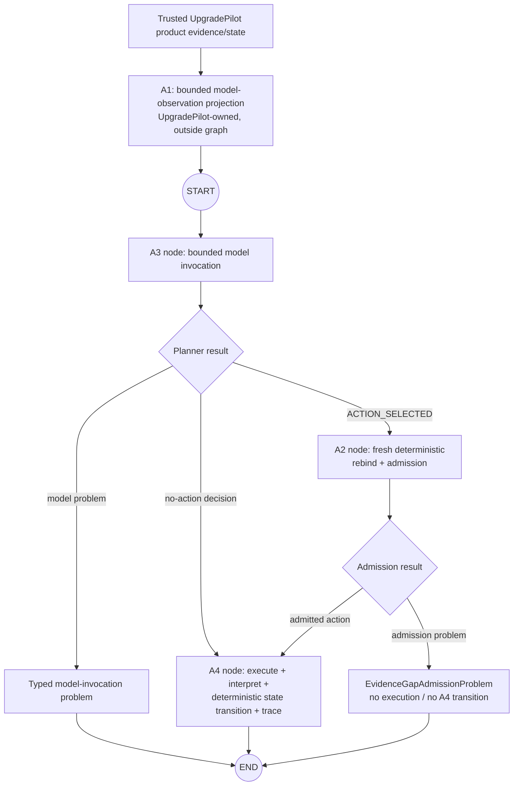
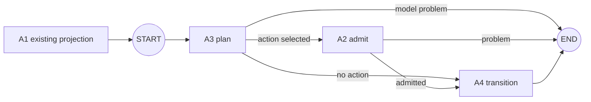

# B2/X1 R4-B LangGraph Research and Design Proposal

**Status:** Candidate / non-controlling proposal  
**Recorded:** 2026-09-02  
**Repository evidence horizon:** `main@5c3036cddf88e1eec9bef02e91ae38fcbbe6f534` (`Record R4-B LangGraph LbD mechanics checkpoint`)  
**Research horizon:** current official LangGraph/LangChain documentation and Python reference consulted on 2026-09-02  
**Responsibility:** B2/X1 R4-B — LangGraph implementation/comparison entry  
**Operation:** research + analysis + design support only

> **Authority / stop line**
>
> This file is a non-controlling proposal under `proposals/README.md`. It does **not** authorize
> LangGraph or LangChain adoption, dependency changes, implementation, source/test modification,
> product-runtime integration, automatic multi-turn planning, a second investigation action,
> checkpointing, or any route/state change. `MEMORY.md` remains the sole owner of live project
> position. Any implementation still requires a later explicit decision and the appropriate
> controlling plan/Build path.

---

## Executive conclusion

The current evidence supports a **real LangGraph comparison**, but not a framework-driven rewrite.
The strongest current reason to use LangGraph in R4-B is its explicit typed workflow/state/routing
model around already-established UpgradePilot responsibilities. The current evidence does **not**
justify using persistence, interrupts, automatic retries, ToolNode, subgraphs, parallelism, or an
agent loop merely because the framework provides them.

The smallest serious baseline I recommend discussing is:

1. keep the existing **A1 model-observation projection** as an UpgradePilot-owned boundary before
   the graph rather than manufacturing a graph node for a pure projection;
2. use a small `StateGraph` for the branch-bearing orchestration from **A3 model invocation** through
   **A2 fresh deterministic admission** to **A4 transition**;
3. keep **A2 as a separate deterministic node/guard** because proposal -> execution authorization is
   a real authority boundary, not presentation structure;
4. keep **A4 cohesive** for the first comparison because its effect, interpretation, immutable state
   update, transition trace, and pure replay already form one proven transition owner;
5. keep existing UpgradePilot domain objects wrapped as typed graph-state values instead of
   flattening them into framework-shaped dictionaries;
6. put external/run-scoped dependencies such as `GitHubRepositoryClient` in LangGraph runtime
   context rather than graph state;
7. use explicit conditional edges for planner/admission routing; and
8. keep `EvidenceGapTransitionTrace` + `replay_evidence_gap_transition(...)` as the semantic replay
   proof. LangGraph checkpoint/time-travel replay is a different mechanism and must not replace it.

Conceptually:



This proposal recommends that shape only as the **first R4-B comparison baseline to discuss**. It
is not a LangGraph adoption decision.

---

# A. Current evidence horizon

## A.1 Governance and current owners inspected

The investigation started from the current `main` head and followed the repository authority
route rather than treating the task prompt as live-state authority.

Inspected governance/operation owners:

- `AGENTS.md`
- `MEMORY.md`
- `OPERATING_GUIDE.md`
- `.agents/skills/upgradepilot-planning-design/SKILL.md`
- `.agents/skills/upgradepilot-learning-by-doing/SKILL.md`
- `plans/README.md`
- `proposals/README.md`

Inspected current R4 owners:

- `plans/B2_X1_POST_RESEARCH_EVIDENCE_GAP_PLANNER_LBD_IMPLEMENTATION_PLAN.md`
- `plans/B2_X1_R4_LBD_LEARNING_DEPTH_AND_REENTRY_MAP.md`
- `working-memory/2026-09-02_B2-X1-R4A4-runtime-lbd-and-reconciliation-closure.md`
- `working-memory/2026-09-02_B2-X1-R4B-langgraph-lbd-entry.md`

The live branch verification for this investigation was:

- branch: `main`
- head: `5c3036cddf88e1eec9bef02e91ae38fcbbe6f534`
- head message: `Record R4-B LangGraph LbD mechanics checkpoint`

That matters because R4-B is **not** a blank framework-entry state anymore. The current R4-B
working memory has already established the three relevant branch classes:

1. planner semantic branching;
2. admission branching; and
3. execution-outcome classification.

It deliberately leaves graph schema, exact node boundaries, A4 splitting, checkpointing, and some
routing representation unresolved.

## A.2 R4-A source/evidence seam inspected

Only the source/tests needed for the real R4-A comparison seam were inspected.

| Responsibility | Current owner / evidence | Established meaning |
|---|---|---|
| A1 model observation + decision contract | `experiments/b2_x1_evidence_gap_planner.py` | `EvidenceGapPlannerContext` is the bounded model-visible observation; `EvidenceGapDecision` is strict untrusted model output; explicit rendering prevents internal fields from becoming model-visible by accident. |
| Real product -> A1 composition | `experiments/b2_x1_evidence_gap_composition.py` | Reuses product-owned dependency/proposition/CI evidence and projects only justified planning semantics; does not re-derive product truth. |
| A3 local model invocation | `experiments/b2_x1_evidence_gap_model.py` | One bounded LM Studio structured-output call; returns `EvidenceGapDecision` or typed `EvidenceGapModelInvocationProblem`; no execution authority. |
| A2 deterministic rebinding/admission | `experiments/b2_x1_evidence_gap_admission.py` | T2 current trusted state is separate from T1 planner observation; selected `action_id` is rebound to exact hidden action identity/preconditions/policy/result contract before execution. |
| A4 transition/update/trace/replay | `experiments/b2_x1_evidence_gap_transition.py` | One already-admitted branch executes/interprets, updates immutable investigation state, records `EvidenceGapTransitionTrace`, and supports pure replay without model/GitHub I/O. |
| Real S001 proof | `experiments/b2_x1_s001_real_flow_a4_transition.py` | Normal S001 product evidence -> A1 -> local A3 -> fresh A2 -> exact A4 target read -> state transition -> trace -> pure replay comparison. |
| Focused tests | `experiments/tests/test_b2_x1_evidence_gap_{planner,model,admission,transition}.py` and composition-focused coverage | Boundary exposure, strict model result, fresh authority checks, semantic result vs operational failure, no-action behavior, state/budget/consumption semantics, and replay. |

## A.3 What is actually established now

The committed evidence records establish the following R4-A control semantics:

```text
trusted UpgradePilot state/evidence
    -> A1 bounded model-visible projection
    -> A3 local model invocation
    -> EvidenceGapDecision               # proposal, not authority
    -> A2 fresh deterministic admission
    -> AdmittedInvestigationAction       # exact execution authorization
    -> A4 execution / interpretation / immutable state transition / trace
```

Durable semantic distinctions already proven by the current control include:

- model-visible state != hidden execution authority;
- `EvidenceGapDecision` != execution authorization;
- graph/workflow progress must not be confused with a trusted domain transition;
- a valid typed target-declaration problem is a **semantic result**, not an operational failure;
- semantic result => investigation budget spent **and** action consumed;
- expected external acquisition failure before valid semantic evidence => budget spent, action **not** consumed, domain assessment unchanged;
- admission rejection => no execution and no fake A4/domain transition;
- no-action decision => no capability execution and only the bounded continuation status changes;
- replay == deterministic reduction from recorded evidence, **not** external re-execution.

The repository records the focused R4 runtime family as `47/47 PASS` and the bounded A4 test set as
`7/7 PASS`. The real S001 A4 proof records:

- action: `acquire_exact_target_python_declaration`;
- exact PR head: `aa2dc024d33f61cdef50bf1973ab5adf0a974f5a`;
- exact target path: `pyproject.toml`;
- target declaration observed: `requires-python = ">=3.10"`;
- applicability: `unresolved -> established_not_applicable`;
- remaining investigation budget: `1 -> 0`;
- action consumed on the semantic-result path; and
- replay equivalent to the recorded A4 after-state.

**Evidence limit:** this research task did not rerun those tests or runtime probes. It treats the
committed test/runtime records as the current evidence horizon and does not strengthen them into a
new runtime claim.

---

# B. Current framework facts relevant to R4-B/R4-C

Official documentation/reference consulted on 2026-09-02 reports `StateGraph` in LangGraph Python
reference `v1.2.11` and LangChain Python `create_agent` reference `v1.3.18`. Those are framework
reference versions at research time, **not** UpgradePilot dependency pins or adoption choices.

## B.1 LangGraph facts that materially affect this design

| Mechanism | Current framework fact | R4 implication |
|---|---|---|
| `StateGraph` | Nodes read shared state and return partial state updates; builder must be `compile()`d before `invoke()`/stream/async execution. | Good structural match for explicit bounded orchestration; not a reason to rewrite domain owners. |
| State schemas | Explicit overall, input, and output schemas are supported; internal/private channels can also exist. | We can keep an internal orchestration envelope smaller/different from public graph input/output. |
| Private channels | Internal/private channels constrain node/input/output access, but **are not automatically redacted from streaming**. | Never treat LangGraph “private state” as the security boundary that protects hidden execution authority from the model. A1’s explicit projection remains the authority boundary. |
| Partial updates | With no custom reducer, a state key is overwritten by the latest update. Custom reducers merge/accumulate. | The current sequential single-turn seam does not need custom reducers. Default overwrite semantics are simpler and safer for singleton typed outcomes. |
| `START` / `END` | Virtual start/terminal nodes define entry and completion. | Useful only as workflow topology; no domain semantics should be attached to them. |
| Normal edges | Static next step. Multiple outgoing normal edges execute destinations in parallel. | Avoid multiple static outgoing edges in the baseline; accidental parallelism would change semantics. |
| Conditional edges | Router reads current state and chooses one/more destinations or `END`. | Strong fit for current planner/admission branches. |
| `Command` | Can combine state update + dynamic `goto`; also supports resume/parent routing. Docs recommend conditional edges when routing alone is needed. | Credible alternative, but baseline should prefer ordinary node updates + explicit conditional edges so work and routing remain independently inspectable. |
| Runtime `context_schema` | Run-scoped dependencies/configuration can be passed outside graph state and accessed through injected `Runtime`. | Strong fit for `GitHubRepositoryClient`, model/planner dependency, and other non-state runtime resources. |
| Errors | Docs distinguish transient retryable errors, LLM-recoverable state errors, human-fixable interrupts, recovery handlers, and unexpected exceptions. | UpgradePilot’s typed model/admission/A4 outcomes must not be turned into framework exceptions merely because error facilities exist. |
| Retry/error handlers | Node retry policy, timeout, and newer error-handler facilities exist. | They can silently change “attempt”, budget, and external-call semantics; defer until UpgradePilot explicitly defines retry semantics and idempotency. |
| Checkpointing | A checkpointer saves graph-state snapshots at super-step boundaries and enables thread history, HITL, time travel, and fault tolerance. | Potential future operational value, but no current R4 requirement. |
| Time-travel “replay” | Replaying from a checkpoint re-executes downstream nodes, including LLM calls/API requests/interrupts. | **Not equivalent** to UpgradePilot semantic replay. It cannot replace `EvidenceGapTransitionTrace` or A4 pure replay. |
| Resume/idempotency | On checkpoint resume/interrupt, affected node execution can restart at a node boundary/from the start of the interrupted node; prior side effects may rerun. | Node boundaries become operationally consequential only if/when persistence/resume is adopted. This is one future reason to reconsider A4 splitting, not a current reason. |
| Interrupts/HITL | `interrupt()` + checkpointer + thread ID can pause for approval/input and resume with `Command(resume=...)`. | Useful future mechanism only if a real human approval/input responsibility appears. Current read-only one-action seam has no such requirement. |
| Tracing/observability | Graph nodes have native tracing/debugging support; LangSmith can provide trace/debug/evaluation. | Potential comparison value, but semantic proof should not depend on an external observability service. |
| Subgraphs | Graphs can be composed as reusable nodes/subgraphs. | No current reusable nested/multi-agent responsibility justifies them. |
| Parallelism / `Send` | Multiple destinations/super-step execution and dynamic fan-out are supported. | Explicitly future-only while R4 owns one sequential admitted action. |
| `ToolNode` | Prebuilt model-tool execution node supports tool calls, injected state/context/store, parallel calls, and error handling. | Structurally useful for tool-calling agents, but dangerous for R4-B if it turns model tool selection into execution and thereby obscures/duplicates A2. |

## B.2 Expected control outcomes vs exceptions

A key framework lesson is that LangGraph does **not** require every non-happy outcome to be an
exception. State values + conditional routing are first-class workflow control.

For R4-B, the current UpgradePilot classifications should therefore remain explicit:

| Current result | Graph treatment for baseline | Why |
|---|---|---|
| `EvidenceGapDecision` no-action kind | typed state value -> conditional route to A4 no-action transition | Expected semantic planner result. |
| `EvidenceGapModelInvocationProblem` | typed terminal workflow result | Expected bounded provider/structured-output failure; no decision exists. |
| `EvidenceGapAdmissionProblem` | typed terminal workflow result | Deterministic expected denial; no capability execution and no A4 transition. |
| A4 semantic result, including typed target problem | remain inside `EvidenceGapTransitionTrace` | It is valid domain evidence and already has tested consumption/budget semantics. |
| `EvidenceGapOperationalFailure` | remain inside `EvidenceGapTransitionTrace` | It is a recognized operational outcome with existing budget/non-consumption semantics, not an unknown framework failure. |
| Unexpected programmer/framework exception | bubble/fail normally unless a later policy explicitly handles it | Do not hide bugs by mapping every exception into domain state. |

This preserves an important agent-engineering mental model: **workflow routing, expected failure,
domain uncertainty, and unexpected exceptions are different categories.**

## B.3 Checkpoints/history/replay are a different responsibility from A4 trace/replay

The terminology collision is significant enough to make explicit:

| UpgradePilot | LangGraph | Equivalence? |
|---|---|---|
| `EvidenceGapTransitionTrace` | graph trace/checkpoint/state history | **No.** The UpgradePilot trace records semantic before/decision/admission/outcome/after evidence for one domain transition. Framework traces/checkpoints record workflow execution/state snapshots. |
| `replay_evidence_gap_transition(trace)` | time-travel replay from a checkpoint | **No.** UpgradePilot replay re-applies recorded semantic outcome with no LM Studio or GitHub I/O. LangGraph time-travel replay re-executes downstream nodes and re-triggers LLM/API calls. |
| domain transition proof | checkpoint recovery/fault tolerance | **Different jobs.** They may coexist later. |

Therefore checkpointing cannot currently “replace” A4 trace/replay. At most it can add a second,
workflow-operational evidence layer if a real persistence/debug/recovery need appears.

## B.4 LangChain’s current relationship to LangGraph

Current LangChain documentation defines an agent as a model calling tools in a loop until a task
is complete. `create_agent(...)` returns a compiled LangGraph graph and its default control flow is:

```text
model -> tool calls? -> tools -> model -> ... -> no tool calls -> finish
```

LangChain agents are explicitly built on LangGraph and inherit its lower-level persistence,
durable execution, HITL, and orchestration capabilities.

Relevant R4-C mechanisms include:

- common chat-model abstractions and `init_chat_model`;
- direct model structured output via `with_structured_output(...)`;
- `create_agent(response_format=...)` using provider-native or tool-based structured-output
  strategies;
- tool calling and `ToolRuntime` injection;
- middleware around model/tool/agent lifecycle;
- guardrails, retries/fallbacks, early termination, and HITL middleware.

Two current details matter especially for UpgradePilot:

1. `ToolRuntime` parameters can be injected into a tool without being included in the tool schema
   shown to the model. This is a useful mechanism for hidden runtime dependencies, but **hidden
   arguments are not execution authorization**. If the model is allowed to call a tool, A2’s
   deterministic freshness/policy authority still has to exist somewhere explicit.
2. LangChain `ToolStrategy` structured-output handling can automatically feed validation errors
   back to the model and retry. That differs from the current A3 one-call typed-failure semantics,
   so an R4-C comparison must treat retry behavior as a semantic variable rather than a free
   improvement.

## B.5 What LangGraph should prove before LangChain

R4-B should teach/prove the lower-level questions first:

```text
explicit workflow state
-> explicit routing
-> deterministic authority boundary inside a graph
-> side-effect/domain-transition ownership
-> graph trace vs semantic trace distinction
-> framework overhead vs clarity
```

Only then can R4-C meaningfully ask what higher-level LangChain abstractions add or obscure:

```text
model abstraction / structured-output convenience
-> tool schema + tool-calling semantics
-> agent loop
-> middleware / lifecycle hooks
-> guardrails / retries
```

If R4-B already uses `create_agent`/ToolNode as the main architecture, the later R4-C comparison is
contaminated because the key LangChain-style agent/tool loop has effectively been adopted early.

---

# C. Concept mapping — UpgradePilot vs framework mechanisms

Classification used below:

- **Direct structural analogue** — closely matches a framework primitive structurally, while
  UpgradePilot still owns the semantics.
- **Partial analogue** — looks similar but important semantics differ.
- **Framework carrier** — framework can transport/execute the concept but does not define it.
- **No appropriate analogue** — the responsibility should remain explicitly UpgradePilot-owned.

| UpgradePilot concept | LangGraph / LangChain relationship | Classification | R4-B consequence |
|---|---|---|---|
| `EvidenceGapPlannerContext` | Can be a typed graph-state/input value; LangChain agent context/messages are not the same contract. | Framework carrier | Preserve the existing bounded object; do not replace it with generic `messages`/agent state. |
| `EvidenceGapDecision` | Typed node output can drive conditional routing; LangChain structured response can carry similar shape. | Partial analogue | Keep the existing untrusted decision type; routing on it does not grant authority. |
| `EvidenceGapAdmissionState` | A graph can carry state, but LangGraph does not provide “fresh deterministic authorization state” as a domain concept. | No appropriate analogue | Reconstruct/read fresh T2 state inside A2 responsibility; never equate it with T1 planner/graph state. |
| `AdmittedInvestigationAction` | Can be a typed node output/state value; tool calls are superficially similar but not equivalent. | Framework carrier | Keep exact UpgradePilot type as the authorization token into A4. |
| `EvidenceGapAdmissionProblem` | Natural typed expected branch to `END` or another node. | Direct structural analogue for routing only | Preserve domain reason/type; no fake domain transition. |
| `EvidenceGapInvestigationState` | LangGraph has shared workflow state, but this object is UpgradePilot trusted evolving domain state. | Partial analogue | **Wrap it inside graph state; do not flatten/equate it with the whole graph state.** |
| `EvidenceGapOperationalFailure` | Could be represented as state or an exception, but current semantics deliberately make it a typed A4 outcome. | Partial analogue | Keep it inside the existing A4 trace; do not convert it into framework exception routing for convenience. |
| `EvidenceGapTransitionTrace` | Framework traces/checkpoints/history record execution mechanics, not the same semantic proof. | No appropriate replacement | Keep it UpgradePilot-owned and separately testable. |
| A1 model-observation projection | Graph node could host it, but LangGraph privacy/state schemas do not establish model visibility authority. | Framework carrier | Existing explicit renderer/projection remains the owner; graph placement is an orchestration choice only. |
| A3 model invocation | Ordinary graph node can invoke a model/runtime dependency and return a partial update. | Direct structural analogue | Good first graph node in minimal baseline. |
| A2 admission/revalidation | Deterministic graph node/guard is a natural structural home. | Framework carrier | Separate node strongly justified because it changes authority, not because it is named A2. |
| A4 execution + state reduction | Ordinary graph node can perform effect and return state/trace update. | Direct structural analogue | Keep cohesive first; split only for a demonstrated framework/operational need. |
| UpgradePilot replay | LangGraph checkpoint replay/time travel re-executes downstream nodes. | **Non-equivalent** | Never use graph replay as proof of semantic replay equivalence. |
| `GitHubRepositoryClient` | Run-scoped dependency through `context_schema` / injected `Runtime`. | Direct structural analogue | Keep out of graph state and out of model-visible context. |
| hidden exact action identity | Runtime/context can hide values from model-facing schemas; ToolRuntime can hide injected parameters. | Partial analogue | Hiding is not authorization. A2 remains necessary. |
| action consumption/budget semantics | Framework state/reducers can store numbers/lists, but their meaning is domain-owned. | Framework carrier | Continue to update only through established UpgradePilot transition semantics. |

## C.1 Terminology rule for R4-B

Use qualified names whenever ambiguity is plausible:

- **UpgradePilot investigation/domain state** = `EvidenceGapInvestigationState` and the product/domain
  evidence it contains.
- **LangGraph workflow state** = the orchestration envelope used to move typed values between graph
  steps.
- **UpgradePilot transition trace** = `EvidenceGapTransitionTrace`.
- **framework trace/checkpoint/history** = LangGraph/LangSmith execution records.
- **UpgradePilot semantic replay** = pure deterministic state reduction from recorded transition
  evidence.
- **LangGraph replay/time travel** = resume/re-execute graph work after a prior checkpoint.

This naming discipline is not cosmetic; it prevents framework state from accidentally becoming a
new source of domain truth.

---

# D. Credible R4-B architecture alternatives

## D.1 Alternative 1 — Minimal orchestration graph (recommended first baseline)

**Shape:** preserve A1 outside the graph; graph only the branch-bearing orchestration.



**Graph state:** small wrapper around existing types, approximately:

```text
planner_context: EvidenceGapPlannerContext                 # graph input
investigation_state: EvidenceGapInvestigationState         # graph input/current trusted domain state
planner_result: EvidenceGapDecision | EvidenceGapModelInvocationProblem
admission_result: AdmittedInvestigationAction | EvidenceGapAdmissionProblem
transition_trace: EvidenceGapTransitionTrace
```

This is a conceptual shape, not an implementation contract. Optional/internal fields and exact
input/output schemas remain a joint design choice.

**Runtime context/resources:**

- bounded model/planner runtime dependency;
- `GitHubRepositoryClient`;
- the narrow current-state capability needed to build/read fresh A2 admission state at T2.

**Routing:** conditional edges after A3 and A2; static `START -> A3` and `A4 -> END`.

**A4:** remains one cohesive transition node. Semantic result vs operational failure remains typed
inside the existing transition trace because both currently end the bounded turn.

**Value:** makes the framework earn its place specifically through visible control flow, typed
state movement, and runtime-resource separation while preserving the plain-Python semantic owners.

**Cost:** smallest graph, fewest new state fields, least duplicated architecture.

**Authority risk:** low if A2 remains explicit and hidden action/client data never enters the model
projection.

**Future extensibility:** adequate. A1 can be moved into the graph, A4 can be split, or persistence
can be added later only when evidence requires it.

## D.2 Alternative 2 — Boundary-visible four-stage graph

**Shape:** expose A1 as a distinct graph node before A3.

```text
START -> A1 project -> A3 model -> [no-action | A2 admission] -> A4 -> END
```

**Graph state:** must additionally carry enough trusted input for A1 and then carry the produced
`EvidenceGapPlannerContext` across the A1/A3 node boundary.

**Advantages:**

- visually teaches the model-observation boundary;
- makes A1 -> A3 data movement inspectable as a graph step;
- may improve graph-level observability of what was projected before model invocation.

**Costs / risks:**

- adds a graph node even though A1 currently performs pure deterministic projection rather than a
  branch or effect;
- may require carrying a larger trusted product object or additional composition inputs through
  workflow state;
- increases the chance of confusing “private graph channel” with “not model-visible”; and
- starts moving a security/authority boundary into framework topology even though the actual
  safety property still comes from UpgradePilot’s explicit renderer.

**Assessment:** credible, especially for learning/observability, but not the minimum-useful baseline.
It should be chosen only if we jointly decide that making A1 an explicit graph step provides enough
learning or inspection value to pay for the extra state plumbing.

## D.3 Alternative 3 — Split A4 effect and deterministic reduction

**Shape:** make external acquisition and deterministic state reduction separate nodes, potentially
with explicit semantic/operational routing.

```text
... -> A2 admit -> execute exact action -> classify outcome -> reduce/update/trace -> END
```

**Advantages:**

- effect boundary becomes separately observable;
- later checkpoint/retry/idempotency design can isolate external I/O;
- pure reduction becomes an explicit graph step;
- could support distinct downstream handling for semantic vs operational outcomes later.

**Costs / risks:**

- duplicates a cohesion boundary that is already tested and replayable in A4;
- graph state must carry raw/intermediate execution result or failure between nodes;
- creates more invalid intermediate-state combinations;
- can tempt us to substitute graph checkpointing for semantic trace/replay;
- creates framework architecture before any current downstream branch actually needs the split.

**Assessment:** technically plausible but currently premature. The plain-Python A4 already contains
pure reduction helpers internally, so we can split later without losing the conceptual capability.

## D.4 More framework-native ToolNode / agent-loop design — deliberately not an R4-B baseline

A design where the model issues a LangChain/LangGraph tool call and `ToolNode` executes the target
investigation would be framework-native, but it is not a clean R4-B comparison yet.

The problem is semantic, not stylistic: a normal model -> tool loop makes model tool selection part
of the execution control path. UpgradePilot currently requires:

```text
model proposal -> fresh deterministic A2 authority -> exact execution
```

ToolNode can hide runtime arguments from the model, but that does not prove freshness, policy,
source identity, budget, consumption, or proposition preconditions. Wrapping A2 inside a tool is
possible, but then R4-B would already be experimenting with the higher-level tool/agent semantics
that R4-C is supposed to compare.

Therefore ToolNode/`create_agent` should remain available for R4-C rather than being smuggled into
R4-B.

## D.5 Trade-off summary

| Dimension | Alt 1: minimal orchestration | Alt 2: boundary-visible | Alt 3: split A4 |
|---|---:|---:|---:|
| Semantic distance from R4-A | **lowest** | low | medium |
| New graph-state plumbing | **lowest** | medium | highest |
| Explicit A1 visibility | low | **highest** | medium |
| Explicit effect observability | medium | medium | **highest** |
| A2 authority clarity | **high** | **high** | **high** if preserved |
| Replay preservation simplicity | **highest** | high | medium |
| Checkpoint/resume extensibility | medium | medium | **highest** |
| Ceremony tax now | **lowest** | medium | highest |
| Risk of framework-driven redesign | **lowest** | medium | highest |
| Best first comparison? | **Yes** | plausible alternative | not yet |

---

# E. Recommended first R4-B design direction

## E.1 Recommendation

Use **Alternative 1: minimal orchestration graph** as the first implementation/comparison baseline
**if we jointly authorize implementation later**.

The key design idea is that node boundaries should correspond to meaningful workflow/authority
changes, not mechanically to every current helper function:

- **A1 remains outside the graph** because the durable responsibility is “construct the exact
  bounded observation shown to the model.” It is a security/context boundary, but currently not a
  branch-bearing workflow step.
- **A3 becomes a graph node** because it introduces a stochastic/external boundary and produces a
  typed result that controls routing.
- **A2 becomes its own graph node** because it transforms an untrusted proposal into either exact
  execution authorization or explicit rejection under fresh current state.
- **A4 remains one graph node** because the current bounded turn has one cohesive trusted transition
  owner and neither semantic-result nor operational-failure currently needs a different downstream
  workflow.

This is deliberately **not** “one node per A-number.” It happens to preserve A3/A2/A4 as separate
nodes because those three boundaries have current control/authority meaning. A1 stays outside for
the opposite reason.

## E.2 Recommended state philosophy

**Wrap, do not flatten.**

The graph should contain existing UpgradePilot values rather than restating their fields as new
framework-owned state channels. Example principles:

- keep `EvidenceGapInvestigationState` as one trusted domain-state value;
- keep `EvidenceGapDecision` / model problem as the exact typed planner result;
- keep `AdmittedInvestigationAction` / admission problem as the exact typed admission result;
- keep `EvidenceGapTransitionTrace` as the exact transition evidence;
- add a graph-specific discriminator only if LangGraph typing/routing genuinely needs one, not just
  for cosmetic convenience.

This avoids two truths such as:

```text
graph.remaining_budget
vs
investigation_state.remaining_investigations
```

where the framework wrapper could drift from the domain owner.

## E.3 What should cross node boundaries

Only values that another node/router actually needs:

1. the bounded `EvidenceGapPlannerContext` entering A3;
2. current `EvidenceGapInvestigationState`;
3. A3’s typed result;
4. A2’s typed result when A2 runs; and
5. the A4 transition trace/final domain state when A4 runs.

Do **not** carry raw repository content, `GitHubRepositoryClient`, provider session objects, exact
hidden action authority merely for convenience, prompt templates, or generic message history.

## E.4 Runtime context vs graph state

Use LangGraph runtime context for **run-scoped dependencies**, not evolving domain facts.

Candidate runtime responsibilities:

- local model/planner dependency used by A3;
- `GitHubRepositoryClient` used by A4;
- a narrow trusted current-state access/composition capability used by A2 to establish T2 admission
  state **after** the model result exists.

The exact shape of that A2 freshness capability is still an implementation-design decision. What
is already non-negotiable is the semantic rule: do not precompute T2 admission state at T1 and call
it “fresh” merely because it is stored in LangGraph state.

## E.5 Routing choice

Prefer **conditional edges** for the first graph:

```text
A3 result:
    model invocation problem -> END
    no-action decision       -> A4 transition
    ACTION_SELECTED          -> A2 admission

A2 result:
    admission problem        -> END
    admitted action          -> A4 transition

A4:
    -> END
```

`Command` is valid framework machinery, but it combines update + routing in a node. The baseline is
more educational and comparable if node functions return typed updates and small pure routers own
only routing.

## E.6 A4 semantic result vs operational failure

Do **not** add a graph-level branch merely to visualize the distinction yet.

Both outcomes currently terminate the bounded turn. A4 already records the distinction and applies
different trusted state semantics:

```text
semantic result:
    budget spent
    action consumed
    domain assessment updated

operational failure:
    budget spent
    action not consumed
    domain assessment unchanged
```

A separate graph route becomes justified only when the next workflow step differs—for example a
retry policy, compensation, escalation, user-visible diagnostic path, or a second planning turn.

## E.7 Plain Python vs LangGraph comparison target

The direct comparison should be the **same bounded responsibility under controlled inputs**, not
“which framework produced prettier code.” Compare:

- branch correctness;
- exact authority boundary;
- before/after `EvidenceGapInvestigationState`;
- budget/consumption semantics;
- external calls that occurred or did not occur;
- transition trace and pure replay equivalence;
- testability;
- state/routing clarity;
- extra framework state/plumbing;
- debugging/observability value; and
- dependency/conceptual overhead.

---

# F. Open decisions and answers to the current design questions

| # | Design question | Current proposal answer | Status for joint discussion |
|---:|---|---|---|
| 1 | Wrap existing domain objects or flatten fields? | **Wrap existing typed objects.** Flattening creates duplicate ownership and drift risk. | Strong baseline recommendation. |
| 2 | What genuinely crosses nodes? | Only planner context, trusted investigation state, typed planner result, typed admission result, and transition trace/final state. | Strong baseline recommendation. |
| 3 | Graph state vs runtime context? | Evolving/routing evidence in state; model/client/current-state dependencies in runtime context. | Strong baseline recommendation. |
| 4 | Store `EvidenceGapPlannerContext` or project only when needed? | For minimal baseline, construct A1 outside and pass the bounded context as graph input; do not accumulate copies. | **Open:** Alt 2 can make A1 a node if we value graph-visible projection enough. |
| 5 | `EvidenceGapDecision` intermediate graph value? | Yes. It is the real untrusted proposal and the planner router/A2 consumer need it. | Strong baseline recommendation. |
| 6 | A2 separate deterministic node/guard? | **Yes.** This is the most important authority boundary to keep visually and structurally explicit. | Strong baseline recommendation. |
| 7 | How should `EvidenceGapAdmissionProblem` terminate/route? | Direct terminal workflow outcome; no execution and no A4/domain transition. | Already aligned with current R4-B semantics. |
| 8 | A4 cohesive or split execute/update? | Cohesive first. Internal pure reducers already exist, so no capability is lost. | Reopen only on concrete operational/control need. |
| 9 | Separate graph route for semantic result vs operational failure? | Not yet; both end the bounded turn and A4 already preserves the semantic difference. | Deferred unless downstream behavior diverges. |
| 10 | Preserve existing replay proof how? | Keep `EvidenceGapTransitionTrace`; run existing pure replay and assert replayed state == trace after-state; zero model/GitHub I/O during replay. | Required proof. |
| 11 | Can checkpoints/history replace transition trace? | **No.** Different responsibility and different replay behavior. | Settled by current semantics + framework docs. |
| 12 | What compare directly with plain Python? | Same initial typed state/context, same controlled model output, same fresh admission conditions, same external result/failure, same final state/trace/call behavior. | Required R4-B/R4-D evidence. |
| 13 | Which LangGraph features remain deferred? | Checkpointing, interrupts, automatic retries/error handlers, custom reducers, subgraphs, ToolNode, parallelism/`Send`, automatic loops, persistence store, framework-native agent tooling. | Strong recommendation. |
| 14 | What future evidence reopens checkpoints/interrupts/parallelism? | Real crash/resume or long-running need; real human approval/input need; real independent multiple admitted actions with defined concurrency semantics. | Triggered, not calendar-based. |
| 15 | Which plain-Python parts may be implementation artifacts? | Exact function/module boundaries, raw LM Studio HTTP adapter, A4’s single public function shape, and concrete client construction may change. Durable responsibilities are bounded observation, untrusted proposal, fresh deterministic authorization, authorized effect + trusted reduction, and semantic trace/replay. | Important R4-B learning conclusion. |

## F.1 The genuinely open decisions before coding

The current evidence does **not** require us to pretend every detail is decided. The main items I
would bring to the joint design discussion are:

1. **A1 placement:** keep the projection outside the first graph (recommended) or pay the extra
   plumbing for an explicit A1 graph node?
2. **Exact graph input/output schema:** what is the smallest typed envelope that is easy to compare
   without leaking internal intermediate fields into the public result?
3. **T2 freshness mechanism:** what existing/narrow owner should the A2 node call to establish fresh
   `EvidenceGapAdmissionState` without inventing an unnecessary repository abstraction?
4. **Intermediate state lifetime:** should the graph output expose planner/admission intermediate
   results for comparison, or filter them behind an output schema while keeping them inspectable in
   focused tests?
5. **Naming:** use an explicit name such as `EvidenceGapWorkflowState`/`R4BLangGraphState` so nobody
   later mistakes framework workflow state for `EvidenceGapInvestigationState`.

Everything beyond those items should remain evidence-driven rather than opened as speculative
architecture work.

## F.2 Durable responsibilities vs current implementation artifacts

| Likely durable responsibility | Current implementation that may be replaced/rearranged |
|---|---|
| exact bounded model observation | exact A1 composition/helper placement |
| strict untrusted planner proposal | current JSON/request rendering mechanics |
| one bounded structured model invocation | `LocalEvidenceGapPlanner` + direct LM Studio HTTP adapter |
| fresh deterministic action authorization | exact `EvidenceGapAdmissionState` construction function/location |
| exact trusted source acquisition capability | concrete `GitHubRepositoryClient` construction/plumbing |
| semantic interpretation and trusted state reduction | whether A4 is one graph node or later effect/reducer nodes |
| semantic transition evidence + pure replay | exact trace serialization/presentation |

This is the correct abstraction level for R4-B: preserve responsibilities unless evidence justifies
redesign, but do not freeze incidental Python function boundaries as architecture forever.

---

# G. Proposed Learning-by-Doing sequence

The learning route should stay attached to the real R4-B design decision rather than becoming a
framework tutorial.

| Step | Concept | What it is / job here | Depth needed now | Deliberately defer |
|---:|---|---|---|---|
| 1 | **Workflow state vs domain truth** | LangGraph state is the shared orchestration snapshot; UpgradePilot investigation state remains the trusted domain object inside it. This determines the schema philosophy. | Be able to explain why wrapping preserves ownership and why duplicate flattened fields are dangerous. | Persistent state migration/versioning. |
| 2 | **Partial updates + runtime context** | Nodes return only changed state keys; runtime context carries dependencies such as model/client rather than evolving evidence. This decides what crosses boundaries. | Design the minimum state/context split for A3/A2/A4. | Stores, deployment/runtime server concerns. |
| 3 | **Edges, conditional routing, `Command`** | Edges represent control flow; conditional edges separate routing from node work; `Command` can combine update+route. This maps our planner/admission branches. | Be able to draw and explain every current route and why admission rejection does not create a domain transition. | Dynamic fan-out, parent commands, complex handoffs. |
| 4 | **Expected outcome vs exception** | Typed semantic/model/admission/operational outcomes are not automatically framework failures. | Map each current union/outcome to route vs trace vs exception. | Automatic compensation/retry policy. |
| 5 | **Authority inside an agent workflow** | A model decision can select a candidate without owning executable identity. A2 is a deterministic policy/freshness gate. | Be able to explain why ToolNode hidden args do not replace admission. | Rich tool-policy/guardrail middleware. |
| 6 | **Semantic replay vs workflow checkpoint replay** | Our replay is pure deterministic reduction; LangGraph replay/time travel re-executes downstream work. | Be able to prove the difference using the real S001/A4 trace model. | Persistence/checkpoint implementation. |
| 7 | **Implement the smallest graph only after the design choice** | Build the chosen A3/A2/A4 topology and compare with the plain-Python control under deterministic fixtures. | Enough framework API to compile/invoke and test routing/state. | Loops, parallelism, HITL. |
| 8 | **Then enter R4-C** | Evaluate LangChain’s model abstraction, structured output, tool/agent loop, and middleware now that lower-level graph behavior is understood. | Compare what abstraction removes and what authority/semantics it obscures. | Broad agent-platform design. |

High-value AI/LLM/agent-engineering knowledge in this sequence is not memorizing LangGraph syntax.
It is learning to distinguish **model observation, model proposal, deterministic authorization,
effect execution, domain state, workflow state, and replay/fault-tolerance semantics**. Those
concepts transfer beyond LangGraph/LangChain.

---

# H. Proof strategy for the eventual R4-B comparison

No tests are changed by this proposal. If implementation is later authorized, the proof should be
small, controlled, and directly comparable to R4-A.

## H.1 Controlled equivalence first

The strongest comparison should hold model/external nondeterminism constant:

- inject/stub the same A3 result into plain-Python and LangGraph paths;
- provide the same fresh A2 conditions;
- provide the same fake/exact repository acquisition result or failure; and
- compare outcomes rather than relying on a live LLM to independently choose the same wording/path
  twice.

For each scenario assert:

```text
plain Python final EvidenceGapInvestigationState
==
LangGraph final EvidenceGapInvestigationState
```

and, when A4 ran:

```text
plain semantic transition semantics
==
LangGraph semantic transition semantics

replay_evidence_gap_transition(graph_trace)
== graph_trace.after_state
```

## H.2 Focused scenario matrix

| Scenario | Required graph path | Required invariant |
|---|---|---|
| A3 invocation/structured-output problem | A3 -> END | No A2/A4 execution; no domain/budget/consumption transition. |
| `QUESTION_SETTLED` | A3 -> A4 no-action -> END | continuation only; no capability/budget/consumption/domain evidence change. |
| `KNOWN_INVESTIGATION_OUTSIDE_CURRENT_BOUNDARY` | A3 -> A4 no-action -> END | same current no-action semantics. |
| `NO_JUSTIFIED_INVESTIGATION_IDENTIFIED` | A3 -> A4 no-action -> END | same current no-action semantics. |
| action selected, fresh A2 rejects | A3 -> A2 -> END | exact rejection reason; **no** repository call; no A4/domain transition. |
| action admitted, valid declaration | A3 -> A2 -> A4 -> END | exact action identity; budget spent; action consumed; domain assessment updated; replay equal. |
| action admitted, typed target problem | A3 -> A2 -> A4 -> END | still semantic result; budget spent; action consumed; domain updated to established unresolved target semantics; replay equal. |
| action admitted, GitHub acquisition failure | A3 -> A2 -> A4 -> END | budget spent; action not consumed; domain unchanged; typed operational failure; replay equal. |

A2 rejection coverage should retain the already-proven stale/consumed/budget/policy/actionability
cases. The graph-specific proof only needs to prove those existing outcomes route correctly and do
not acquire new semantics.

## H.3 Authority-boundary proof

The LangGraph experiment should separately prove:

- A3 still receives only `EvidenceGapPlannerContext` through the existing explicit renderer;
- repository/revision/path/preconditions/result-family/mutation authority remain absent from the
  model payload;
- model explanation or graph state cannot redefine exact executable identity;
- A2 obtains T2 current state after A3 output and can reject a proposal that became stale while the
  model was reasoning; and
- `GitHubRepositoryClient` is never model-visible merely because it is available in runtime context.

Also remember: LangGraph internal/private channels are not an information-security boundary for
streaming. Tests should prove **model projection**, not merely absence from a selected `invoke()`
output.

## H.4 External-call proof

Use mocks/fakes/call assertions to prove:

- no A2 call on no-action model decisions;
- no repository call on model invocation problem;
- no repository call on A2 rejection;
- exactly one expected repository call on an admitted bounded action in the baseline; and
- zero model/repository calls during UpgradePilot semantic replay.

## H.5 Real S001 proof after controlled tests

After deterministic equivalence is green, one bounded real S001 graph smoke can prove that the
framework path composes with real UpgradePilot evidence/runtime resources.

It should stay comparable to the existing S001 reference:

```text
real product evidence
-> existing A1 projection
-> LangGraph A3/A2/A4 orchestration
-> exact target result / state transition
-> transition trace
-> pure replay equivalence
```

A live local-model result is evidence of runtime behavior, not a substitute for deterministic
semantic-equivalence tests.

## H.6 Comparison report dimensions

R4-B/R4-D should record both benefits and costs:

- responsibility clarity;
- branch readability;
- authority-boundary clarity;
- state duplication/plumbing;
- test complexity;
- framework-specific failure modes;
- observability/debuggability;
- replay/debug terminology burden;
- dependency/runtime overhead;
- learning value; and
- evidence-backed future extensibility.

The success condition is **not** “LangGraph works.” It is “we can state precisely what it improves,
what it costs, and whether the same semantics remain provable.”

---

# I. Deferred features and explicit reopening triggers

| Feature | Why explicitly deferred now | Concrete trigger to reopen |
|---|---|---|
| Checkpointer / persistent graph history | No current long-running/resume/thread need; risks confusing workflow history with semantic replay. | A real crash/restart recovery, long-running pause, thread continuity, or checkpoint-debug requirement. |
| LangGraph time-travel replay | Re-executes downstream LLM/API work and therefore has different semantics. | Use only as a workflow debugging/forking feature alongside—not instead of—semantic replay. |
| Interrupts / HITL | Current action is read-only and already deterministically admitted; no real human approval/input requirement. | A concrete action needs human approval/edit/input before continuation. |
| Automatic retry policy | Retries alter attempt count, external calls, budget/consumption interpretation, and possibly model results. | UpgradePilot defines explicit retry semantics + idempotency + budget accounting for that failure class. |
| `error_handler` / compensation branch | Current typed outcomes already have explicit handling; unexpected errors should surface. | A recognized post-retry failure requires a specific recovery/compensation workflow. |
| Custom reducers | One sequential writer per current state value; default overwrite is sufficient. | Parallel writers or legitimate accumulation semantics appear. |
| `Command` routing | Conditional edges make current update vs route ownership clearer. | A node genuinely must atomically express a state update plus dynamic destination and separate routers become duplication. |
| `ToolNode` | Normal tool loop risks bypassing/obscuring A2 and belongs to later LangChain/tool comparison. | R4-C explicitly compares tool-calling while preserving/re-testing deterministic admission. |
| `create_agent` | Adds default model/tool loop and agent-message state, contaminating lower-level R4-B comparison. | R4-C after the lower-level LangGraph baseline is understood. |
| Subgraphs | No reusable nested/multi-agent responsibility exists in current seam. | A real reusable nested workflow or separately-owned agent responsibility appears. |
| Parallelism / `Send` | Current seam authorizes one sequential action; concurrency would add reducer/freshness/race semantics. | Two or more independent admitted actions exist and concurrent execution has a defined benefit and authority model. |
| Automatic multi-turn/loops | Explicitly outside current R4 evidence; could accidentally create repeated investigation. | A second real planning turn/action is admitted with explicit continuation, budget, anti-repeat, and stopping semantics. |
| Persistent Store / cross-thread memory | No current cross-run agent memory responsibility. | A real cross-thread/user/application memory requirement appears. |
| Streaming as required architecture | Nice observability, no current user-facing need; internal channels can expose more state than output schema. | A concrete UX/diagnostic requirement needs progressive updates, with explicit output/redaction policy. |
| LangSmith as proof dependency | Useful observability but external tracing is not semantic correctness. | Adopt only if trace/evaluation value justifies operational dependency; tests remain authoritative. |

---

# J. Risks / traps

## J.1 Framework-shaped architecture

**Trap:** splitting every helper into a node or adopting every LangGraph primitive because it exists.

**Control:** node boundaries must pay for themselves through routing, authority, effect isolation,
observability, or a current operational need.

## J.2 Duplicated authority

**Trap:** model tool call, conditional edge, or graph state becomes a second authorization mechanism
beside A2.

**Control:** only `AdmittedInvestigationAction` produced by fresh deterministic admission authorizes
A4 execution.

## J.3 Giant graph state

**Trap:** carry the full product investigation, raw evidence, action catalog, provider objects,
client objects, prompts, and every intermediate field through shared state.

**Control:** wrap the smallest existing typed objects that downstream nodes actually need; runtime
dependencies go in context.

## J.4 Workflow state mistaken for domain truth

**Trap:** add flattened graph fields such as `budget`, `supported_python`, or `action_consumed` and
later read them instead of canonical domain owners.

**Control:** graph state contains `EvidenceGapInvestigationState`; graph-specific fields describe
workflow outputs, not duplicated domain facts.

## J.5 “Private graph state” mistaken for model secrecy

**Trap:** assume an internal/private channel cannot leak because it is absent from graph output.
Current docs explicitly note private channels may still appear in streaming.

**Control:** A1 explicit model projection remains the security/authority boundary. Model visibility
is proven at the request renderer/model node, not inferred from graph schema names.

## J.6 Checkpoint replay confused with semantic replay

**Trap:** delete/replace `EvidenceGapTransitionTrace` because LangGraph has history/time travel.

**Control:** retain semantic trace + pure replay. Treat checkpoint history as a separate optional
workflow/debug/fault-tolerance layer.

## J.7 Expected outcomes converted into exceptions

**Trap:** map `EvidenceGapAdmissionProblem`, typed target problems, or recognized A4 operational
failure into generic graph exceptions just to use retry/error-handler machinery.

**Control:** preserve current typed semantics. Reserve exception handling for actual exceptional
conditions or explicitly designed retry classes.

## J.8 Retry silently changes budget semantics

**Trap:** a framework retry causes three GitHub/model calls but UpgradePilot still records one
investigation attempt without an explicit policy decision.

**Control:** no retries in baseline. Define attempt/budget/idempotency semantics first if retries are
later considered.

## J.9 ToolNode bypasses deterministic admission

**Trap:** expose `acquire_exact_target_python_declaration` as a normal model tool and let tool-call
selection directly execute it.

**Control:** R4-B does not use ToolNode. R4-C may compare tool calling only with explicit A2
preservation and proof.

## J.10 Accidental multi-turn behavior

**Trap:** `create_agent`, message history, checkpoint threads, or a graph back-edge creates an agent
loop that keeps investigating.

**Control:** first R4-B topology is acyclic and bounded to one model decision + at most one admitted
action.

## J.11 Premature A4 splitting

**Trap:** split external execution, interpretation, result classification, state reduction, and
trace merely to make the graph look richer.

**Control:** keep the proven cohesive owner until a real downstream route, retry/resume boundary, or
observability requirement needs the split.

## J.12 False freshness

**Trap:** create `EvidenceGapAdmissionState` before A3, store it in graph state, then run A2 later and
still call it “fresh.”

**Control:** establish/read T2 current admission state inside the A2 responsibility after the model
result exists.

## J.13 Tracing becomes a hidden data leak

**Trap:** move hidden executable authority into graph state for convenience, then emit all state via
stream/tracing.

**Control:** keep sensitive/executable resources in runtime context where appropriate, minimize
state, explicitly choose observable outputs, and remember that operator observability and model
visibility are separate threat boundaries.

## J.14 LangChain abstraction erases the R4-C question

**Trap:** use `create_agent`, ToolNode, or middleware in R4-B so heavily that R4-C has nothing clean
left to compare.

**Control:** R4-B stays lower-level. Preserve A3 model abstraction/tool-loop/middleware choices for
R4-C.

---

# R4-C responsibilities deliberately left available

The first R4-B baseline should leave these comparisons untouched for later R4-C:

1. **Model abstraction:** direct LM Studio HTTP adapter vs LangChain chat-model interface.
2. **Structured output:** current strict provider JSON schema/parser vs
   `with_structured_output(...)` / LangChain provider strategy.
3. **Tool representation:** current action descriptor + deterministic A2 vs LangChain tool schema and
   tool-call lifecycle.
4. **Agent loop:** explicit one-decision bounded graph vs `create_agent` model/tool loop.
5. **Middleware:** whether model/tool lifecycle hooks improve observability/guardrails without hiding
   authority or introducing retries/loops.
6. **Guardrails:** what is genuinely framework-level policy vs what remains UpgradePilot semantic
   admission/revalidation.

A particularly clean R4-C experiment may be to replace **only A3’s provider abstraction first**
while keeping A1/A2/A4 unchanged. That would reveal the value/cost of LangChain’s model + structured
output abstraction before evaluating its higher-level tool/agent loop.

---

# Authoritative framework sources consulted

All sources below were consulted as current official documentation/reference on 2026-09-02.

## LangGraph

- StateGraph reference: https://reference.langchain.com/python/langgraph/graph/state/StateGraph
- Runtime reference: https://reference.langchain.com/python/langgraph/runtime/Runtime
- Conditional-edge reference: https://reference.langchain.com/python/langgraph/graph/state/StateGraph/add_conditional_edges
- Graph API overview: https://docs.langchain.com/oss/python/langgraph/graph-api
- Persistence/checkpointing: https://docs.langchain.com/oss/python/langgraph/persistence
- Time travel/replay: https://docs.langchain.com/oss/python/langgraph/use-time-travel
- Interrupts: https://docs.langchain.com/oss/python/langgraph/interrupts
- Thinking in LangGraph / failure handling: https://docs.langchain.com/oss/python/langgraph/thinking-in-langgraph
- ToolNode reference: https://reference.langchain.com/python/langgraph.prebuilt/tool_node/ToolNode
- ToolRuntime reference: https://reference.langchain.com/python/langgraph.prebuilt/tool_node/ToolRuntime

## LangChain

- LangChain overview / relationship to LangGraph: https://docs.langchain.com/oss/python/langchain/overview
- Agents: https://docs.langchain.com/oss/python/langchain/agents
- `create_agent` reference: https://reference.langchain.com/python/langchain/agents/factory/create_agent
- Tools / ToolRuntime: https://docs.langchain.com/oss/python/langchain/tools
- Structured output: https://docs.langchain.com/oss/python/langchain/structured-output
- Model `with_structured_output` reference: https://reference.langchain.com/python/langchain-core/language_models/chat_models/BaseChatModel/with_structured_output
- Middleware overview: https://docs.langchain.com/oss/python/langchain/middleware/overview

---

# Final decision-support position

The current evidence justifies learning and implementing a **small explicit LangGraph orchestration
comparison**, not a redesign of the planner and not a framework adoption decision.

The first design discussion should center on one concrete question:

> **Do we want the minimum three-node A3 -> A2 -> A4 graph with A1 preserved outside, or is the
> learning/observability value of making A1 an explicit graph node worth the extra state plumbing?**

My recommended starting answer is the three-node graph. It exercises the parts of LangGraph that
can add present value—typed workflow state, explicit routing, runtime dependency separation, and
inspectable control flow—while preserving the current deterministic authority and replay semantics.

If that baseline cannot demonstrate clearer control flow, better inspectability, or meaningful
future leverage without disproportionate plumbing, that is valid evidence **against** further
LangGraph use for this responsibility. If it does, we can then compare LangChain in R4-C without
having already collapsed the experiment into an agent/tool framework.

---

`UP-SKILL:upgradepilot-planning-design`  
`UP-SKILL:upgradepilot-learning-by-doing`
