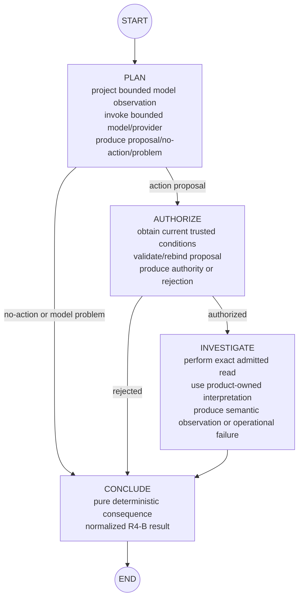

# B2/X1 R4-B Corrected LangGraph Independent Research and Design Proposal

**Status:** Candidate / non-controlling proposal  
**Recorded:** 2026-09-03  
**Repository evidence horizon:** `main@9bb534eda0ef68d701b031b5a19add432a52e910` (`Preserve original R4-B working memory with minimal supersession header`)  
**Research horizon:** current official LangGraph/LangChain documentation and Python reference consulted on 2026-09-03  
**Responsibility:** B2/X1 R4-B — independently design and evaluate the smallest credible LangGraph implementation of the bounded `EvidenceGapPlanner` responsibility under the corrected comparison boundary  
**Operation:** research + analysis + architecture-design support only  
**Relationship to prior proposal:** corrected successor research evidence to `2026-09-02_B2_X1_R4B_LANGGRAPH_RESEARCH_AND_DESIGN_PROPOSAL.md`; the prior file remains unchanged historical evidence

> **Authority / stop line**
>
> This file is a non-controlling proposal under `proposals/README.md`. It does **not** authorize
> LangGraph or LangChain adoption, dependency changes, source/test implementation, product-runtime
> integration, a fabricated second investigation action, automatic multi-turn planning, checkpoint
> persistence, HITL, retry policy, or any plan/memory/specification/ADR change. `MEMORY.md` remains
> the sole owner of live project position. The selected R4-B plan and applicable accepted
> specifications remain controlling.

---

# Executive conclusion

The corrected comparison boundary materially changes the strongest R4-B design.

The first proposal asked too early whether LangGraph should wrap the existing R4-A A1/A3/A2/A4
shape. The current repository route correctly rejects that premise. R4-A is a serious control and
engineering evidence source, but its state classes, A-number decomposition, trace object, replay
function, and module boundaries are not the LangGraph architecture specification.

Starting independently from the bounded responsibility, accepted trust/authority/failure semantics,
reusable product capabilities, R4-A failure lessons, and LangGraph's current execution model, my
strongest first R4-B candidate is now a **small explicit Graph API `StateGraph` with four
responsibility-derived stages**:

```text
START
  ↓
PLAN
  ├─ model/provider problem ───────────────┐
  ├─ explicit no-action ──────────────────┤
  └─ action proposal → AUTHORIZE          │
                        ├─ rejected ───────┤
                        └─ authorized      │
                              ↓            │
                         INVESTIGATE       │
                              ↓            │
                         CONCLUDE ←────────┘
                              ↓
                             END
```

The names are intentional:

- **`plan`** owns the model-facing planning step. It constructs the exact bounded model observation
  immediately at the model boundary, invokes the bounded model/provider dependency, and produces
  an untrusted proposal/no-action/provider-problem outcome.
- **`authorize`** owns the current deterministic pre-effect authority decision. It obtains
  sufficiently current trusted conditions only after a model proposal exists and either produces
  exact executable authority or an explicit rejection.
- **`investigate`** owns the admitted external investigation effect and product-owned interpretation
  needed to turn the effect into a valid semantic observation or expected operational failure.
- **`conclude`** is a pure deterministic consequence/result stage. It converts whichever preceding
  bounded outcome occurred into the final R4-B semantic result: budget consequence,
  action-consumption consequence, final domain/applicability state where relevant, and
  continuation/stopping outcome.

This is **not** A1/A3/A2/A4 under new names:

- the model projection is not pre-assumed to be a separate node or a pre-graph step; it is a local
  boundary inside `plan` unless later evidence earns a separate node;
- the final deterministic consequence is deliberately separated from the external investigation
  effect rather than inheriting R4-A A4 cohesion;
- model problems, no-action outcomes, and authority rejection all converge on one pure conclusion
  stage instead of being forced through R4-A transition machinery;
- graph input, internal state, output, and proof representation are independently designed rather
  than required to be `EvidenceGapPlannerContext`, `EvidenceGapInvestigationState`, or
  `EvidenceGapTransitionTrace`.

For branch-producing nodes, current LangGraph documentation makes **`Command(update=..., goto=...)`**
a stronger first candidate than the previous proposal admitted: when a node both produces a new
workflow value and determines the next destination, `Command` is the framework-native mechanism.
Static edges remain suitable for `investigate -> conclude -> END`. Conditional edges remain a
credible alternative if separating routing from work materially improves inspectability or testing;
they are no longer preferred merely for pedagogy.

The graph should use a **small new experiment-owned workflow communication schema**, with explicit
input/internal/output separation. It may contain existing product-owned domain values where those
values are already the correct truth owner, but it should not mechanically wrap every R4-A class and
must not duplicate product/domain truth into parallel graph fields. Run-scoped service/dependency
objects belong in LangGraph runtime context rather than shared workflow state.

The most important newly surfaced alternative is LangGraph's **Functional API** (`@entrypoint` +
`@task`). It is a first-class LangGraph API using the same runtime and is a serious fit for today's
small sequential/branching responsibility. The previous proposal missed it. I do **not** recommend
building both APIs in the first slice. I recommend the explicit Graph API candidate above because:

1. the current bounded responsibility already has multiple meaningful decision points;
2. explicit authority and effect boundaries benefit from inspectable routing;
3. explicit state/input/output boundaries improve the architecture comparison itself; and
4. already-known future pressure includes additional investigation actions/evidence families and
   potentially bounded repeated planning, where current LangGraph guidance favors the Graph API.

The Functional API should remain the primary alternative/fallback: if the explicit graph requires
more state plumbing or ceremony than its routing/observability/growth value earns, that is evidence
that the Functional API—or ordinary Python—may be the better current implementation.

The semantic comparison must use a **framework-neutral observable result/projection**, not identical
R4-A/R4-B objects or traces. A pure `conclude` stage gives R4-B a clean way to prove deterministic
semantic reconstruction from recorded pre-conclusion inputs/outcomes without re-running the model
or repository effect. R4-A's `EvidenceGapTransitionTrace` remains valid R4-A evidence; it is not the
mandatory R4-B proof object.

No persistence, retry, cache, ToolNode, HITL, subgraph, parallel fan-out, automatic loop, LangSmith
proof dependency, or product integration is justified for the first slice.

---

# 1. Current evidence and corrected comparison boundary

## 1.1 Current repository position

This research followed the current repository owner chain rather than using the task prompt as a
replacement for it.

Material governance / operation owners inspected:

- `AGENTS.md`
- `MEMORY.md`
- `OPERATING_GUIDE.md`
- `.agents/skills/upgradepilot-planning-design/SKILL.md`
- `.agents/skills/upgradepilot-learning-by-doing/SKILL.md`
- `proposals/README.md`

Current R4 owners and handoff evidence inspected:

- `plans/B2_X1_POST_RESEARCH_EVIDENCE_GAP_PLANNER_LBD_IMPLEMENTATION_PLAN.md`
- `plans/B2_X1_R4B_LANGGRAPH_LBD_IMPLEMENTATION_AND_COMPARISON_PLAN.md`
- `plans/B2_X1_R4_LBD_LEARNING_DEPTH_AND_REENTRY_MAP.md`
- `working-memory/2026-09-03_1804_B2-X1-R4B-comparison-boundary-reframe.md`
- historical `working-memory/2026-09-02_B2-X1-R4B-langgraph-lbd-entry.md`
- historical `proposals/2026-09-02_B2_X1_R4B_LANGGRAPH_RESEARCH_AND_DESIGN_PROPOSAL.md`

Applicable accepted semantic owners inspected:

- `docs/specifications/UPGRADEPILOT_CORE_PIPELINE_AND_CONTRACT_SPECIFICATION.md`
- `docs/specifications/UPGRADEPILOT_PRODUCT_DECISION_MODEL_SPECIFICATION.md`

Relevant R4-A implementation/evidence inspected:

- `experiments/b2_x1_evidence_gap_planner.py`
- `experiments/b2_x1_evidence_gap_composition.py`
- `experiments/b2_x1_evidence_gap_model.py`
- `experiments/b2_x1_evidence_gap_admission.py`
- `experiments/b2_x1_evidence_gap_transition.py`
- current recorded focused/runtime evidence through the active plans and `MEMORY.md`.

The repository head immediately before this proposal write was:

```text
main@9bb534eda0ef68d701b031b5a19add432a52e910
Preserve original R4-B working memory with minimal supersession header
```

No LangGraph source implementation has begun under the corrected R4-B route.

## 1.2 Current R4-A evidence horizon

The current committed R4-A control evidence remains:

```text
A1 10/10 PASS
A2 13/13 PASS
A3 13/13 PASS
A4 7/7 PASS
combined focused family 47/47 PASS
real S001 selection/admission PASS
real S001 execution/update/trace/replay PASS
```

The real S001 record includes the exact target `pyproject.toml`, exact PR head
`aa2dc024d33f61cdef50bf1973ab5adf0a974f5a`, observed `requires-python = ">=3.10"`, applicability
`unresolved -> established_not_applicable`, budget `1 -> 0`, action consumption on the semantic
result path, and pure R4-A replay equivalence.

**Evidence limit:** this proposal did not rerun those tests or runtime probes. It uses the committed
records as the current evidence horizon.

## 1.3 Corrected comparison rule

The successor R4-B working memory and current bounded plan correctly establish:

```text
R4-A
= serious ordinary-Python reference/control
= engineering evidence
= learning evidence
= failure-mode / design-pressure evidence
= later comparison evidence

R4-A
!= LangGraph state specification
!= mandatory A1/A2/A3/A4 topology
!= mandatory trace/replay representation
!= mandatory class/type reuse boundary
```

The comparison should therefore hold **responsibility and accepted semantics** constant while
allowing each implementation to use an architecture natural to its mechanism.

The central question becomes:

> **Given the bounded UpgradePilot EvidenceGapPlanner responsibility, accepted product/trust/
> authority/failure/investigation semantics, reusable product-owned capabilities, R4-A evidence,
> and LangGraph's current execution model, what is the strongest small LangGraph workflow we would
> design if R4-A's implementation architecture did not have to be preserved?**

## 1.4 Framework-independent semantic floor

The following are constraints on the R4-B implementation regardless of internal graph shape.
Some are stable product-specification requirements; some are bounded R4 experiment requirements
selected by the current plans.

- model observation is bounded to justified decision context;
- model output is a proposal/semantic output and cannot assign its own execution authority;
- exact source/evidence identity and scope remain trustworthy and inspectable;
- a selected action may execute only after sufficiently current deterministic pre-effect authority
  exists;
- stale/consumed/unknown/disallowed/non-actionable proposals do not execute;
- explicit no-action outcomes remain semantically distinguishable and honest;
- expected semantic/domain result, expected provider/acquisition/operational failure, and unexpected
  implementation/framework defect remain different classes;
- investigation budget and action-consumption consequences remain correct for the bounded
  experiment;
- existing product/domain evidence acquisition and interpretation owners are not silently
  duplicated by framework orchestration;
- forbidden external calls must remain absent after model failure, no-action, or authority
  rejection;
- semantic consequences must remain testable/reconstructable without silently re-running
  nondeterministic/external work where that proof responsibility applies;
- no fabricated second action or automatic multi-turn loop is introduced.

---

# 2. R4-A classification before LangGraph design

The corrected route requires distinguishing what R4-A **proved or taught** from what R4-A merely
**implemented one way**.

A single R4-A mechanism can contain more than one category. The table classifies its material
responsibilities rather than pretending every file belongs to exactly one bucket.

## 2.1 Accepted framework-independent requirements / invariants

| R4-A concept/evidence | Underlying responsibility/problem | Framework-independent conclusion |
|---|---|---|
| Explicit model-visible context | Internal trusted state may contain facts the model does not need and must not control. | The actual model request must expose only justified planning information. Graph-private/internal state is not sufficient proof of this. |
| `EvidenceGapDecision` treated as untrusted | Schema-valid model output is still model output. | Model proposal/no-action semantics may guide workflow routing but cannot grant exact execution authority. |
| T1 planner observation vs T2 admission state | Trusted conditions can change while model reasoning occurs. | Sufficiently current deterministic conditions must be established immediately before the effect boundary; stale planner observation cannot be treated as current authority. |
| Rejection suppresses execution | An unknown/stale/consumed/disallowed proposal must not reach the external effect. | Pre-effect authority rejection is a normal bounded workflow outcome and must prevent the effect. |
| Explicit no-action kinds | Unresolved or stopped investigation is not equivalent to success or negative evidence. | No-action/stopping semantics remain explicit; no framework may manufacture an action or stronger conclusion. |
| Semantic result vs operational failure vs defect | A valid target problem can itself be evidence, while GitHub/provider failure is lack of that semantic observation; code bugs are different again. | Failure classes must not collapse for framework convenience. |
| Budget / consumption consequences | An attempted bounded investigation consumes budget under the current experiment; action consumption depends on whether valid semantic evidence was obtained. | The R4 comparison must preserve the bounded experiment's consequences even if internal state representation differs. |
| Exact evidence identity/scope | Evidence meaning depends on repository/revision/path/context identity. | The graph may orchestrate acquisition but does not weaken product evidence/provenance requirements. |
| Honest stopping | `unresolved + no further justified investigation` is a valid endpoint. | Graph termination cannot silently mean established-not-applicable, safe, or generally sufficient. |

## 2.2 Reusable product-owned capabilities

These are not R4-A architecture merely because R4-A calls them. They already own product/domain
truth that R4-B should reuse when the same responsibility is needed.

| Capability / owner | Why reuse matters in R4-B |
|---|---|
| `PublicPullRequestInvestigation` and product-owned dependency/CI/impact outputs | They establish real upstream evidence/state. LangGraph should not re-parse or reinterpret the same product truth to create its own planner facts. |
| `GitHubRepositoryClient.get_exact_commit_text_file(...)` | Existing exact repository/revision/path acquisition owner. A framework node may call it; the framework should not invent a second exact-head acquisition contract. |
| `interpret_target_python_declaration(...)` | Existing target declaration interpretation owner. |
| `evaluate_target_python_relevance(...)` | Existing candidate/target relevance owner. |
| `evaluate_python_support_drop_impact(...)` | Existing domain impact reevaluation owner after valid target evidence. |
| Product-owned proposition/assessment and dependency identity values | Reuse their established semantic meaning rather than restating those facts as LangGraph-specific truth. |

`experiments/b2_x1_evidence_gap_composition.py` is useful evidence for how current product outputs can
feed the planner, but it remains experiment-owned projection/composition code. It is **not** itself
a product-owned capability that R4-B must preserve unchanged.

## 2.3 R4-A engineering lessons / evidence

These should pressure the independent LangGraph design even when the implementation form changes.

| Lesson | What problem caused it | R4-B design pressure |
|---|---|---|
| Explicit projection prevented accidental model visibility | Automatic serialization could expose newly added trusted fields. | Keep the model projection explicit and adjacent enough to the model boundary that visibility can be tested directly. |
| Strict structured decision parsing was useful | Provider schema validity does not prove cross-field semantics or authority. | Preserve strict bounded output semantics, but exact R4-A parser/type need not be reused. |
| Typed provider problems improved diagnosis | Transport/HTTP/envelope/truncation/structured-output failures are meaningfully different from a valid planner decision. | Preserve expected provider/problem classification rather than treating every failure as a generic graph exception. |
| T1/T2 separation exposed freshness/TOCTOU pressure | Model reasoning can race current trusted state. | Authorization must obtain current conditions after proposal, not precompute a supposedly fresh snapshot before the model call. |
| Exact action rebinding kept hidden authority out of model control | A stable action label should not let the model redefine repo/path/policy/preconditions. | R4-B needs an exact deterministic capability/authority step; its physical representation is open. |
| Valid typed target problems are semantic evidence | A target declaration may legitimately be absent/unsupported while acquisition succeeded. | Investigation output must distinguish valid semantic problem from provider/acquisition failure. |
| Operational failure and semantic result have different consumption effects | An attempt can spend budget without producing reusable semantic evidence. | Pure consequence logic should encode this explicitly and be easy to prove. |
| Pure replay/reduction was valuable | External re-execution would make semantic proof nondeterministic and expensive. | R4-B needs deterministic semantic reconstruction/proof, but not necessarily the R4-A trace object or replay function. |
| Generic executor registry was unnecessary with one real action | Abstraction pressure exceeded current capability count. | Do not add a framework action registry/fan-out solely because future families are expected. |

## 2.4 R4-A / ordinary-Python implementation choices

The following are open design choices unless another owner independently requires them:

- exact `EvidenceGapPlannerContext` dataclass shape;
- exact `EvidenceGapDecision` dataclass and parser location;
- exact `EvidenceGapAdmissionState`, `BoundInvestigationAction`,
  `AdmittedInvestigationAction`, and `EvidenceGapAdmissionProblem` class shapes;
- exact `EvidenceGapInvestigationState` representation;
- exact `EvidenceGapTransitionTrace` representation;
- exact `replay_evidence_gap_transition(...)` API;
- A1/A3/A2/A4 module/function boundaries;
- direct LM Studio HTTP adapter implementation details;
- A4's choice to combine external acquisition, semantic interpretation, deterministic state
  consequence, trace construction, and replay support behind one public transition seam;
- passing `EvidenceGapPlannerContext` as the direct model planner API input;
- wrapping state transitions through `dataclasses.replace(...)`;
- current one-file/one-function placement decisions.

## 2.5 Classification consequence

The R4-B design should repeatedly ask:

> **What problem made this R4-A mechanism necessary? Does LangGraph need to solve that problem in
> the same way, a different way, or not at all?**

This avoids both failure modes:

```text
implementation retention bias
→ Python structure becomes accidental LangGraph architecture

fake framework independence
→ accepted/product-owned truth is duplicated under new LangGraph names
```

---

# 3. Current LangGraph mechanisms materially relevant to this responsibility

Official LangGraph documentation currently presents **two first-class APIs** built on the same
runtime:

1. **Graph API** — explicit state, nodes, edges, conditional routing, visualization;
2. **Functional API** — `@entrypoint` + `@task`, ordinary Python control flow, less explicit state
   plumbing.

That API-level choice is itself an R4-B architecture decision. The previous proposal did not
consider it.

## 3.1 Mechanism classification

| Mechanism | Current framework fact | R4-B classification | Reason |
|---|---|---|---|
| Graph API / `StateGraph` | Nodes read shared state and return partial updates; explicit input/output schemas and runtime context; compile before invoke/stream. | **Useful for first implementation; recommended candidate.** | Current responsibility already has multiple decision points and trusted boundaries worth making explicit. |
| Functional API / `@entrypoint` | Standard Python `if`/loops/function calls; no required explicit shared graph state; same underlying runtime. | **Credible alternative worth comparing.** | Very proportionate for the current one-action bounded flow and provides a lower-ceremony LangGraph option. |
| `@task` | Discrete work returning futures; with persistence, completed task results can be restored rather than recomputed. | **Credible alternative/future boundary; not required first.** | Useful if persistence/side-effect replay later matters; without a checkpointer it adds limited present value. |
| Input / internal / output state schemas | `StateGraph` may expose a smaller input/output contract than internal state. | **Useful first.** | Supports a small caller/result contract while keeping intermediate proposal/authority/observation data internal. |
| Default overwrite state channels | State keys overwrite unless reducers are declared. | **Useful first.** | Current first slice is sequential and single-writer per stage value; no custom reducer needed. |
| Runtime context | `context_schema` / injected `Runtime` carries run-scoped dependencies outside graph state. | **Useful first.** | Model/provider callable, current-authority supplier, and repository client are dependencies/resources rather than evolving workflow facts. |
| `Command(update, goto)` | A node can update state and route in one step; current docs recommend it when both are needed. | **Useful first; preferred for branch-producing nodes.** | `plan` and `authorize` naturally produce a result and choose the next responsibility together. |
| Conditional edges | Router decides destination based on state; useful when only routing is needed. | **Credible first alternative.** | Valuable if independent router testing/visibility outweighs extra functions; no longer preferred by default. |
| Multiple normal outgoing edges | All destinations execute in parallel next superstep. | **Relevant caution; not a first feature.** | Accidental multiple static edges could change semantics. |
| Streaming | `updates`, `values`, custom streams, task events, etc. | **Operationally useful but not required architecture.** | Helpful for debugging; no current user-facing streaming responsibility. |
| Private/internal state channels | Can be hidden from `invoke` output but are not automatically hidden from streaming. | **Important safety fact.** | Graph-private is not model-private or operator-secret. Actual model projection remains the boundary. |
| Native graph visualization | Explicit Graph API topology can be rendered. | **Current comparison value.** | Useful for inspecting authority/effect routing and later growth, but not correctness proof. |
| Retry policy / error handlers / timeouts | Framework can retry node failures, handle errors, apply node defaults, and time out async nodes. | **Future capability, currently unjustified.** | Retries can change external-call, budget, and idempotency semantics. Existing provider timeout does not need migration merely because framework supports one. |
| Cache policy | Node/task results may be cached. | **Currently risky/unjustified.** | Currentness is part of authority/evidence semantics; stale cache reuse could violate the very boundary R4-B is proving unless cache identity/invalidation is explicitly designed. |
| Checkpointer / persistence | Saves workflow checkpoints for thread memory, HITL, time travel, fault tolerance. | **Future capability, currently unjustified.** | No current long-running/resume/thread responsibility. |
| Functional task replay | On resume, completed task results can be restored; unfinished tasks may run again; side effects should be idempotent. | **Important future design fact.** | Shows why effect boundaries matter if durable execution is later adopted, but does not justify tasks/checkpointing now. |
| Interrupt / HITL | Pauses workflow; resumed Graph API node restarts from its beginning. | **Future only.** | No current human approval/input responsibility. |
| Subgraphs | Compose nested workflows. | **Future only.** | Reopen when an investigation family becomes a real separately cohesive/reusable workflow. |
| Parallelism / `Send` | Fan-out work and merge state; multiple writers may require reducers. | **Future only.** | No current multiple independently admitted actions/concurrency semantics. |
| `RemainingSteps` / recursion limit | Runtime guard against too many graph supersteps. | **Future guard, not domain budget.** | Must never replace UpgradePilot investigation budget/stopping semantics. |
| ToolNode / ToolRuntime | Model tool-call execution with state/context injection, parallelism, error handling, Commands. | **Credible later/R4-C alternative; not first R4-B.** | It changes the planning interface into a tool-call lifecycle and can obscure deterministic authority unless explicitly wrapped/re-proven. |
| LangChain `create_agent` | Higher-level model/tool loop built on LangGraph with prebuilt agent semantics. | **R4-C, not first R4-B.** | It changes multiple variables at once and weakens the lower-level orchestration comparison. |
| LangChain structured-output strategies | Agent/model abstractions support provider/tool-based structured responses and configurable error handling. | **R4-C.** | R4-B should keep model/provider semantics controlled while evaluating orchestration. |
| LangSmith / tracing policy | Framework has tracing/observability controls; node trace policy can transform recorded payload but is not a secrets-redaction guarantee. | **Useful optional observability, not correctness/security proof.** | R4-B tests remain the semantic oracle; sensitive/model-hidden data still needs explicit boundary control. |

## 3.2 Graph API vs Functional API is the first architecture fork

Current official guidance favors the Graph API for:

- explicit shared state;
- multiple conditional decision points;
- workflow visualization/debugging;
- parallel paths/merges;
- workflows where explicit topology improves understanding.

It favors the Functional API for:

- minimal changes to procedural code;
- standard `if`/`else`/loops/function calls;
- simple/linear workflows;
- function-scoped state;
- rapid lower-boilerplate prototypes.

Both share LangGraph's runtime and can later coexist or migrate.

R4-B currently sits near the boundary:

```text
CURRENT PRESSURE
one model decision
+ one deterministic authority decision
+ at most one external investigation
+ several explicit terminal outcomes

KNOWN GROWTH PRESSURE
more real investigation actions/evidence families
+ possibly richer branching
+ possibly bounded repeated planning when independently admitted
```

The current workflow is small enough that Functional API is credible. It is also already branchful
enough that explicit Graph API structure can earn value now. This is why both are serious, but only
one should be built first.

## 3.3 `Command` changes the routing conclusion from the previous proposal

Current official docs say:

```text
need only dynamic routing
→ conditional edge

need state update + dynamic routing together
→ Command(update=..., goto=...)
```

In the independently derived design, `plan` naturally creates a proposal/problem and simultaneously
determines whether workflow goes to `authorize` or `conclude`. `authorize` similarly creates an
authority outcome and routes to `investigate` or `conclude`.

Therefore `Command` is not merely syntactic novelty here. It can remove separate router helpers that
would read the value the node just produced and repeat the same classification.

Important caution from current docs: a node should not simultaneously use a dynamic `Command`
destination and an unconditional static edge for the same next-step responsibility, because both
can run. Static edges should therefore be used only where routing is static, such as
`investigate -> conclude -> END` in the proposed topology.

## 3.4 Runtime context is dependency injection, not authority

Candidate runtime context fields include:

- bounded model/provider callable/client;
- current trusted authority-state supplier/composer;
- `GitHubRepositoryClient` or narrower exact acquisition capability;
- stable run configuration needed by those dependencies.

Placing something in `Runtime.context` does **not** make it trusted or authorized by itself. Trust
comes from the owning product/domain contract and deterministic checks. Runtime context only solves
workflow dependency plumbing.

## 3.5 Model observation remains an explicit projection problem

LangGraph input/internal/output schemas do not decide what the model sees. Private channels may also
appear in streaming. The actual safety/authority boundary remains:

```text
trusted workflow/product information
→ explicit model-facing projection
→ provider/model request
```

The new design therefore keeps projection **inside the `plan` responsibility immediately before
model invocation** unless a separate graph step later earns value. This preserves the actual
security/authority property without forcing A1's old physical placement.

## 3.6 Persistence/replay is a different responsibility from semantic proof

LangGraph persistence solves workflow continuity/fault tolerance/HITL/time-travel concerns. With
Functional API, resume replays the entrypoint while completed task/subgraph results may be restored
from checkpoints; an unfinished task may run again. With interrupts, Graph API nodes resume by
restarting the affected node from its beginning.

That is not the same problem as:

```text
recorded bounded semantic observation/outcome
+ deterministic consequence rules
→ reconstruct the same semantic result
without model/repository I/O
```

R4-B can satisfy the latter through a pure deterministic `conclude` stage and focused tests. A
checkpointer is not required for that proof.

---

# 4. Independently derived architecture space

## 4.1 Derivation questions

Before choosing a node count, ask only the responsibility questions:

```text
what does the workflow need from the caller?
what exact subset may the model observe?
what output may the model control?
what current trusted facts must be checked before any effect?
what operation performs external I/O?
what makes that I/O valid semantic evidence versus operational failure?
what deterministic consequences follow from each bounded outcome?
what information must cross between those responsibilities?
what final result does the caller/comparison actually need?
```

This produces four meaningful responsibility changes independent of R4-A's A-number layout:

```text
PLAN
proposal/no-action/provider problem

AUTHORIZE
proposal -> exact current execution authority OR rejection

INVESTIGATE
admitted authority -> external observation / expected operational failure

CONCLUDE
bounded outcome -> deterministic semantic/domain/continuation consequences
```

## 4.2 Why these four stages independently earn existence

### `plan`

A real stochastic/provider boundary occurs and produces the first workflow decision value. It is
also the only location where model observation is material. This is a natural node.

### `authorize`

The workflow crosses from **model suggestion** to **permitted external effect**. Current trusted
conditions must be obtained after the suggestion exists. Rejection changes routing. This boundary
has independent trust and control-flow meaning, so a separate node is justified even without R4-A
A2 precedent.

### `investigate`

This is the only admitted external repository effect in the first slice. Separating the effect from
the final deterministic consequence gives a clear effect boundary and leaves product acquisition/
interpretation with their existing owners.

### `conclude`

All preceding outcome families need one normalized final semantic result. A pure final stage:

- centralizes budget/consumption/continuation consequence rules;
- avoids constructing final results differently in `plan`, `authorize`, and `investigate`;
- makes deterministic semantic reconstruction testable without re-running the model or repository;
- provides a natural later place to decide whether another planning turn is justified **if** such a
  turn is ever admitted;
- is useful now even with no persistence.

This is the strongest intentional divergence from R4-A A4. It earns one extra graph step through
proof and responsibility clarity, not through framework aesthetics.

## 4.3 Recommended first topology



Suggested routing mechanics:

```text
PLAN
→ Command(update=proposal/problem, goto=AUTHORIZE or CONCLUDE)

AUTHORIZE
→ Command(update=authority/rejection, goto=INVESTIGATE or CONCLUDE)

INVESTIGATE
→ state update with observation/operational failure
→ static edge to CONCLUDE

CONCLUDE
→ final normalized result
→ static edge to END
```

Conditional edges remain acceptable if implementation evidence shows separate routers materially
improve clarity/proof. Do not add routers solely to expose more LangGraph syntax.

---

# 5. Recommended state / data model

## 5.1 Do not choose between “wrap R4-A” and “flatten R4-A”

That is still an R4-A-centered question.

The correct StateGraph question is:

> **What values must be communicated between the independently justified workflow stages?**

The first candidate should use a small experiment-owned internal state envelope with stage values
such as, conceptually:

```text
start_input
planner_outcome
execution_authority_outcome
investigation_outcome
final_result
```

The exact names/types are Build-time details. The design rules are more important:

- use existing product/domain objects where they already own the needed truth;
- do not mirror product/domain fields into independent graph fields unless routing/proof requires a
  separate representation;
- do not store clients/sessions in graph state;
- do not carry raw repository content farther than the next product interpretation step requires;
- do not preserve intermediate values merely because R4-A had a class for them;
- prefer one writer per stage field in the first sequential graph;
- no custom reducers unless actual multi-writer/parallel accumulation appears.

## 5.2 Input / internal / output separation

### Graph input

The caller should provide the smallest trusted starting responsibility data needed to formulate the
bounded planning question and later derive current authority. It should not be forced to construct
R4-A's `EvidenceGapPlannerContext` merely because that is today's Python control input.

The graph input may legitimately include or reference:

- the real product investigation/candidate evidence state;
- the bounded planning question;
- trusted consumed-investigation history;
- bounded investigation budget;
- the current offered action semantics/selection needed for the bounded responsibility.

The exact representation is unresolved until the ownership trace decides whether current R4-A
composition helpers can be reused without importing Python-specific structure.

### Internal state

Only information needed by a later node or final proof belongs here:

- planner proposal/no-action/provider problem;
- deterministic authority outcome;
- exact authorized action/capability token when admission succeeds;
- semantic investigation observation or expected operational failure;
- final normalized result.

### Graph output

The public R4-B result should expose the bounded responsibility result needed by callers/tests, not
all internal graph state. Intermediate graph values remain test/trace evidence without becoming the
public semantic contract.

## 5.3 Type strategy

A proportionate first implementation could use:

```text
TypedDict
→ graph communication envelope

small immutable/discriminated values
→ planner outcome / authority outcome / investigation outcome / final result
```

Pydantic, dataclass-only state, or another supported StateGraph schema form remain valid if they
materially improve validation/clarity. Exact framework typing syntax is not an architecture goal.

The important requirement is to avoid a giant `total=False` bag whose arbitrary optional
combinations cannot be reasoned about. Each stage should have a small expected input set and produce
one clear next-stage value.

## 5.4 Runtime context

Runtime context should carry run-scoped dependencies such as:

```text
model/provider dependency
current-authority-state supplier / trusted composition capability
repository acquisition client/capability
```

It should not carry evolving budget, consumed actions, proposal outcome, domain conclusion, or other
values whose semantic consequence must be inspected by the workflow/comparison.

---

# 6. Model interaction design

## 6.1 R4-B should isolate orchestration from LangChain provider abstraction

LangGraph itself is the orchestration framework under evaluation. Pulling LangChain model/tool
abstractions into the same first slice would change another major variable and weaken R4-C.

Therefore the first graph should keep the model/provider behavior as controlled as practical.
A reasonable implementation strategy is to reuse the current bounded local provider callable or a
thin adapter around it **as experimental control**, not because its class shape is architecturally
mandatory.

The architecture should not require the graph's public state/input to become
`EvidenceGapPlannerContext`. If the current provider callable is reused, a narrow adapter can build
the model-facing value locally inside `plan`.

Before Build, the exact reuse decision should pass the normal retention/ownership question:

```text
reuse current provider/projection helper
→ does it hold the model variable constant with less duplication?
→ does it accidentally force R4-A state/classes into graph architecture?
→ can a small adapter preserve isolation without creating a second semantic truth?
```

## 6.2 Structured output

The first R4-B implementation should preserve the same bounded semantic output family:

- one action proposal;
- explicit no-action kind;
- expected provider/structured-output problem when no usable planner decision exists.

It does not need to preserve the exact `EvidenceGapDecision` class or JSON parser if an independently
clean representation is better. But changing to LangChain `ProviderStrategy`, `ToolStrategy`, or a
`create_agent` structured-response lifecycle belongs to R4-C unless packaging reality forces a
smaller dependency consequence that is separately analyzed.

---

# 7. Deterministic execution-authority design

## 7.1 Required responsibility

The stable boundary is:

```text
model proposal
!= executable authority
```

For an action proposal, the workflow must establish sufficiently current trusted execution
conditions **after** the proposal exists and immediately before the effect boundary.

The authority responsibility includes, where applicable to the bounded current action:

- selected action identity exists in the current trusted set;
- not already consumed;
- investigation budget remains;
- exact source identity is current;
- current execution/mutation policy admits the action;
- current proposition/precondition state still makes the action actionable;
- exact repository/revision/path/result authority comes from trusted code/data rather than model
  echo.

## 7.2 Why `authorize` should be a node

A separate node is independently justified because:

- it has a different trust source from the model step;
- it must acquire/check current state at a later time boundary;
- it can terminate the workflow before any external effect;
- it is a useful observability/test boundary;
- later multiple actions can share a common proposal->authority contract even if their execution
  families differ.

This conclusion happens to resemble R4-A A2, but its justification no longer depends on A2's
existence.

## 7.3 What is still open

The exact implementation mechanism remains open:

1. reuse the R4-A deterministic admission function because it already expresses the exact bounded
   authority semantics;
2. implement a graph-specific authority value/helper using the same accepted conditions;
3. later extract a genuinely framework-neutral admission capability if evidence shows both
   implementations are duplicating the same stable responsibility.

R4-B should not perform a premature shared refactor before comparison evidence exists. Conversely,
it should not duplicate product/domain truth just to prove independence.

The Build-time choice should minimize simultaneous variable changes while keeping the graph's own
state/topology independent.

---

# 8. External effect and deterministic consequence design

## 8.1 `investigate` owns the effect boundary

The first slice has one real admitted read-only action. `investigate` should:

1. receive exact deterministic authority;
2. perform the exact repository read through the existing product acquisition owner;
3. interpret the returned evidence through existing product/domain owners;
4. return either:
   - a valid semantic observation/result, including a typed domain/target problem that is still
     valid evidence; or
   - an expected operational/acquisition failure before valid semantic evidence exists.

Unexpected programmer/framework defects should normally surface rather than being translated into
a normal semantic outcome merely to keep the graph alive.

## 8.2 `conclude` owns pure deterministic consequence

`conclude` should not call the model or GitHub.

It should consume the bounded workflow outcome already obtained and determine the framework-neutral
semantic consequence.

Examples under the current bounded rules:

### No-action

```text
no external execution
budget unchanged
consumption unchanged
continuation/stopping outcome reflects exact no-action kind
```

### Authority rejection

```text
no external execution
no fabricated domain evidence
budget/consumption consequence follows the admitted bounded rejection semantics
final result records rejection reason/category
```

### Authorized semantic result

```text
external execution occurred
valid semantic evidence exists
budget consequence applied
action consumption applied
product-owned domain/applicability state updated from the valid observation
```

### Expected operational failure

```text
external attempt occurred
no valid semantic target observation
budget consequence applied
action not consumed under current bounded semantics
domain/applicability conclusion not silently strengthened
operational failure remains explicit
```

### Model/provider problem

```text
no execution authority
no repository effect
no fabricated planner decision
final result preserves provider/problem class
```

## 8.3 Why split effect from consequence now

Unlike checkpointing/retry infrastructure, this split earns present value:

- external I/O is isolated from pure semantic state consequence;
- deterministic consequence can be tested without provider/repository mocks;
- framework-neutral comparison becomes simpler;
- semantic reconstruction no longer depends on retaining R4-A `EvidenceGapTransitionTrace`;
- future retry/checkpoint design has a clearer effect boundary if that pressure later appears;
- future action families can produce a normalized observation and converge on shared consequence
  logic when their semantics genuinely allow it.

The cost is one extra node and one intermediate workflow value. If Build evidence shows that the
intermediate representation is mostly ceremony or creates many invalid states, the cohesive
`investigate_and_conclude` variant remains a legitimate simplification. This is a real design gate,
not a requirement to preserve four nodes at all costs.

---

# 9. Serious architecture alternatives

## Alternative 1 — explicit four-stage `StateGraph` (recommended)

### Topology

```text
START
→ plan
   → conclude [model problem / no-action]
   → authorize [action proposal]
        → conclude [rejection]
        → investigate [authorized]
             → conclude
→ END
```

### State model

Small experiment-owned communication envelope with separate input/internal/output schemas and
stage-specific typed values.

### Routing

`Command` for `plan` and `authorize`; static edges for `investigate -> conclude -> END`.

### Model interaction

Explicit bounded projection inside `plan`; controlled existing provider seam or narrow adapter.

### Authority

Dedicated deterministic node obtains current trusted conditions after proposal.

### Currentness

Current authority supplier called inside `authorize`, not precomputed before `plan`.

### External effect

`investigate` only after authorization.

### Product reuse

Exact repository acquisition + target/domain interpretation reuse established product owners.

### Failure/outcome model

Expected outcomes represented in workflow values; unexpected defects bubble. Pure `conclude`
normalizes semantic consequences.

### Proof strategy

Controlled scenario inputs + normalized semantic projection; pure conclusion reconstruction without
model/GitHub I/O.

### Observability/debugging

Strongest of the small alternatives: explicit authority/effect nodes, graph visualization, internal
stage values, framework trace.

### Complexity / ceremony

Moderate but still small: four nodes, small internal state, two dynamic routing points.

### LangGraph-specific strengths

Makes current branching and future action/family growth explicit; input/internal/output and runtime
context are first-class; later subgraphs/loops/parallelism can be introduced only if real.

### Weaknesses

More state plumbing than Functional API or plain Python; possible temptation to turn every semantic
step into a node.

### Future growth fitness

High without pre-building future features.

### R4-A convergence/divergence

Converges on a distinct current authority boundary for independent trust reasons. Diverges by
placing projection inside `plan`, using new graph communication/output semantics, and separating
external effect from deterministic conclusion rather than retaining A4 cohesion.

---

## Alternative 2 — Functional API entrypoint with selected tasks

### Topology / control flow

```text
@entrypoint
workflow(start_input):
    planner_outcome = plan(...)
    if model_problem or no_action:
        return conclude(...)

    authority = authorize_current(...)
    if rejected:
        return conclude(...)

    observation = investigate_task(...).result()
    return conclude(...)
```

Model/external calls could become `@task` boundaries if there is a current reason. With no
checkpointer, ordinary helpers may remain simpler.

### State model

Function-scoped local variables; no explicit shared graph-state schema required.

### Routing

Normal Python `if`/return flow.

### Model interaction / authority / effect

Same semantic responsibilities as Alternative 1, expressed procedurally.

### Proof strategy

Very clean unit testing of helpers and final normalized result; fewer graph-state combinations.

### Observability/debugging

LangGraph runtime/tracing remains available, but no static graph visualization and less explicit
shared workflow-state inspection.

### Complexity / ceremony

Lowest LangGraph ceremony.

### LangGraph-specific strengths

Allows R4-B to test LangGraph runtime capabilities without restructuring a naturally procedural
workflow.

### Weaknesses

At current scope it may look very similar to ordinary Python, providing weaker evidence about the
Graph API orchestration model that future multiple actions/families may need. Less explicit trust
and routing visualization.

### Future growth fitness

Good for modest growth; current docs explicitly allow migration to Graph API when branching/state
becomes complex. A future migration may still be required.

### R4-A convergence/divergence

Could look superficially closest to ordinary Python, but that is because the framework offers an
imperative API—not because R4-A topology is preserved.

### Assessment

**Serious alternative.** If the explicit graph's state plumbing does not earn enough present/future
value, this may be the better R4-B implementation.

---

## Alternative 3 — coarser Graph API: combine planning + authorization

### Topology

```text
START
→ decide_and_authorize
   → conclude [model problem / no-action / rejection]
   → investigate [authorized]
→ conclude
→ END
```

### Rationale

The model result and deterministic current-authority check can occur sequentially inside one node;
accepted semantics do not logically require two physical nodes.

### Advantages

- smaller state surface;
- fewer graph steps;
- no proposal value needs to cross a node boundary unless retained for final evidence;
- still prevents external effect before current deterministic authority.

### Weaknesses

- hides a major trust transition inside one node;
- weaker graph-level evidence that currentness happened after proposal;
- more difficult to inspect/model future shared authorization across multiple action families;
- model/provider failure and authority rejection become internal branches of one larger node.

### Future growth fitness

Medium. Likely to split once action families/current authority become richer.

### Assessment

**Credible and proportionate, but not preferred.** It is the strongest challenge to whether
`authorize` genuinely deserves its own node. The current trust/observability value is enough to keep
the split in the recommended design.

---

## Alternative 4 — cohesive effect/consequence node

This is a serious sub-variant of Alternative 1 rather than a completely different workflow.

```text
... -> authorize -> investigate_and_conclude -> END
```

### Advantages

- one less node/intermediate state value;
- simplest current action path;
- avoids creating a generic observation representation before a second action exists.

### Weaknesses

- external I/O and deterministic semantic consequence remain coupled;
- pure semantic reconstruction requires extracting helper logic anyway;
- future retry/persistence/effect analysis has a less explicit boundary;
- final result construction may become duplicated across terminal branches unless a separate
  finalizer still exists.

### Assessment

**Credible fallback if the four-stage split proves ceremony-heavy.** R4-A's cohesive A4 does not
settle this decision either way.

---

## ToolNode / model-tool-call architecture — explored but not selected first

A model could potentially produce a tool call and a tool wrapper could perform deterministic
current authorization before any effect. That means ToolNode is **not inherently incompatible**
with UpgradePilot's authority model.

It is still a poor first R4-B candidate because it changes several dimensions at once:

- planner output becomes a framework tool-call/message lifecycle;
- ToolNode error and parallel-call behavior enters the experiment;
- hidden runtime/tool arguments may look like authority even though they are only injection;
- deterministic admission would still need an explicit wrapper/guard and proof;
- the comparison would overlap heavily with R4-C's LangChain/tool/agent abstraction question.

Therefore defer it for experimental isolation and proportionality, not because ordinary Python did
not use tools.

---

# 10. Trade-off analysis

| Dimension | Alt 1 explicit StateGraph | Alt 2 Functional API | Alt 3 coarse graph | Alt 4 cohesive effect variant |
|---|---:|---:|---:|---:|
| Current semantic fit | High | High | High if carefully implemented | High |
| Trust/authority visibility | **Highest** | Medium | Medium | High |
| Effect boundary visibility | **Highest** | Medium/high with task/helper | High | Medium |
| Explicit state/routing clarity | **Highest** | Low/medium | High | High |
| Current boilerplate | Medium | **Lowest** | Low/medium | Low/medium |
| Risk of invalid intermediate state | Medium | **Lowest** | Low | Low/medium |
| Static visualization | **Yes** | No | Yes | Yes |
| Pure semantic consequence proof | **Strongest** | Strong | Strong | Requires helper extraction |
| Framework-specific learning value | **Highest relevant value** | Medium | Medium/high | High |
| Future more-actions/families fitness | **High** | Medium/high | Medium | High |
| Future bounded re-plan fitness | **High** | Medium | Medium | High |
| Risk of over-engineering current slice | Medium | **Lowest** | Low | Low |
| Risk of hiding trust boundary | Low | Medium | **Highest** | Low |
| Best first R4-B candidate | **Yes** | Serious fallback | No | Sub-variant/fallback |

The recommendation is not “Graph API is objectively better.” It is:

> **Alternative 1 is the strongest discriminating R4-B implementation because it remains small,
> represents today's real decision/authority/effect boundaries explicitly, and exercises the
> LangGraph orchestration strengths most likely to matter under already-known growth pressure.**

If it cannot justify its extra state/graph ceremony against Alternative 2/plain Python after real
implementation evidence, that is meaningful negative evidence for product adoption.

---

# 11. Framework-neutral semantic comparison / proof strategy

## 11.1 Do not compare internal object identity

Invalid comparison target:

```text
R4-A EvidenceGapInvestigationState
==
R4-B graph state
```

or:

```text
R4-A EvidenceGapTransitionTrace
==
LangGraph trace/checkpoint
```

Those are framework/implementation artifacts.

## 11.2 Define one small normalized semantic projection for evaluation

For controlled scenarios, the comparison harness should be able to project each implementation's
result into fields such as:

```text
planner_outcome_kind
    action_proposed | exact_no_action_kind | model/provider_problem

proposed_action_id
    exact ID or None

authority_outcome
    authorized | rejected(reason) | not_applicable

executed_action_id
    exact ID or None

external_execution_occurred
    bool

investigation_outcome_kind
    semantic_result | expected_operational_failure | none

budget_consequence
    before / after or normalized delta

action_consumption_consequence
    consumed / not_consumed / unchanged

final_domain_conclusion
    exact bounded applicability/domain state where relevant

continuation_or_stopping_outcome
    active/settled/outside-boundary/no-justified-investigation/etc.

external_call_evidence
    expected call identity/count + forbidden-call absence
```

This projection is **evaluation machinery only**, not a new product state model.

If one item above turns out to be R4-A-specific rather than required by the selected bounded
responsibility, the comparison should remove or normalize it rather than forcing LangGraph to emit
it.

## 11.3 Controlled comparison inputs

Hold constant where practical:

- same semantic starting case and target/revision identity;
- same bounded model-visible information, even if represented by different classes;
- same controlled model proposal/no-action/provider problem;
- same current T2 authority conditions;
- same controlled exact repository result or acquisition failure;
- same accepted product/domain interpretation functions.

This isolates orchestration differences from model nondeterminism and external service variation.

## 11.4 Required scenario family

At minimum:

1. provider/model invocation or structured-output problem;
2. `QUESTION_SETTLED`;
3. `KNOWN_INVESTIGATION_OUTSIDE_CURRENT_BOUNDARY`;
4. `NO_JUSTIFIED_INVESTIGATION_IDENTIFIED`;
5. selected unknown action rejected;
6. selected consumed action rejected;
7. budget-exhausted proposal rejected;
8. stale exact source identity rejected;
9. current proposition/precondition rejection;
10. authorized action + valid target declaration semantic result;
11. authorized action + valid typed target/domain problem that is still semantic evidence;
12. authorized action + expected repository acquisition/provider failure;
13. unexpected implementation defect remains distinguishable rather than normalized into a normal
    domain outcome;
14. deterministic semantic consequence reconstruction without model/repository re-execution.

The exact number of focused tests should remain proportional; several rejection cases may share a
table/parameterized proof rather than becoming ceremony-heavy files.

## 11.5 Forbidden-call proof

Explicitly establish:

```text
model/provider problem
→ zero repository effect

no-action
→ zero authority-required external effect

authority rejection
→ zero repository effect

authorized current action
→ exactly the admitted bounded repository effect

deterministic conclusion reconstruction
→ zero model calls + zero repository calls
```

## 11.6 Deterministic semantic reconstruction

The recommended split gives R4-B a framework-independent proof primitive:

```text
recorded start / preceding semantic values
+ recorded planner/authority/investigation outcome
→ pure conclude(...)
→ same normalized final semantic result
```

This proves the **semantic consequence** without requiring:

- LangGraph checkpoint replay;
- model re-invocation;
- GitHub re-acquisition;
- R4-A `EvidenceGapTransitionTrace`;
- equality with R4-A internal state.

R4-A can continue proving its own transition through `EvidenceGapTransitionTrace` and
`replay_evidence_gap_transition(...)`. R4-D then compares the semantic results/proof ergonomics,
not the proof-object shape.

## 11.7 Framework-specific evidence is separate

Record separately:

- node/step topology;
- internal state size/optional-field pressure;
- `Command`/edge clarity;
- graph visualization usefulness;
- trace/stream usefulness;
- debugging experience;
- framework exceptions/failure ergonomics;
- dependency/setup cost;
- amount of adapter/state plumbing;
- change locality;
- ease of adding a real second action/family later;
- learning/maintenance burden.

These are framework value/cost evidence, not semantic oracle fields.

---

# 12. Current vs near-future growth fitness

## 12.1 Current one-action responsibility

The recommended graph is deliberately acyclic and bounded:

```text
one model decision
+ at most one authority decision
+ at most one external investigation
+ one deterministic conclusion
```

No second action is fabricated. No loop exists. No persistence or parallel execution is needed.

At current scope, Functional API/plain Python may remain simpler. The explicit StateGraph must earn
its extra ceremony through clearer trust/effect routing, observability, proof, and growth locality.

## 12.2 Additional real actions

If a second/third independently admitted action later exists, the architecture can grow without
changing the model-vs-authority contract:

```text
plan
→ authorize common proposal/currentness contract
→ route exact authorized action to its real investigation family
→ normalize valid observation/failure
→ conclude
```

Do **not** create a generic action registry now. When the second action arrives, compare:

- explicit branch;
- small dispatch map;
- shared executor contract;
- ToolNode/tool representation;
- subgraph/family boundary;

and choose the smallest mechanism then.

## 12.3 Additional evidence families

A family that has several cohesive internal steps may later earn a subgraph. A single action should
not become a subgraph merely because the framework supports nesting.

Product/domain interpretation remains outside framework ownership. The graph coordinates those
capabilities; it does not become the source of evidence truth.

## 12.4 Bounded repeated planning

If later evidence admits another planner turn, the current topology has a natural possible extension:

```text
conclude
→ if material non-final state + justified action + budget/stopping rules permit
   → plan
→ else END
```

That edge is **not authorized now**.

Before adding it, the project must define/prove:

- what domain condition admits another turn;
- how current evidence re-enters model observation;
- anti-repeat/consumed-action behavior;
- exact budget semantics;
- stopping semantics;
- provider/operational failure continuation policy;
- whether current authority is recomputed each turn.

## 12.5 Recursion limit is not investigation budget

LangGraph currently exposes recursion limits / `RemainingSteps` as runtime execution safeguards.
They solve a different problem from UpgradePilot's semantic investigation budget.

```text
LangGraph recursion limit
→ runtime graph-step safety

UpgradePilot investigation budget
→ domain/planning responsibility and stopping semantics
```

Do not replace one with the other. A future loop may use both, with the runtime limit only as a
secondary fail-safe.

## 12.6 Parallelism

Reopen only when:

- at least two real investigations are independently admitted;
- concurrent execution provides material latency/value benefit;
- both actions can be authorized without race/ordering ambiguity;
- result merge/reducer semantics are defined;
- budget/consumption semantics under partial failure are explicit.

Until then, parallelism would create concurrency semantics rather than solve a current problem.

---

# 13. Explicit delta and self-critique against the 2026-09-02 proposal

## 13.1 Framework facts that remain correct/useful

The previous research was valuable and most low-level framework facts survive:

- `StateGraph` shared state / partial update model;
- input/internal/output schema distinction;
- runtime context for run-scoped dependencies;
- conditional edges and `Command` as routing mechanisms;
- graph-private state is not automatically hidden from streaming;
- expected workflow outcomes do not need to become exceptions;
- retries/error handlers can change semantics and require policy;
- checkpointer/history/HITL solve workflow continuity, not product semantic authority;
- checkpoint/time-travel semantics are not equivalent to R4-A pure semantic replay;
- ToolNode runtime injection does not by itself establish deterministic execution authority;
- subgraphs/parallelism/HITL/persistence are unjustified without concrete pressure;
- LangSmith/tracing is useful observability but not semantic correctness proof.

## 13.2 Previous recommendations biased by the old comparison framing

Withdraw or materially weaken these old recommendations:

### “A1 must stay outside the graph”

Withdraw as an architecture premise. The real requirement is explicit bounded model observation.
The new recommendation performs projection locally inside `plan`; a future separate node remains
possible if it earns independent value.

### “A3 -> A2 -> A4 is the minimum graph”

Withdraw. This was still an A-number-centered topology. The new stages are derived from
responsibility and deliberately split the old A4 effect/consequence boundary.

### “Wrap existing R4-A typed objects”

Withdraw as default state philosophy. Reuse product/domain truth where appropriate, but design graph
communication from what nodes actually need. R4-A experiment types may be reused selectively only
when they remain the simplest correct controlled representation.

### “A4 should remain cohesive first”

Withdraw as default. Independent reasoning now gives `investigate` vs `conclude` a credible present
proof/clarity benefit. Cohesion remains a fallback if the split proves ceremony-heavy.

### “Conditional edges preferred for the baseline”

Weaken. Current official guidance gives `Command` a strong fit when nodes both update state and
route. Use conditional edges only if separating routing produces real clarity/proof value.

### “Keep `EvidenceGapTransitionTrace` + existing replay as required R4-B proof”

Withdraw. Preserve the **semantic proof responsibility**, not the R4-A proof object. R4-B can use a
pure final consequence/reconstruction mechanism and a framework-neutral result projection.

### “Same final `EvidenceGapInvestigationState` / same trace”

Withdraw as the cross-framework oracle. Compare normalized semantic consequences instead.

## 13.3 Important alternative the previous proposal missed

The previous proposal did not evaluate the **Functional API**, despite current LangGraph treating it
as a first-class API sharing the same runtime with Graph API.

That omission matters because the current bounded workflow is simple enough that Functional API may
be more proportionate. A fair LangGraph design investigation must compare the API paradigms before
assuming `StateGraph` is the only legitimate framework-native form.

## 13.4 Previous recommendations that survive for better independent reasons

Several old conclusions still survive, but now for responsibility/framework reasons rather than
R4-A preservation:

- a distinct current deterministic authority boundary is still justified;
- runtime context is still appropriate for clients/dependencies;
- explicit model projection is still required;
- persistence/retry/HITL/parallelism remain deferred;
- ToolNode/create_agent remain better R4-C candidates for experimental isolation;
- no fabricated second action or multi-turn loop;
- semantic proof must remain possible without blind external re-execution.

---

# 14. Challenges to remaining assumptions in the current corrected route

The 2026-09-03 correction is directionally right, but it is not beyond criticism.

## 14.1 The bounded plan remains somewhat Graph-API-centric

The current R4-B plan and learning map heavily emphasize:

```text
StateGraph
shared graph state
nodes
edges
conditional routing
architecture freeze around graph state/topology
```

Current LangGraph has a first-class Functional API that does not require explicit shared state or
static graph topology. Therefore the corrected route should conceptually choose the **LangGraph API
paradigm first**, then learn/freeze only the state/node details required if Graph API wins.

This proposal does not modify the plan; it records the design pressure for the next architecture
freeze discussion.

## 14.2 “Graph state” should not become a mandatory responsibility concept

Ali should understand Graph API state well enough to evaluate it, but if Functional API were
selected, function-scoped workflow values would be the implementation mechanism. The deeper concept
is:

```text
workflow communication / evolving values
vs
product/domain truth
vs
run-scoped dependencies
```

not “every LangGraph workflow must have a shared state object.”

## 14.3 “Graph trace” language should not become the proof requirement

The current plan is already mostly corrected here, but real S001 wording should be interpreted
framework-neutrally if Functional API remains viable. What matters is inspectable workflow evidence
and bounded semantic proof, not one specific trace representation.

## 14.4 Near-future growth is architecture pressure, not adoption proof

Additional actions/evidence families are credible product direction and should pressure today's
design. They do not justify implementing generic dispatch, loops, parallelism, persistence, or
subgraphs before those responsibilities exist.

The project-wide proportionality rule still applies:

```text
credible future pressure
→ avoid obvious dead-end architecture

credible future pressure
!= build future machinery now
```

## 14.5 R4-C separation remains useful but should not become dogma

ToolNode/LangChain abstractions should remain out of the first R4-B implementation because doing so
keeps the comparison controlled. If a packaging/API reality makes a tiny LangChain dependency
unavoidable, the correct response is to analyze that fact, not preserve an artificial boundary at
all costs. No current evidence requires such an exception.

---

# 15. Genuinely unresolved decisions before Build

The research narrows the architecture substantially, but the following decisions remain real.

## U1 — exact graph input representation

Should R4-B start from the real product investigation object plus orchestration values, a new
narrow start-input type, or a selective reuse/adaptation of R4-A composition output?

**Decision criterion:** smallest representation that preserves product ownership, provides the
facts `plan`/`authorize` need, and does not force R4-A architecture into the graph.

## U2 — exact model/provider reuse boundary

Should `plan` call the existing `LocalEvidenceGapPlanner` through an adapter, reuse its lower-level
HTTP helper, or implement a graph-specific bounded provider callable?

**Recommendation:** hold provider behavior constant as much as possible for R4-B so orchestration is
the main variable; avoid importing its R4-A input class as the graph's public state solely for reuse.

## U3 — exact deterministic authority implementation

Reuse current R4-A admission function, implement a graph-specific authority helper, or later extract
a framework-neutral shared capability?

**Recommendation:** do not refactor shared architecture before comparison. Choose the smallest path
that preserves currentness and exact authority without duplicating product-owned truth. Record any
R4-A reuse explicitly as comparison-control reuse, not architecture authority.

## U4 — `investigate` / `conclude` split

The proposal recommends the split. During architecture freeze, verify that the intermediate
observation/failure type is small and natural rather than a new generic abstraction invented for one
action.

## U5 — exact state-schema type

`TypedDict` envelope + small immutable values is the current proportionate candidate. Pydantic or
dataclass state should win only if they materially improve validation/clarity.

## U6 — `Command` vs conditional edges

`Command` is the current recommendation for `plan`/`authorize`. Revisit only if router separation
makes branch proof/visualization materially clearer.

## U7 — exact normalized comparison projection

Freeze only the framework-independent fields the selected R4-B plan truly requires. Do not let the
evaluation projection become a new product contract.

## U8 — whether Functional API needs implementation evidence too

Do **not** build a second LangGraph implementation by default. Reopen only if:

- the explicit StateGraph result is ambiguous because framework ceremony dominates;
- R4-D cannot judge LangGraph value without a lower-ceremony LangGraph baseline; or
- implementation friction directly suggests Functional API would change the conclusion.

---

# 16. Recommended Learning-by-Doing sequence

This is not a generic LangGraph course. Learn only what changes the R4-B decision.

| Step | Concept | What it is here | Depth now | Deferred / trigger |
|---:|---|---|---|---|
| 1 | **Requirement vs implementation classification** | Distinguish accepted invariant, reusable product capability, R4-A lesson, Python choice. | **Must master.** This prevents retention bias and fake reinvention. | Revisit whenever a proposed reuse/split cannot explain its independent reason. |
| 2 | **Graph API vs Functional API** | Two first-class LangGraph workflow styles on the same runtime. | **Must master at design level.** Be able to explain why explicit graph wins or loses here. | Exact Functional decorator syntax is lookup-level unless selected. |
| 3 | **Workflow communication vs domain truth vs runtime dependencies** | Graph/local workflow values coordinate work; product/domain owners retain semantic truth; runtime context carries service dependencies. | **Must master.** Central architecture boundary. | Stores/persistent memory deferred until real cross-run memory need. |
| 4 | **Node responsibility + `Command`/routing** | Nodes do meaningful work; `Command` can update+route; static edges express fixed continuation. | **Must understand practically.** Be able to draw every current route and forbidden effect. | Advanced `Send`, parent commands, handoffs deferred. |
| 5 | **Model proposal vs current execution authority** | Stochastic proposal cannot self-authorize; current T2 facts must be checked before effect. | **Must master.** Core agent/security engineering concept. | Rich tool-policy/middleware only when ToolNode/R4-C becomes active. |
| 6 | **Effect boundary vs pure deterministic consequence** | Repository I/O is separated from semantic state/budget/consumption conclusion. | **Must master for selected design.** Needed to evaluate node split and proof. | Durable idempotency/task design deepens if persistence/retry appears. |
| 7 | **Expected workflow outcome vs exception** | No-action/rejection/domain problems/operational failure are not automatically framework exceptions. | **Must master.** Prevents misuse of retry/error handlers. | Learn exact error-handler API if retry/recovery is admitted. |
| 8 | **Semantic reconstruction vs checkpoint resume** | Pure conclusion proof reuses recorded outcomes; checkpointing replays/resumes workflow execution. | **Must understand distinction; operational API depth only.** | Deepen on real crash/resume/HITL requirement. |
| 9 | **Framework-neutral comparison** | Different internals can satisfy same responsibility; compare normalized observable consequences. | **Must master.** Required for fair R4-D judgment. | Broader eval platform deferred unless more frameworks/cases genuinely need it. |
| 10 | **Exact StateGraph syntax** | `StateGraph`, schema, `add_node`, `Command`, compile/invoke. | **Operational/lookup level until Build.** | Fluency grows through implementation/repetition; no memorization requirement. |

The highest-value transferable concepts are:

```text
model observation
!= model proposal
!= execution authority
!= external effect
!= semantic/domain consequence

workflow state/communication
!= product/domain truth

workflow recovery
!= semantic proof
```

---

# 17. Deferred mechanisms and concrete reopening triggers

| Mechanism | Why deferred now | Reopen when |
|---|---|---|
| Checkpointer / persistent thread state | No crash/resume/long-running/thread continuity responsibility. | Real workflow must survive restart, pause for long periods, or preserve thread continuity. |
| Functional `@task` solely for durability | Without persistence, wrapping every operation adds little present value. | Checkpointer/HITL/durable execution becomes real, especially around nondeterministic/external side effects. |
| Interrupt / HITL | No current human approval/edit/input boundary. | A real investigation requires human authorization/input before continuation. |
| Retry policy / error handlers | Retries change attempt count, external calls, and potentially budget semantics. | Explicit retryable failure class + idempotency + attempt/budget policy is accepted. |
| Node/task cache | Currentness and exact evidence identity are central; stale reuse could be unsafe. | A real repeated-cost problem appears and cache key/freshness/invalidation/provenance semantics are defined. |
| Custom reducers | Current graph is sequential, one writer per stage value. | Parallel/multi-writer accumulation becomes a real selected design. |
| Subgraphs | No current nested independently reusable investigation workflow. | A real evidence family has cohesive multi-step internal flow and independent reuse/ownership value. |
| Parallel fan-out / `Send` | One admitted action, no concurrency semantics. | Multiple independent admitted actions + material concurrency benefit + defined merge/budget/failure semantics. |
| Automatic back-edge / multi-turn loop | Explicitly outside current R4 scope. | A second real planning turn is admitted with stop/budget/anti-repeat/currentness semantics. |
| `RemainingSteps` as internal loop guard | No loop now; domain budget already owns investigation count. | A bounded loop exists and needs a secondary runtime safety guard; never replace domain budget. |
| Persistent Store / cross-thread memory | No cross-thread memory responsibility. | Product requires durable cross-run/user/application memory. |
| Advanced streaming | No current user/operator requirement for progressive graph events. | Concrete UX/diagnostic requirement appears with explicit exposure/redaction policy. |
| LangSmith as required tooling | External observability is not semantic proof. | Trace/eval productivity materially justifies the service; tests remain correctness oracle. |
| ToolNode | Changes planner output/action execution lifecycle and overlaps R4-C. | R4-C explicitly compares tool calling while re-proving current deterministic authority. |
| `create_agent` | Adds prebuilt model/tool loop and message-state assumptions. | R4-C after lower-level orchestration is understood. |
| LangChain model/structured-output abstraction | Would change provider layer during orchestration comparison. | R4-C model-abstraction slice or a real second-provider need. |
| Async/concurrency design | Current bounded path does not require it. | Parallel actions, streaming, latency, concurrent effects, or race/currentness pressure becomes real. |

---

# 18. Risks, traps, and controls

## 18.1 Implementation-retention bias

**Trap:** rename A1/A3/A2/A4 as graph nodes and call the result independent.

**Control:** every node must trace to an independently necessary workflow responsibility.

## 18.2 Framework-shaped over-engineering

**Trap:** add nodes/reducers/checkpoints/tasks because LangGraph exposes them.

**Control:** apply the Universal Proportional Process Rule; each mechanism must buy current
capability/risk control or credible evaluation value a simpler mechanism cannot provide.

## 18.3 Ignoring Functional API

**Trap:** assume “LangGraph” means `StateGraph` and therefore overstate graph-state necessity.

**Control:** keep Functional API as the serious lower-ceremony alternative and compare its official
fit criteria before architecture freeze.

## 18.4 Graph state becomes a second domain model

**Trap:** duplicate `remaining_investigations`, applicability, evidence identity, or consumed history
in graph-owned fields that drift from product/domain owners.

**Control:** state contains only workflow communication plus existing canonical domain values where
needed; no duplicate truth without an independent proposition owner.

## 18.5 “Private state” mistaken for model secrecy

**Trap:** rely on internal/private schema to hide executable authority from the model.

**Control:** explicitly construct the model request inside `plan`; test exact model-visible payload.

## 18.6 Runtime context mistaken for trust/authority

**Trap:** assume a hidden runtime client/action definition is authorized because the model cannot see
it.

**Control:** current deterministic authority is still explicit and testable before effect.

## 18.7 False freshness

**Trap:** construct the authority state before model invocation, keep it in graph state, then call it
current at authorization time.

**Control:** obtain/check T2 conditions inside `authorize` after proposal exists.

## 18.8 `Command` plus static edge causes unintended double routing

**Trap:** return `Command(goto=...)` and also define an unconditional edge from the same branching
node.

**Control:** one routing mechanism per branching node. Use static edges only for fixed continuation.

## 18.9 Accidental parallelism

**Trap:** add multiple normal outgoing edges and unknowingly execute all destinations in the same
superstep.

**Control:** explicit dynamic single-destination routing for current branch points.

## 18.10 Expected failures converted into framework exceptions

**Trap:** turn no-action, authority rejection, valid target problem, or expected GitHub failure into
`NodeError`/retry flow.

**Control:** represent expected bounded outcomes explicitly; reserve unhandled exceptions for actual
unexpected defects unless later recovery policy says otherwise.

## 18.11 Retry silently changes investigation semantics

**Trap:** framework retries external calls while budget/action accounting still assumes one attempt.

**Control:** no retries until attempt/budget/idempotency policy is accepted and proven.

## 18.12 Cache violates currentness

**Trap:** cache a model decision, authority result, or repository evidence and reuse it after target or
trusted conditions changed.

**Control:** no cache in first slice; later cache requires exact identity/freshness/invalidation
semantics.

## 18.13 Checkpoint replay confused with semantic proof

**Trap:** treat successful workflow resume/history as proof that the same domain conclusion follows
from recorded evidence.

**Control:** keep pure deterministic conclusion/reconstruction proof separate from persistence.

## 18.14 Recursion limit mistaken for semantic budget

**Trap:** use `RemainingSteps` as the planner's investigation budget.

**Control:** runtime safety limit and product/domain investigation budget remain separate.

## 18.15 Effect/conclude split becomes generic abstraction ceremony

**Trap:** invent a universal `InvestigationObservation` hierarchy for one current action.

**Control:** use the smallest bounded intermediate value; collapse the nodes if the split's proof/
clarity value does not pay for itself.

## 18.16 Normalized comparison result becomes product architecture

**Trap:** the test projection starts dictating product runtime/state fields.

**Control:** label it evaluation-only; promote nothing without later accepted design/spec/ADR work.

## 18.17 Provider reuse re-imports R4-A architecture

**Trap:** reuse `LocalEvidenceGapPlanner` by forcing the entire graph to revolve around its R4-A input
classes.

**Control:** use a narrow adapter or reconsider reuse; provider control value does not justify graph
state retention.

## 18.18 Fake independence duplicates authority semantics

**Trap:** rewrite every admission check from scratch only to look framework-native.

**Control:** independently justify the boundary, then choose reuse/new helper based on ownership and
comparison isolation—not novelty.

## 18.19 Tracing leaks internal values

**Trap:** assume output schema, private channels, or node `TracePolicy` is a universal secret-redaction
boundary.

**Control:** minimize state; separate model visibility from operator observability; configure tracing
explicitly if used; never treat tracing helpers as semantic/security proof.

## 18.20 ToolNode turns proposal into execution

**Trap:** model tool selection becomes de facto authority.

**Control:** if ToolNode is later tested, deterministic current authorization must still occur before
any effect and be independently proven.

## 18.21 Future architecture pressure becomes speculative build

**Trap:** add action registries, loops, subgraphs, parallelism, persistence now because product growth
is expected.

**Control:** evaluate extension fitness on paper/tests; implement each mechanism only when the real
responsibility appears.

---

# 19. Evidence limitations

This proposal establishes design support, not implementation proof.

It did **not**:

- install or execute LangGraph in UpgradePilot;
- inspect a future lock/dependency result;
- compile/invoke the proposed graph;
- test `Command`, StateGraph schemas, Functional API, tasks, retries, or checkpoints in this repo;
- rerun the R4-A `47/47` focused family;
- rerun LM Studio or the real S001 smoke;
- prove that the four-stage graph has lower maintenance cost than Functional API/plain Python;
- prove LangGraph product adoption value;
- prove multi-action/multi-turn behavior;
- establish any second action/evidence family.

Official documentation establishes current framework semantics/APIs; it does not prove their fit for
UpgradePilot. R4-A records establish the current control evidence horizon; they do not prove the
recommended LangGraph architecture. Only later implementation + focused comparison can do that.

---

# 20. Authoritative framework sources consulted

Current official material consulted on 2026-09-03:

## LangGraph

- LangGraph Python reference / package overview:  
  https://reference.langchain.com/python/langgraph
- `StateGraph` reference:  
  https://reference.langchain.com/python/langgraph/graph/state/StateGraph
- Graph API overview:  
  https://docs.langchain.com/oss/python/langgraph/graph-api
- Choosing between Graph and Functional APIs:  
  https://docs.langchain.com/oss/python/langgraph/choosing-apis
- Functional API overview:  
  https://docs.langchain.com/oss/python/langgraph/functional-api
- `entrypoint` reference:  
  https://reference.langchain.com/python/langgraph/func/entrypoint
- `task` reference:  
  https://reference.langchain.com/python/langgraph/func/task
- Runtime reference:  
  https://reference.langchain.com/python/langgraph/runtime/Runtime
- Persistence:  
  https://docs.langchain.com/oss/python/langgraph/persistence
- Fault tolerance / retries / error handling:  
  https://docs.langchain.com/oss/python/langgraph/fault-tolerance
- Interrupts / HITL:  
  https://docs.langchain.com/oss/python/langgraph/interrupts
- ToolNode / ToolRuntime reference:  
  https://reference.langchain.com/python/langgraph.prebuilt/tool_node/ToolNode
- Streaming / observability material reached through current LangGraph documentation/reference.

Current reference material reported `langgraph` `StateGraph`, Functional `entrypoint`, and `task` at
`v1.2.11` during this research. That is a framework research fact, not an UpgradePilot dependency pin.

## LangChain boundary research

- Agents / `create_agent`:  
  https://docs.langchain.com/oss/python/langchain/agents
- Structured output:  
  https://docs.langchain.com/oss/python/langchain/structured-output

These were consulted only to preserve the R4-B/R4-C boundary and understand ToolNode/agent/structured
output alternatives. No LangChain adoption is proposed here.

---

# 21. Final recommendation

If I were designing this bounded UpgradePilot responsibility competently with LangGraph today,
knowing the accepted product semantics and lessons from R4-A but **not** being required to preserve
R4-A's implementation architecture, I would build first:

```text
small explicit StateGraph

START
→ plan
   model projection + bounded provider call
   → no-action/model problem → conclude
   → action proposal → authorize

→ authorize
   fresh current deterministic authority
   → rejection → conclude
   → exact authority → investigate

→ investigate
   exact admitted read
   + existing product-owned interpretation
   → semantic observation OR expected operational failure
   → conclude

→ conclude
   pure deterministic budget/consumption/domain/continuation consequence
   + normalized R4-B result
→ END
```

I would use:

- a small new experiment-owned workflow communication schema rather than defaulting to R4-A state;
- explicit input/internal/output boundaries;
- runtime context for provider/current-authority/repository dependencies;
- `Command` for the two nodes that naturally update + route;
- static edges for fixed continuation;
- no custom reducers;
- no persistence/checkpointer;
- no retry/cache/HITL;
- no ToolNode/create_agent;
- no subgraph/parallelism;
- no multi-turn back-edge;
- no fabricated second action;
- no product-runtime integration.

I would preserve R4-A only where it independently earns reuse:

```text
product-owned evidence/acquisition/interpretation
→ reuse

accepted trust/authority/failure/budget/stopping semantics
→ preserve

current provider seam where useful to hold nondeterminism constant
→ reuse/adapt if it does not dictate graph architecture

R4-A A-number topology/state/trace classes
→ no preservation requirement
```

The decisive evidence would then be:

```text
SEMANTIC CORRECTNESS
same normalized bounded outcomes and forbidden-call guarantees

ARCHITECTURAL QUALITY
clear state/input/output + trust/effect ownership without duplicate truth

FRAMEWORK VALUE
routing/visualization/observability/change-locality value
vs state/dependency/maintenance ceremony

GROWTH FITNESS
can additional real actions/evidence families and later bounded replanning extend coherently
without redesigning the model/authority/domain boundaries?
```

If the explicit graph preserves semantics but its state plumbing/ceremony does not buy meaningful
clarity, proof leverage, or growth locality, the result should count **against** using Graph API at
this complexity. The Functional API then becomes the first LangGraph fallback rather than a failure
of the framework experiment.

If the graph makes the trust/effect lifecycle substantially clearer and provides a clean extension
path without absorbing product/domain authority, that is strong evidence for LangGraph's
orchestration value—but still **not** a product-adoption decision. R4-C and R4-D remain necessary.

---

`UP-SKILL:upgradepilot-planning-design`  
`UP-SKILL:upgradepilot-learning-by-doing`
