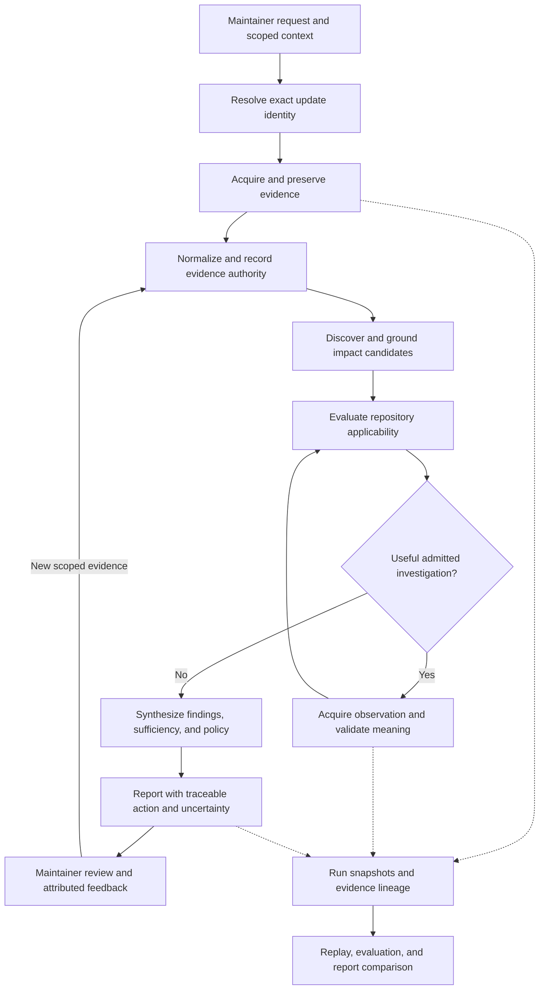

# UpgradePilot End-to-End Product and Engineering Proposal

**Recorded:** 2026-09-05

**Status:** Exploratory proposal, version 0.10

**Authority:** Non-controlling; authorizes no implementation, external action, technology adoption, or route change.

**Requested emphasis:** Balanced AI, backend, and applied ML, selected by Ali on 2026-09-05.

**Responsibility:** Connect a broader product ambition to complete maintainer outcomes, dependable engineering, and demonstrable learner ownership.

## 1. Proposal and reading guide

UpgradePilot could become a dependency-update investigation and decision workspace: a maintainer brings an update, inspects repository-specific consequences, resolves worthwhile uncertainties, and receives a defensible action with reproducible evidence.

This proposal develops three connected questions:

1. **What can the maintainer accomplish?** Sections 3–5 describe complete journeys and candidate capabilities.
2. **What engineering makes those outcomes dependable?** Sections 6–10 cover responsibility ownership, failure behavior, scale, and release evidence.
3. **What can Ali demonstrate ownership of?** Sections 11–13 connect AI, backend, and applied ML to independent work, comparison experiments, and a possible delivery sequence.

Sections 14–17 extend the proposal with eight concrete enhancements, product improvement practices, balanced engineering investigations, and a provisional priority comparison. Section 18 walks the full proposed experience against preserved S010–S012 evidence and identifies the information still missing. Section 19 supplies a dated source-grounded feasibility assessment and refines the earlier priorities.

Breadth is intentional. Ideas beyond the public-Python/read-only boundary are included and explicitly identified. Inclusion is an invitation to investigate, not a requirement to implement everything. The proposal assumes no deadline, infrastructure budget, traffic level, hiring-market demand, or measured implementation capability.

### Relationship to existing material

| Owner or source | Relationship |
|---|---|
| [Project Charter](../PROJECT_CHARTER.md) | Owns accepted mission, public Python Dependabot scope, five recommendation classes, admission, and claim limits. |
| [Product Decision Model](../docs/specifications/UPGRADEPILOT_PRODUCT_DECISION_MODEL_SPECIFICATION.md) | Owns candidate/applicability/investigation semantics; this proposal leaves later synthesis questions open. |
| [Core Invariants](../docs/specifications/UPGRADEPILOT_CORE_PIPELINE_AND_CONTRACT_SPECIFICATION.md) | Owns evidence, representation, authority, and responsibility boundaries. |
| [Mature System Horizon](UPGRADEPILOT_MATURE_SYSTEM_HORIZON.md) | Existing orientation to the reasoning system. This companion adds product journeys, operational completion, and balanced capability development. |
| [July ambition proposal](2026-07-20_UPGRADEPILOT_PRODUCT_AMBITION_AND_ENHANCEMENT_PROPOSAL.md) | Provenance for impact relationships, temporal evidence, investigation planning, policy, evaluation, interfaces, and advanced-method candidates. Those ideas are developed here, not claimed as new. Its historical route is not inherited. |
| [Delivery route](../plans/UPGRADEPILOT_90_DAY_PLAN.md) | Owns accepted stage gates. Section 13 is a possible dependency sequence, not a replacement route. |
| [ADR-0007](../docs/architecture/ADR-0007-responsibility-based-python-subpackages.md) | Owns accepted Python structure. Conceptual boxes below do not prescribe packages or services. |
| [Security](../SECURITY.md) and [proposal lifecycle](README.md) | Own applicable trust/action boundaries and admission procedure. |

Sections 1–18 describe proposed behavior and case-derived design, not implementation proof. Section 19 separately records a bounded source-grounded assessment with focused deterministic verification; it is not a runtime acceptance assessment. Earlier proposals' implementation labels remain dated statements requiring verification before reuse.

## 2. Product thesis and scope choices

**Candidate thesis:** Repository-specific impact reasoning, decision-time evidence, and selective investigation can help maintainers make better-supported dependency-update decisions with less unnecessary review work.

The thesis needs comparison with a transparent baseline and actual maintainer tasks. More findings, longer explanations, or higher model confidence do not establish usefulness.

Three scope classes make expansion explicit:

- **Core-related candidate:** Elaborates the public-Python Dependabot decision workflow. Still needs relevant design and admission; compatibility with the charter is not implementation authorization.
- **Scope expansion:** Adds users, targets, actions, or operational obligations outside the frozen charter. Admission would require revising the applicable controlling owners.
- **Method experiment:** Compares ways of delivering a responsibility, such as a semantic model or learned ranking. A successful experiment need not become product architecture.

The proposed first product audience remains a public Python maintainer. Team users, private installations, and additional ecosystems are separate expansion choices. Balanced learning does not require equal feature counts or equal time in AI, backend, and ML.

## 3. What the maintainer can accomplish

### Journey A — Review one update

**Trigger:** A maintainer submits a public Dependabot PR locator.

The product resolves the exact base/head and package transition, acquires scoped evidence, identifies justified concerns, evaluates repository applicability, and performs only admitted worthwhile investigations. The report leads with the supported action, decisive reasons, material unknowns, and evidence freshness. A maintainer can expand each material factual claim to its source and interpretation history.

**Completion evidence:** An unfamiliar supported PR reaches a usable report or an explicit unsupported/failed outcome. Representative cases include a consequential finding, a justified non-applicability result, a conflict, and insufficient evidence. A usability review checks whether a maintainer can explain the result without reading internal model traces.


#### A.1 Interaction contract

The proposed first experience needs one required input: a public PR locator. The user should not have to name the dependency, interpret the diff, select a model, or construct an evidence bundle. The application derives supported identity and reports ambiguity rather than requiring hidden expert work from the user.

Optional review context may include an explicit environment or policy profile when that feature is admitted. Show whether context was detected from repository files or supplied by the maintainer. Defaults must be visible where they affect conclusions. Do not invent a default maintainer policy.

Proposed interaction sequence:

| Step | Maintainer sees or does | System responsibility | Useful exit |
|---|---|---|---|
| Submit | Paste PR locator and choose Analyze | Validate locator and identify supported proposal | Correct invalid input or receive specific unsupported reason |
| Identify | Repository, PR, exact revision, dependency transition, detected scope | Establish identity before combining evidence | Continue supported analysis or explain unresolved identity |
| Analyze | Named work stage, source problems, stop/cancel control where supported | Perform bounded work and preserve state | Complete, stop with partial evidence, or report failure |
| Read | Recommendation, decisive reasons, material unknowns, analyzed revision | Present a bounded result with its rationale | Understand action and limits without opening every source |
| Inspect | Expand a reason into observation, interpretation, scope, source | Expose evidence and authority accurately | Verify or challenge the claim |
| Act | See the specific check or investigation that could help | Connect uncertainty to an actionable question | Perform normal review or enter a separately admitted investigation journey |

Start analysis immediately after valid submission; an obligatory confirmation screen would add little value to ordinary public read-only acquisition. Pause only for material ambiguity or an action requiring a different authority boundary. The Identify step can be an in-place summary rather than a separate page.

A missing source should not automatically trigger a user question. First determine whether it is material, whether admitted acquisition can resolve it, and whether a useful limited result remains possible. A question is worthwhile when the maintainer can supply information that could affect the supported decision.

#### A.2 Worked hypothetical case

**Design example only:** All repository, package, version, evidence, and report identifiers below are invented. This is neither an observed public case nor an accepted recommendation rule.

A public Python library has a Dependabot PR updating fictional package `sample-parser` from 4.8 to 5.0. Its repository metadata declares Python >=3.9. The proposed dependency release declares Python >=3.10. Available CI reports success for Python 3.11 and 3.12; there is no observed Python 3.9 check in the inspected CI scope.

Evidence inputs to the example:

| ID | Hypothetical observation | What it can support | What it cannot establish alone |
|---|---|---|---|
| E1 | Exact PR head changes the package constraint from 4.8 to 5.0 | Identity of the analyzed transition | Full resolved dependency behavior in every environment |
| E2 | Exact target metadata declares Python >=3.9 | Declared support includes Python 3.9 | Maintainer intent, actual users, or successful execution |
| E3 | Version-bound release metadata declares Python >=3.10 | Declared runtime requirement of that release | A measured application failure or every upstream behavior change |
| E4 | Inspected head-associated CI results pass on 3.11 and 3.12 | Those recorded check outcomes and their inspected scope | Python 3.9 coverage or universal compatibility |

The proposed reasoning identifies a declared-support mismatch for Python 3.9. Applicability to a particular installation path still depends on the dependency's role and relevant environment conditions. The report must not silently replace those questions with a statement that all users will fail.

An illustrative report could say:

> **Investigate or block**
>
> Resolve the Python 3.9 support mismatch before merging.
>
> This repository declares support for Python 3.9, while the proposed dependency release declares Python >=3.10. The inspected passing checks cover Python 3.11 and 3.12. No Python 3.9 execution result was observed in that scope.
>
> **What remains unresolved:** Whether Python 3.9 is intentionally supported for the affected installation path, and what a matching check would establish.
>
> **Useful next step:** Confirm the affected support contract; if Python 3.9 remains required, inspect the relevant resolution/installation path or obtain an authorized targeted check.

This is a candidate action projection for discussion. Formal action selection remains an open synthesis responsibility under the accepted Product Decision Model. It would be wrong to adopt this example as a universal rule matching two version numbers.

#### A.3 Report information hierarchy

The maintainer should get a complete short answer before choosing to inspect detail. Proposed report order:

1. **Analyzed update:** repository, PR, package transition, base/head identity, observation time, and freshness status.
2. **Recommendation:** one charter-owned action class when justified, with a direct explanation. If the run failed before a trustworthy recommendation, display that failure instead.
3. **Decisive reasons:** findings that materially support the action, with source links and visible evidential status.
4. **Material unknowns:** uncertainty that limits the conclusion or could change the action.
5. **Useful next action:** the question to resolve, suggested evidence/check, and what its result could establish.
6. **Scope and supporting details:** inspected evidence, coverage limits, eliminated concerns when relevant, and export/replay references.

The default view should not require reading internal prompts, every candidate, or a raw execution log. Details remain available where they help inspect a material claim or diagnose the run.

A proposed text layout for the hypothetical case:

```text
Review dependency update
sample-project · PR 42 · sample-parser 4.8 → 5.0
Analyzed revision: [exact head] · Evidence observed: [timestamp]
Freshness: [head match last checked at timestamp]

Recommendation: Investigate or block
Resolve the declared Python 3.9 support mismatch before merging.

Why
  Repository declares Python >=3.9.                  [Inspect E2]
  Proposed release declares Python >=3.10.           [Inspect E3]
  Inspected CI passes on 3.11 and 3.12.               [Inspect E4]

Still unknown
  Whether Python 3.9 is required for this installation path.
  No matching Python 3.9 execution result observed in inspected CI.

Suggested next action
  Confirm the affected support contract and inspect/check that path.
  Expected evidence: [specific scoped question and result meaning]

[Inspect analysis scope] [Inspect evidence] [Export report]
```

Button labels describe proposed affordances, not implemented controls. The report must never label itself simply “up to date” without a freshness observation boundary. A saved report can display when freshness was last checked even when it cannot contact GitHub.

#### A.4 Claim inspection

Expanding a reason should answer, in order:

- What does the source state or the observation show?
- Which repository/release/revision/environment does it describe?
- How did UpgradePilot interpret it?
- What contribution does it make to this recommendation?
- What remains unestablished, conflicting, or outside inspected scope?
- Where can the maintainer inspect the original or preserved source?

Source quotation, deterministic interpretation, model-derived interpretation, and maintainer assertion need distinguishable labels in ordinary language. A source citation establishes a place to inspect the statement; it is not a semantic correctness badge.

For E4, the explanation should say “the inspected checks pass on 3.11 and 3.12.” It should not upgrade that observation to “CI confirms compatibility” or infer “the project does not support 3.9.” A missing check and a failed check need different representations.

The normal reading flow is report reason → evidence item → preserved source and transformation context. There is no need to expose a graph merely because lineage has relationships; introduce a visual graph only if it helps users answer a concrete inspection question.

#### A.5 Progress, failure, and freshness

Progress should report work actually known to have occurred. Proposed stages include resolving identity, acquiring sources, analyzing applicability, and preparing the report. Do not manufacture a completion percentage or time estimate when the remaining investigation path is unknown.

Maintain three independent dimensions:

| Dimension | Example states | Meaning |
|---|---|---|
| Execution | Running, completed, stopped, failed | What happened to the analysis process |
| Evidence and coverage | Sufficient for a stated claim, limited, conflicted | What the inspected material supports |
| Recommendation | Charter-owned action or no trustworthy recommendation | What action projection the analysis can justify |

These are explanatory dimensions, not approved runtime enums. In particular, an internal exception is not a semantic abstention, and a completed run may legitimately abstain.

| User-visible condition | Proposed response | Preserve |
|---|---|---|
| Invalid locator | Identify the invalid input and how to correct it | No invented repository identity |
| Unsupported bot, ecosystem, or ambiguous grouped transition | State the precise unsupported boundary | Any safely established identity; no fabricated full report |
| Material source unavailable | Explain source and consequence; offer retry when meaningful | Evidence problem and affected claim scope |
| Non-material source unavailable | Continue with a visible limitation in supporting detail | Honest acquisition status |
| User cancellation | Confirm stopping; distinguish partial evidence from a final recommendation | Valid captured evidence where persistence is supported |
| Unexpected internal failure | Show failure and diagnostic reference, with a useful retry/recovery route | Error category; no misleading recommendation |
| PR head changes | State analyzed revision and detected newer head; offer fresh analysis | Original report and evidence identity |
| Conflicting evidence | Show disagreement and its action consequence | Both scoped claims and provenance |
| No concern discovered | Explain discovery scope and limits | No conversion of non-discovery into universal safety |

Fresh analysis is an explicit new run. Silent background reanalysis and notifications belong to separately admitted monitoring behavior. If a head change is detected while collecting evidence, do not mix old and new revisions to finish a report.

#### A.6 What this journey requires from engineering

| Experience obligation | Owning responsibility | AI/backend/ML connection |
|---|---|---|
| User supplies one locator | Identity and acquisition | Backend contracts eliminate manual case preparation from the normal workflow |
| Report explains source meaning | Semantic interpretation and trusted admission | AI output remains attributed and challengeable |
| Impact is specific to this repository | Applicability and coverage | Structured reasoning and bounded source analysis prevent generic summaries |
| Report survives reopening | Versioned report and evidence persistence when admitted | Backend state and reproducibility |
| Recommendation and exports agree | Shared decision result with explicit presentation transformations | Interface consistency without forcing storage/runtime/UI into one schema |
| Next action addresses a real unknown | Investigation design | Agent planning or learned ranking can be compared with rules once action candidates and labels exist |
| Maintainer can understand the result | Presentation and task evaluation | Applied evaluation starts before any training; comprehension is a product measure |

The interface may expose the same domain result through CLI, machine output, and a local visual report. That does not require a remote API or a permanently running web server. Choose the interaction mechanism from the actual journey rather than from the mock layout.

#### A.7 Pressure tests and design exit

Before admitting the journey as a product contract, walk through the hypothetical case and at least these contrasting responsibilities:

- A grounded concern is established not applicable, while discovery coverage remains bounded.
- One decisive finding coexists with unrelated unresolved concerns.
- Source evidence conflicts and a stronger action cannot be justified.
- CI is unavailable but sufficient other evidence supports a limited useful conclusion.
- All acquired sources are valid but the supported semantic interpretation is insufficient.
- The PR revision changes, leaving an inspectable historical report.
- Analysis fails internally before synthesis.

These are scenario categories, not a mandatory case count or claims of completed user testing. Use real public cases for admission where feasible; synthetic variations isolate specific failure mechanisms.

A proposed usability exercise asks a maintainer to identify the analyzed revision, explain the recommendation, locate a decisive source, name a material unknown, and describe what evidence would help next. Record comprehension errors, time, and points requiring assistance; choose acceptance thresholds before evaluating the final design. The task must detect confident misunderstanding, not merely whether the user clicked the intended control.

**Design conclusions from this walkthrough:** a concise report can preserve evidence rigor through progressive detail; progress, evidence sufficiency, and recommendation need separate representation; normal submission should not demand expert evidence preparation; and the next action must answer a specific uncertainty.

**Still open:** exact cross-candidate action rules, which investigation controls are included in the first release, persistence scope for that release, and the visual interface choice. Resolve these through their responsible design owners and concrete case/task evidence rather than freezing them from this illustration.


#### A.8 Real-case grounding for synthesis and stopping

**Design continuation recorded 2026-09-05:** Ali identified the existing product-simulation corpus as the preferred grounding for this discussion. Use relevant preserved cases before constructing new illustrative cases. The hypothetical example above remains a presentation aid; it is not the main evidence for synthesis design.

This review inspected the simulation index/local instructions, selected case syntheses, the S010 scenario, and its mechanism/stopping artifacts. It did not reacquire external PRs, rerun experiments, or verify current product implementation. Statements below concern recorded cases at their preserved scope, not live upstream state.

The [accepted Product Decision Model, sections 13–14](../docs/specifications/UPGRADEPILOT_PRODUCT_DECISION_MODEL_SPECIFICATION.md) distinguishes investigation stopping from action sufficiency and leaves the mature synthesis method open. The existing [Cross-Candidate and Repository-Context Pressure Test](../product-simulation/CROSS_CANDIDATE_CONTEXT_SYNTHESIS_PRESSURE_TEST_01.md) already establishes discovery pressure against scalar aggregation, candidate erasure, and premature final actions. This section develops that input into a candidate user-facing decision procedure; it does not claim to invent those earlier findings or close the specification.

##### Real-case contrast map

| Preserved evidence | Recorded conclusion | Design implication | Boundary |
|---|---|---|---|
| [S010 scenario](../product-simulation/scenarios/S010-podcast-script-numpy-discovery-breadth/README.md) and [synthesis](../product-simulation/S010_POST_CASE_SYNTHESIS.md) | One requirement broadening removes a NumPy guard for one mechanism; a different mechanism has a target-local shim | Preserve distinct mechanism and handling states; neither concern cancels the other | No final action, exhaustive discovery, or whole-application failure established |
| [S007 synthesis](../product-simulation/S007_POST_CASE_SYNTHESIS.md) | Static package/build evidence and constraints refute formation of the exact declared PyTorch/CUDA package set | Prune downstream runtime checks for that impossible unchanged environment | No need to execute a resolver merely to repeat the established contradiction |
| [S009 synthesis](../product-simulation/S009_POST_CASE_SYNTHESIS.md) | Updated pandas requirement conflicts with unreconciled publication-environment statements | Preserve context findings separately; clarify intended repository contract | Does not prove changed numerical results or determine maintainer intent |
| [S006 synthesis](../product-simulation/S006_POST_CASE_SYNTHESIS.md) | A real-derived controlled variant exposes a precise validator behavior-path question and discriminating differential check | Continue when a check can resolve the actual uncertainty | Prior oracle exposure prevents a blind autonomous-discovery claim; the real project was not shown to lack the test |
| [S012 synthesis](../product-simulation/S012_POST_CASE_SYNTHESIS.md) | Historical artifact producer version can be needed for a cross-version persistence question | Preserve missing deployment history; prefer provenance-matched evidence if consequences must be tested | Does not establish that a particular deployment has an old artifact or that loading it fails |

These records are development/design evidence already inspected by the designer. They cannot also be presented as unseen final evaluation cases. Transfer evaluation may reuse them with that exposure disclosed; an independent generalization claim needs appropriately isolated cases or evaluators.

##### S010 worked synthesis: what should survive into the report?

The recorded proposal is `invaderDMG/podcast-script#36`, broadening `numpy>=1.26,<2.0` to `numpy>=1.26,<3.0`. It is not an exact installed NumPy version transition.

The [mechanism map](../product-simulation/scenarios/S010-podcast-script-numpy-discovery-breadth/artifacts/MECHANISM_DISCOVERY_MAP.json) distinguishes:

- **C1:** The transitive inaSpeechSegmenter 0.7.6 feature path calls `numpy.lib.pad`. The proposal removes the target's documented NumPy <2 guard. No target-local rewrite of that call was identified in the inspected boundary.
- **C2:** A separate pyannote/vstack mechanism has a target-local list-materializing shim. Its presence is evidence of handling, not proof that the entire stack is compatible.
- **Context:** The recorded Dependabot configuration/discussion concerns requirement broadening despite semver-major suppression. This is automation context, not a third runtime mechanism.
- **Unknowns:** Exact chosen resolution, concrete runtime consequences, other undiscovered changes, and the historical resolved pyannote revision remain outside the established result.

A proposed report fragment grounded in those recorded findings is:

> **Established concern:** This proposal removes the NumPy <2 guard around a transitive segmentation compatibility concern.
>
> **Separately handled concern:** The target contains a shim for a different vstack mechanism; it does not address the pad call.
>
> **Still unknown:** The concrete resolved environment and runtime consequence, and whether additional material mechanisms exist.
>
> **Action status:** The preserved simulation does not establish a final maintainer recommendation. A product synthesis must establish the relevant action criteria before assigning one.

This is useful even before a final action rule is accepted: it explains the concrete concern without fabricating a score or implying that a positive finding offsets a negative one. The [recorded stopping artifact](../product-simulation/scenarios/S010-podcast-script-numpy-discovery-breadth/artifacts/DISCOVERY_COVERAGE_AND_STOPPING.json) explicitly says that a maintainer action is not established.

##### Candidate decision procedure: a decisive finding with remaining unknowns

A finding is “decisive” only relative to a specific proposed action and its justified scope. It is not an intrinsic severity label, a vote, or whatever concern was discovered first.

Proposed reasoning sequence:

1. **Name the exact decision.** For example, whether the unchanged proposal can satisfy an explicitly required environment; this is narrower than whether the library is compatible in every environment.
2. **Establish the finding's evidential standing.** Preserve identity, activation conditions, source/interpretation authority, conflicts, and whether the finding is conditional.
3. **Establish why it matters to that decision.** Link it to an admitted action criterion or explicit supported requirement. A plausible concern without this link is not automatically a blocker.
4. **Challenge apparent decisiveness.** Could an unresolved condition refute the finding, establish a mitigation, show that the path is irrelevant, or reveal that the requirement was misunderstood? If so, relevant investigation may still be needed.
5. **Assess remaining questions individually.** Ask whether new evidence could change the action, its scope, its explanation, the remedy, or the validity of the decisive finding.
6. **Select useful permitted work or stop explicitly.** Keep unresolved questions and stop reasons visible. A stopped question must not become a negative finding.
7. **Render the action only when its criteria are supported.** If action sufficiency remains unresolved, present that limitation rather than using the simulation's stop as a recommendation rule.

The asymmetry is important. Evidence that one required condition is unsatisfied may justify withholding a favorable recommendation for an exact proposal, once the requirement and action relationship are established. Eliminating one concern cannot establish a favorable overall recommendation when other material concerns or discovery limits remain. This is a proposed design argument, not a universal automatic-block rule.

Different findings do not cancel numerically. S010's shim for C2 does not repair C1, and an unrelated passing check cannot negate a package constraint contradiction such as S007's. New evidence can still revise an apparent contradiction when it changes the relevant premises.

##### Continue, prune, or preserve unresolved?

| Remaining question | Proposed treatment | Why |
|---|---|---|
| Could disprove or narrow the apparent decisive finding | Continue with a discriminating admitted investigation when available | The action rationale may be wrong or overbroad |
| Could establish a mitigation or clarify a required support/policy condition | Investigate or ask for scoped maintainer context when appropriate | Action applicability is not yet settled |
| Could change the remedy while leaving the action class unchanged | Consider continued work based on value and budget | “Investigate or block” alone may be too vague to help the maintainer |
| Depends on a necessary path already refuted | Prune that branch under the unchanged premises | S007's incoherent environment does not support meaningful deeper runtime testing |
| Would repeat evidence already sufficient for the owned question | Stop unless an independent corroboration obligation exists | More observations are not automatically more useful |
| Addresses a different product/scientific question | Preserve separately; do not activate by default | S009's context inconsistency does not require numerical reproduction |
| Needs unavailable private deployment/artifact history | Preserve unresolved and state what scoped evidence would help | S012's missing history is not evidence that old state is absent |
| Could reveal additional mechanisms needed for the intended broader conclusion | Continue discovery if justified and permitted | S010 shows that finding one concern is not discovery completeness |
| Has no material effect on the action, scope, remedy, or rationale and exceeds useful budget | Stop with a reason | Uncertainty can remain without forcing unlimited investigation |

This procedure does not say “stop as soon as the action label stops changing.” Useful work may still make the remedy actionable or expose a mistaken premise. It also does not say “investigate everything before speaking”: the report can explain a supported narrow conclusion while preserving broader limits.

Authorization and resource availability constrain feasible investigations; they do not determine factual truth. “Cannot execute this check” must not become “the concern is absent,” “defer,” or any other automatic action.

##### Report behavior when a final action is justified

A future admitted synthesis should make the following recoverable in ordinary language:

- **Recommended action and scope:** Which exact proposal/environment/question it concerns.
- **Decisive reason:** What supported finding and applicable requirement justify it.
- **Other material findings:** Including independent mitigations or context; do not hide them.
- **Remaining unknowns:** Whether they could change the action, remedy, or only a broader conclusion.
- **Investigation disposition:** What was resolved, what was pruned, and what remains unresolved with no useful permitted check.
- **Reassessment condition:** The relevant new evidence, changed proposal, mitigation, or clarified requirement that would warrant reconsideration.

This is an information responsibility, not a required new runtime schema or universal policy engine. The renderer should explain preserved decision inputs rather than ask a model to invent an explanation after choosing the action.

Definitions distinguishing “investigate or block,” “run targeted checks,” “defer,” and “abstain” need separate accepted synthesis design with representative cases. This proposal intentionally does not assign those labels to the recorded S007–S012 cases by inference.

##### Design pressure checks derived from the cases

These are proposed checks, not executed product tests:

| Deliberate change or challenge | Expected design behavior |
|---|---|
| Present S010 C2's shim before C1's guard removal | Preserve both mechanisms and their distinct evidence; avoid order-dependent cancellation |
| Duplicate a source describing S010 C1 | Do not count an additional independent mechanism or corroboration |
| Ask for an exact proposed NumPy version in S010 | Retain range broadening and unresolved resolution |
| Ask for application execution after S007's exact formation contradiction is established | Identify why deeper execution is non-discriminating under those premises |
| Reframe S009 from preserving publication provenance to intentionally updating the analysis environment | Treat this as a changed intended contract requiring attribution, not a refutation of the historical observation |
| Supply fresh-state passing tests for S012 | Do not infer historical artifact compatibility |
| Supply evidence that an apparent decisive concern is mitigated | Reevaluate action sufficiency; do not retain the earlier action merely because it was selected first |
| Remove the ability to run a useful check | Preserve uncertainty and feasible alternatives; do not automatically invent a final action |
| Keep the action class fixed but identify a materially better remedy | Recognize potential investigation value beyond label changes |

**Bounded conclusion:** The existing corpus supports preserving candidate/context structure and question-relative stopping. It supplies strong counterexamples to “first concern means block,” “all known candidates resolved means safe,” and “any unknown means keep investigating.” It does not yet supply a validated complete mapping to final action classes. The contribution of this section is a reviewable candidate decision procedure and case-derived pressure checks for that unresolved design.

### Journey B — Understand and challenge a finding

**Trigger:** The report says that an API removal might affect a repository path.

The maintainer sees the upstream change, relevant usage, activation assumptions, and missing evidence. They can identify an incorrect interpretation or provide context such as “this package only runs in the documentation build.” Supplied context retains its author, scope, timestamp, and corroboration state; it does not silently rewrite source evidence. A revised analysis shows precisely which conclusions changed.

**Completion evidence:** A disputed claim can be inspected, a correction is attributed, and unsupported human assertions remain distinguishable from observed facts. Sharing or multi-user editing would add an explicit identity/access design.

### Journey C — Choose the next useful investigation

**Trigger:** An important applicability proposition remains unresolved.

The report presents a concrete question, candidate evidence acquisitions or checks, expected evidential meaning, cost/budget, and stopping conditions. The maintainer can compare alternatives and understand why a full test run might answer less than a focused check. An authorized result is validated for revision, environment, and contrast before changing the conclusion.

**Completion evidence:** The selected investigation addresses the unresolved proposition, result validation rejects mismatched evidence, and the process stops when further work has insufficient value. Recommending a command, acquiring public evidence, and executing target code are distinct capabilities. Target execution is a scope expansion.

### Journey D — Understand a changed recommendation

**Trigger:** A PR head changes, CI finishes, upstream evidence changes, or a policy is revised.

The product preserves the previous report, identifies invalidated inputs, and explains the new result. The user sees whether the difference came from new source evidence, a corrected interpretation, a model/software version, or policy. A replay of captured observations remains distinct from fresh acquisition and from rerunning a nondeterministic model.

**Completion evidence:** A controlled change produces the expected report difference; irrelevant changes do not spuriously change established conclusions. Replay cannot include evidence obtained after the claimed decision time.

### Journey E — Manage several updates

**Trigger:** A maintainer has a backlog across one or several repositories.

The product groups relevant updates, identifies interactions and stale analyses, and explains priority. A rank is accompanied by reasons and uncertainty. Shared public acquisition may be reused when identities match. Monitoring should notify on material changes with duplicate suppression and user-configurable delivery.

**Completion evidence:** Priority helps a maintainer choose work in a defined comparison task, interacting updates are not treated as independent without justification, and cancellation/retries do not create duplicate reports. Monitoring, notifications, and portfolio coordination require separate scope review.

## 4. Capability portfolio

The table describes proposed outcomes, not implementation status. Priorities express product reasoning, not accepted scheduling.

| Capability | User benefit | Smallest credible baseline | What would justify more complexity? |
|---|---|---|---|
| Broad impact discovery | Surface relevant API, support, behavior, configuration, packaging, and dependency changes | Structured metadata plus one bounded semantic method, with explicit discovery limits | Held-out mechanisms are repeatedly missed or invented; broader method improves measured coverage without unacceptable false claims |
| Repository exposure analysis | Connect a change to code, configuration, environment, and dependency role | Exact declarations and bounded syntax/reference inspection | Real indirect, framework, or transitive relationships defeat the baseline |
| Investigation selection | Spend effort on uncertainty that affects the decision | Explicit candidate actions and transparent selection rules | A bounded agent or learned ranker improves resolution per unit cost |
| Cross-candidate synthesis | Combine decisive, unresolved, eliminated, and contextual findings | Explicit composition and action rationale | Real cases expose interactions the baseline cannot represent |
| Evidence workspace | Inspect sources, assumptions, unknowns, and next checks | Human/machine report with source links; local report view | User tasks require interactive filtering, correction, comparison, or navigation |
| Temporal comparison | Explain why a report changed | Immutable run snapshots and a structured difference | Repeated analyses demonstrate worthwhile incremental invalidation and reuse |
| Policy scenarios | Compare supported environments or maintainer requirements | Small versioned policy data with explicit interpretation | Concrete policy diversity justifies a richer evaluator |
| Recovery and diagnosis | Resume interrupted analysis and explain degradation | Explicit run state and transactional persistence | Measured concurrency or long waits justify independent workers or durable orchestration |
| Evaluation and correction | Reveal unsupported claims, misses, and useful abstentions | Versioned case corpus, reviewed rubric, deterministic baseline | Enough independent labels support ranking/calibration studies |

Priority should favor the complete review → inspect → investigate → explain-change experience. A large discovery subsystem without usable reports and evaluation would leave that experience incomplete.

## 5. Broader expansion options

| Expansion | Additional outcome | Material new responsibilities | Small discriminating study |
|---|---|---|---|
| Other Python update bots and grouped PRs | Analyze more update proposals | Admission/transition identity, multi-package interactions | Compare diverse bot/grouped fixtures and public cases without executing them |
| Additional ecosystems | Apply the decision method beyond Python | Package semantics, build/runtime models, evidence providers, ecosystem-specific evaluation | Fully analyze a contrasting ecosystem case and identify what actually transfers |
| Private/self-hosted use | Analyze confidential repositories | Access boundaries, retention/deletion, auditability, model/data residency, installation support | Threat model and local deployment/data-flow design before private acquisition |
| Team collaboration | Review and resolve disagreements together | Identity, authorization, attribution, concurrent edits, policy ownership | Prototype the review workflow and test whether collaboration improves a concrete task |
| Authorized check execution | Obtain targeted behavioral evidence | Isolated execution, resource/network limits, artifact provenance, cancellation, cleanup | Design one exact comparative check and its containment/evidence contract |
| Proposed remediation | Suggest a migration or patch connected to a finding | Patch scope, applicability, independent validation, exact write authorization | Produce and evaluate a local reviewable patch in an explicitly admitted case |
| Supply-chain context | Add package-origin/advisory evidence to review | Source freshness, attribution, identity, distinct security claim limits | Check whether added evidence changes useful review actions beyond existing tools |
| Portfolio monitoring | Prioritize and revisit multiple repositories | Scheduling, fairness, subscriptions, duplicate suppression, notification consent | Replay a bounded backlog and measure useful alerts versus noise |

Automatic merge and generic vulnerability prediction are not proposed defaults. They would change the decision-support mission and need a separate product thesis. Supply-chain signals must not be represented as proof of authenticity, non-exploitability, or update safety beyond what their evidence establishes.

## 6. Engineering responsibilities and end-to-end ownership

The following diagram is a proposed logical composition, not a service or source-tree plan:



The accepted Product Decision Model owns the meaning of applicability and investigation stopping. The synthesis box is an unresolved design responsibility: ending investigation does not automatically authorize a particular action.

| Producer → consumer | Earliest proposed owner | Contract that must survive the boundary |
|---|---|---|
| Locator → acquisition | Request/identity boundary | Exact repository, PR, revisions, dependency transition, supported-input status |
| Provider response → interpretation | Source-specific normalization | Raw identity, retrieval time, source scope, explicit failure/availability state |
| Model extraction → candidate reasoning | Trusted semantic admission | Attributed claim, grounding, method identity, uncertainty; no model-assigned truth |
| Candidate + target context → applicability | Candidate-specific reasoning | Exposure/activation propositions and coverage limits |
| Proposed investigation → execution/acquisition | Authorized application boundary | Admitted action, budget, exact target, expected observation; proposal is not permission |
| Observation → reevaluation | Observation validation | Revision/environment/contrast and what the result actually establishes |
| Findings + policy → report | Synthesis and presentation responsibilities | Facts remain distinct from policy and interpretation; material unknowns remain visible |
| Run records → replay/evaluation | Persistence/replay boundary | Versions, immutable references, temporal scope, reproducibility limits |

A downstream component should not repeat an upstream validation without an independent responsibility for distrusting or recombining its inputs. Storage models, runtime contracts, and presentation models may differ; they should not become accidental public APIs for one another.

### Persistence and change semantics

Candidate durable entities are an analysis request, run/attempt, immutable evidence item, attributed claim, candidate revision, observation, policy version, and report revision. This is a conceptual vocabulary, not an approved database schema.

Begin the storage comparison with one transactional store and explicit durable evidence references. Decide raw-object storage, retention, indexing, and migrations from representative artifact sizes and query/replay needs. A graph-shaped domain does not automatically need a graph database, and evidence search does not automatically need a vector database.

Reuse needs two separate decisions: does the source identity still match, and are the interpretation/decision inputs still valid? Cache keys may require revision, source, environment, policy, and method versions according to the exact responsibility. Do not assume one universal key. Preserve old reports and supersession relationships instead of overwriting history.

### AI control and context

Models may propose candidates, interpret text, select among admitted tools, or synthesize attributed explanations. Deterministic boundaries retain identity, allowed actions, evidence status, budget enforcement, and authority constraints. A schema-valid answer can still be false; source correspondence can still be uncorroborated.

Context selection should identify which evidence answers which question and measure omissions as well as token cost. Retrieval is justified when relevant evidence exceeds practical context capacity or cannot be found reliably by simpler selection. Agent memory must not turn previous generated statements into independent evidence. Local inference remains the baseline boundary unless a separately authorized decision admits another route.

## 7. Failure and edge-case design

| Failure or variation | Proposed observable behavior | Discriminating proof |
|---|---|---|
| Head changes while sources are being fetched | Bind results to the original revision; mark stale or restart explicitly | Inject a head change between acquisitions and reject mixed-revision synthesis |
| CI passes but relevant jobs skip or use another environment | Preserve exact check scope and uncovered paths | Contrast pass/skip and environment mismatch cases |
| API source is rate-limited, missing, or malformed | Distinguish conditions; bounded retry only when appropriate; partial result or failure | Fault injection with controlled responses and retry limits |
| Duplicate/out-of-order events or concurrent requests | Apply idempotent processing and detect stale updates | Reorder and duplicate a captured event sequence |
| Worker stops during persistence | Resume from a valid durable boundary without presenting incomplete results as final | Terminate at selected write boundaries and inspect recovery |
| Model returns invalid, invented, or instruction-like content | Preserve source evidence; reject invalid output/unauthorized action and expose semantic limits | Adversarial fixtures plus independently reviewed claim checks |
| Two sources repeat the same original claim | Preserve common origin; avoid counting them as independent corroboration | Duplicate-source lineage case |
| Dynamic imports, plugins, optional extras, or platform markers | Report bounded analysis and unresolved activation where needed | Contrast direct usage with an indirect or conditional route |
| Multiple updates interact | Model joint constraints or disclose unsupported interaction coverage | Compare joint transition with individual transitions |
| Human correction conflicts with source | Retain attribution and disagreement | Replay a correction without allowing it to erase contrary evidence |
| Time/budget expires or cancellation arrives | Stop new work, preserve valid partial evidence, report stopping reason | Exhaust budget/cancel during acquisition and investigation |
| Report is reopened after evidence/model/policy changes | Explain freshness and version difference | Compare preserved run with fresh analysis; do not silently relabel old output |
| Future target execution fails or emits hostile output | Keep failure separate from incompatibility; constrain and validate artifacts | Admitted containment and comparative-execution tests |
| Future private/team records cross access boundaries | Deny access and prevent cache/telemetry leakage | Cross-user/repository authorization and deletion tests before release |

Passing these checks would establish behavior for tested conditions, not universal correctness. Static evidence absence must not imply absence of exposure without adequate coverage.

## 8. Scale and operational choices

Scale has four independent dimensions: semantic breadth, concurrent workload, collaboration/integration breadth, and operational reliability. Measure each instead of treating “scale” as a reason to add distributed components.

| Situation | Candidate baseline | Trigger for larger architecture | Evidence before adoption |
|---|---|---|---|
| Individual/local analysis | One application with direct bounded execution | Long work blocks required interactions or recovery is inadequate | Measured latency and interrupted-run behavior |
| Several concurrent analyses | Same application with persisted jobs and bounded workers | Contention, backlog age, or deployment isolation prevents required service levels | Throughput, tail latency, fairness, duplicate/retry correctness |
| Long waits and resumable investigation | Explicit state machine and durable records | Resume/interrupt/versioning complexity becomes demonstrably costly | Failure/recovery comparison against a workflow engine |
| Large evidence history | One store with appropriate indexes and retention | Measured storage/query patterns exceed the baseline | Query plans, artifact volumes, restore time, storage cost |
| Team/private operation | Separately designed access and data boundaries | User needs justify shared hosting | Threat model, access tests, retention and recovery evidence |

Before a load study, define representative repository size, source count, candidate count, model calls, artifact volume, and concurrent runs. Report acquisition/model/storage costs separately and measure p50/p95 latency, failure rate, backlog age, and recovery time. Numerical targets should be selected from user requirements and baseline measurements; none are invented here.

Backpressure means limiting accepted or active work when capacity is constrained. Idempotency means retries do not create additional logical effects. Both are valuable before microservices. Availability targets, backups, restoration, rollback, schema migration, and resource limits belong to the chosen deployment's actual operating contract.

## 9. Evaluation that can test the product thesis

Evaluate individual responsibilities and the complete user task. Keep observed maintainer behavior separate from technical truth: merged, reverted, or CI-green outcomes are incomplete labels.

| Question | Proposed measure | Important limitation |
|---|---|---|
| Are discovered concerns grounded? | Reviewed unsupported material claims / reviewed material claims | Grounding alone does not establish applicability or completeness |
| Are important concerns missed? | Recall against independently reviewed case concerns | Reference review can miss concerns; annotate its coverage limits |
| Does applicability distinguish cases? | Agreement and error breakdown across applicable/non-applicable/unresolved/conflicted cases | Ambiguous cases should retain uncertainty, not forced labels |
| Does investigation help? | Material uncertainty resolved and useful action changes per request/time/cost | Extra evidence volume is not useful resolution |
| Are recommendations useful? | Rubric-based task quality and maintainer decision explanation | No universal “safe to merge” ground truth |
| Does the interface save effort? | Paired review time and comprehension with/without the product | Learning/order effects and participant differences need control |
| Does abstention behave appropriately? | Coverage versus consequential error, with reason breakdown | A system can appear accurate by abstaining on nearly everything |
| Does a learned score deserve confidence? | Calibration against a defined labeled outcome, if probabilistic output is used | Do not interpret uncalibrated scores or model self-confidence as probabilities |

Separate development cases, controlled perturbations, held-out repository families, and temporally later cases where feasible. Deduplicate related PRs and copied upstream evidence across splits. Freeze the final rubric, labels, baselines, model/prompt versions, budgets, and acceptance/rejection criteria before the comparison. Review disagreement with an explicit adjudication process; use a second independent reviewer where feasible and disclose reliance on one reviewer otherwise.

Compare a transparent metadata/CI baseline, repository-context reasoning, and only then added semantic/agent/learned methods. Ablation removes one component while holding other conditions fixed to test its contribution. Report failure examples, uncertainty and sample limitations, cost, and repeatability alongside aggregate scores. Numerical admission thresholds remain open until a bounded experiment defines the decision costs and feasible sample.

Maintainer feedback may become evaluation data after attribution, consent where applicable, label review, and contamination checks. It must not automatically trigger training or strengthen future factual claims.

## 10. What a finished release would need to demonstrate

A release should declare its supported inputs, mechanisms, interfaces, deployment, and exclusions. “End to end” means a maintainer can complete the supported task, not that every expansion is included.

Candidate acceptance evidence:

1. Clean installation and documented configuration reproduce a complete supported public-PR journey.
2. Human and machine reports agree on identity, findings, action, and uncertainty; claims can be inspected through durable references.
3. Representative contrasting cases establish the supported reasoning scope, including useful abstention and explicit unsupported inputs.
4. Source failures, changed revisions, cancellation, and interrupted work have observable, tested outcomes.
5. Replay reproduces the promised deterministic boundary; fresh model inference is not mislabeled deterministic replay.
6. Evaluation states baseline comparison, label limits, unsupported claims, missed concerns, useful coverage, and cost.
7. The supported deployment has measured resource behavior, diagnosis, upgrade/rollback, and backup/restore evidence where persistent storage is offered.
8. Usability checks cover understanding the recommendation, finding an evidence source, recognizing uncertainty, and identifying the next action; a visual UI should support keyboard navigation and avoid color-only meaning.
9. Security checks match the actual exposed surfaces, including untrusted evidence and any separately admitted execution/private-data boundary.
10. Ali can independently explain and modify representative AI, backend, and ML/evaluation responsibilities, with assistance disclosed.

This is a proposed acceptance map, not a passed checklist or a production-readiness claim. A useful local release and a supported shared service have different completion obligations.

## 11. Balanced learning and ownership

Learning should follow a real responsibility through problem, alternatives, implementation, failure, evidence, and explanation. The following are proposed demonstrations, not claims about Ali's existing capability or hiring outcomes.

| Track | Real UpgradePilot responsibility | Concepts and tools to investigate | Independent demonstration |
|---|---|---|---|
| AI engineering | Grounded change interpretation | Structured outputs, context selection, tool contracts, prompt/version management | Diagnose a plausible false claim, identify the failed boundary, and improve it on held-out contrasts |
| Agent engineering | Bounded investigation with feedback | State transitions, tool selection, interrupts, budgets, stopping | Explain why one action is useful, implement a new admitted action, and diagnose an invalid observation |
| Backend engineering | Durable run/evidence lifecycle | API contracts, transactional storage, migrations, idempotency, caching | Recover an interrupted run and prove that retry does not corrupt or duplicate results |
| Platform engineering | Supported deployment and operation | Containers when useful, telemetry, resource limits, load/fault tests, restore/rollback | Find a slow/failing stage from evidence and demonstrate a measured correction and recovery |
| Applied ML | Rank worthwhile investigations or review priorities | Feature/label design, simple baselines, learning-to-rank, temporal splits, calibration where applicable | Build and reject or retain a model using leakage-aware evaluation and error analysis |
| Data/evaluation engineering | Reproducible comparison corpus | Dataset versions, provenance, annotation, sampling, uncertainty | Reproduce a result and explain what label limitations prevent claiming |
| Product/full-stack engineering | Evidence review and report comparison | Interface state, accessible presentation, typed APIs, user-task testing | Implement a report interaction and show how it improves a defined maintainer task |

A strong portfolio package could contain a reproducible demo, an architecture explanation tied to code, a failure/recovery exercise, a baseline-versus-method report, and one rejected approach with evidence. For each, record what Ali did independently and what AI assisted. Exposure, passing tests, and presentation fluency alone do not prove ownership.

The ML track remains valuable if training is rejected for insufficient labels or lack of benefit: a defensible evaluation and rejection demonstrates a different capability from deploying a successful learned ranker. It must be described accurately.

## 12. Tool and method comparison opportunities

These are comparisons to investigate, not selected dependencies. Official references were consulted on 2026-09-05; their documented features do not establish suitability for UpgradePilot.

| Responsibility | Simpler comparison | Candidate and its role | Adoption question |
|---|---|---|---|
| Target source analysis | Python syntax/declaration inspection | [LibCST](https://libcst.readthedocs.io/en/latest/) preserves concrete syntax; its [metadata](https://libcst.readthedocs.io/en/latest/metadata.html) can attach analysis to nodes | Does the required analysis or a separately admitted transformation need this information? |
| Investigation continuation | Explicit application state and persisted records | [LangGraph persistence](https://docs.langchain.com/oss/python/langgraph/persistence) offers checkpoints; [interrupts](https://docs.langchain.com/oss/python/langgraph/interrupts) support suspension/resumption | Does it improve actual investigation control and recovery under the same domain contracts? |
| Durable application jobs | One application with bounded workers | [Temporal](https://docs.temporal.io/) is a candidate for durable workflow execution | Do long waits, failures, and coordination justify its additional operating system components? |
| Operational diagnosis | Structured logs with run/stage IDs | [OpenTelemetry](https://opentelemetry.io/docs/) supports traces, metrics, and logs | Which concrete diagnosis or correlation task benefits from instrumentation? |
| Invariant testing | Example and contrast tests | [Hypothesis](https://hypothesis.readthedocs.io/en/latest/) generates inputs for property-based tests | Which domain properties have a defensible oracle beyond mirroring implementation? |
| External comparison | Transparent dependency metadata/CI baseline | [Dependency Review Action](https://github.com/actions/dependency-review-action) supplies vulnerability/license-oriented dependency review | Which overlapping task can be compared fairly, and which behavioral-analysis task differs? |
| Learned investigation ranking | Transparent heuristic ordering | A small supervised ranker, algorithm selected after data inspection | Is independent labeled data sufficient, and does ranking improve utility at equal budget? |

LangGraph checkpointing and application job durability are related but different responsibilities. Comparing both does not justify running both. Existing bounded experiment plans and any accepted method decisions must be reconciled before a future comparison is activated.

Graph algorithms, retrieval systems, policy engines, experiment tracking, Kubernetes, and cloud portability remain possible studies. Each needs a specific question and a smaller alternative. One may study a tool without committing the product to it.

## 13. Candidate dependency sequence and decisions still needed

The following sequence groups complete experiences. It has no dates and does not select live work:

| Candidate increment | Complete outcome | Entry condition | Evidence that permits considering expansion |
|---|---|---|---|
| P1 — Review and inspect | A maintainer can analyze one supported update and inspect decisive evidence and limits | Accepted reasoning scope and report contract | Contrasting real cases and a usability task establish a useful complete path |
| P2 — Recover and compare | Analyses survive supported interruption and explain changed results | Stable identity/evidence contracts and persistence design | Failure injection, replay, migration/recovery, and revision-difference evidence |
| P3 — Investigate effectively | Material uncertainty drives bounded useful actions | Valid action/result contracts and baseline selection | Comparison shows useful resolution and justified stopping at bounded cost |
| P4 — Measure and improve | Independent evaluation can distinguish better methods from plausible output | Reviewed cases, split/rubric discipline, baseline and budget | Held-out comparisons support retain/reject decisions, including learned methods if justified |
| P5 — Expand the audience | A selected team/private/ecosystem/portfolio workflow is complete | Validated user need and explicit boundary redesign | A full representative journey plus new security, reliability, and evaluation obligations |

Evaluation begins with P1; P4 deepens it. These groups are not a requirement to defer an already selected advanced-method checkpoint or to finish all backend work before AI/ML. They must be reconciled with the accepted route and its scheduled experiment handoffs before any execution plan is selected.

Open decisions and the smallest useful way to resolve them:

| Decision | Proposed starting assumption | Discriminating evidence |
|---|---|---|
| First maintainer surface | CLI/machine report plus a reviewable local visual report | Observe report-inspection tasks before choosing a persistent web application |
| First product scope | Public Python Dependabot workflow | Contrasting maintainer cases identify the most consequential unsupported outcome |
| Cross-candidate action semantics | Preserve uncertainty and five charter-owned action classes | Work through cases where a decisive finding coexists with unrelated unknowns; design in the specification owner |
| First learned task | Investigation ranking if usable labels exist | Label feasibility and heuristic performance before selecting an algorithm |
| First deployment | One supported local/single-installation model | User installation needs and measured workload; no simultaneous multi-cloud commitment |
| Policy authority | Separate requirements from observed facts | Cases where policy changes action without changing applicability |
| Broader audience | Leave team/private/ecosystem expansion open | Concrete workflow demand and one full comparative design per candidate |
| Cost and quality thresholds | Leave numerical targets open | Measure baseline and define acceptable errors, latency, and budget with the user |

The recommended design work is to walk one full maintainer case through P1–P3, including a changed revision and one important unresolved concern, then use the resulting decisions to choose a bounded proposal portion for admission. This is a proposal recommendation, not a live continuation instruction.


## 14. Additional product enhancements: turn a finding into a useful outcome

**Expansion recorded 2026-09-05.** These candidate enhancements deepen the broad proposal without changing accepted scope. Each starts from a maintainer task. Case links support the stated design pressure, not implementation claims, validated demand, or an endorsed remedy. “Perfect” is not a measurable acceptance criterion; the proposed aim is a useful, dependable product with explicit limits and a repeatable improvement process.

### E1 — Compare remedies and alternative upgrade paths

**Maintainer question:** “What could I change to address this concern, and what would each option leave unresolved?”

A report could compare retaining a relevant guard, coordinating related dependency versions, adopting a supported environment, changing a local compatibility adaptation, or deliberately postponing the update. Each option should identify its assumptions, affected findings, unresolved concerns, validation needs, and maintenance consequences.

S007 provides pressure for coordinated-package alternatives; S010 provides pressure for distinguishing a guard from a local shim; S012 exposes migration/recreation of persisted state as a separate possible responsibility. These cases do not prove which alternative maintainers should adopt.

**Smallest version:** Explain two evidence-supported alternatives for one exact concern without generating a patch. Do not enumerate arbitrary versions or present retaining an old dependency as automatically preferable: it can have its own unresolved obligations, including separately established security concerns.

**Engineering/learning:** Constraint reasoning, alternative generation, causal explanation, uncertainty, and evaluation of recommendations. AI may propose alternatives; deterministic identity and source checks plus independent semantic review constrain their claims.

**Success evidence:** A maintainer can explain the trade-off and identify what each alternative actually fixes. A correction to one mechanism must not be described as resolving all mechanisms.

**Failure/rejection condition:** Suggestions are generic, require unsupported assumptions, or duplicate an upstream migration guide without repository relevance.

**Boundary:** Comparative advice is a core-related candidate. Patch generation, target mutation, and check execution require separately admitted scopes. No numeric “best option” score is needed before a defensible preference model exists.

### E2 — Environment-specific impact and coverage view

**Maintainer question:** “Which of our supported installation modes or environments does this finding concern?”

[Recorded S008 evidence](../product-simulation/S008_POST_CASE_SYNTHESIS.md) distinguishes metadata admissibility, wheel availability, source fallback, and observed build success. [Recorded S011 evidence](../product-simulation/S011_POST_CASE_SYNTHESIS.md) distinguishes optional-group declaration, installation, platform/hardware activation, and behavior coverage.

A proposed view could show relevant environment slices with separate columns for declared support, formation evidence, activation, inspected checks, and unresolved questions. For S008 it would preserve “binary path unavailable; source fallback exists; build success unresolved.” For S011 it would preserve “the inspected workflows do not install the affected extra,” without inventing their run outcomes.

**Smallest version:** Derive only the environments relevant to the changed dependency and discovered concern. Avoid constructing every combination of operating system, interpreter, architecture, extra, and feature flag.

**Engineering/learning:** Conditional dependency semantics, bounded static analysis, relational evidence queries, combinatorial test design, and information presentation.

**Success evidence:** Contrasting S008/S011-style inputs retain the separate propositions; users identify the actual coverage gap. Every displayed cell has evidence or an explicit unknown.

**Failure/rejection condition:** A matrix creates false completeness, assumes every declared environment exists, or becomes too large to explain.

### E3 — Evidence-targeted maintainer questions

**Maintainer question:** “What small piece of information do you need from me to make this report useful?”

S009's intended publication contract and S012's deployment artifact history illustrate questions that additional public-source reading may not resolve. A useful prompt identifies why the information matters and how different answers would change the analysis.

Examples include “Is this environment intended to preserve the published analysis?” and “Will this deployment reuse a model produced under the old dependency version?” These are contextual questions, not established answers or requests for private artifacts by default.

**Smallest version:** At most one material question at a time, with an explicit “unknown” response. Preserve the supplied answer as an attributed assertion until corroborated where necessary. Show the expected decision effect before asking.

**Engineering/learning:** Human–AI interaction, information value, conditional workflows, provenance, and semantic validation.

**Success evidence:** The question resolves or narrows an actual decision uncertainty and avoids asking for facts already available in admitted evidence. Cancellation or an unknown answer produces an honest limited result.

**Failure/rejection condition:** The application makes the maintainer perform its normal acquisition/interpretation work, repeatedly asks low-value questions, or converts assertions into independent facts.

### E4 — Minimal actionable check plans

**Maintainer question:** “What exact check would distinguish the remaining possibilities?”

S006 motivates check design tied to version and behavior activation; S011 adds environment formation; S012 adds historical producer/consumer identity. A useful plan states prerequisites, the proposition, relevant contrasts, possible observations, and their interpretation. It should also explain a non-discriminating result such as an environment setup failure.

**Smallest version:** A reviewable check specification for one unresolved proposition. A command is optional and should be offered only when its invocation and scope can be justified; do not fabricate an executable command from a conceptual test description.

**Engineering/learning:** Test selection, agent action contracts, experimental control, reproducible environments, and potentially learned ranking.

**Success evidence:** Independent review agrees that the check can distinguish the named possibilities under its stated conditions. Setup failure, invalid result identity, and technical incompatibility remain separate.

**Failure/rejection condition:** The suggested check is merely “run the full suite,” does not activate the relevant path, or claims causal attribution from an uncontrolled comparison.

**Boundary:** Producing a plan does not execute it. Automatic workflow reruns and target execution require exact admission and authorization.

### E5 — Change-sensitive report validity

**Maintainer question:** “Can I still rely on this report after another commit or a changed environment?”

Preserve which evidence and assumptions support each material finding. When a head, dependency resolution, policy, or method changes, identify what must be reassessed. S010's guard and shim are concrete assumptions whose later removal would have different effects; S012's selected persisted artifact may change even without a source commit.

**Smallest version:** Explicit freshness and invalidation at a supported coarse boundary, such as rerunning analysis after a relevant head change. Optimize to selective recomputation only when its dependencies can be modeled and measured reliably.

**Engineering/learning:** Cache invalidation, dependency relationships, immutable snapshots, incremental computation, and reproducibility.

**Success evidence:** Relevant changes invalidate dependent conclusions; the product never reuses a claim under an incompatible context. Measure saved acquisition or model cost only after correctness checks.

**Failure/rejection condition:** The dependency model is too incomplete to support selective reuse, or optimization costs more than the saved work. Fall back to broader reanalysis rather than preserving unjustified freshness.

**Boundary:** Showing validity on demand is distinct from continuous monitoring and notifications, which remain scope expansions.

### E6 — Review handoff and resolution evidence

**Maintainer question:** “Can another maintainer understand the finding and verify whether we addressed it?”

A portable report could preserve proposal identity, decisive evidence references, assumptions, unresolved questions, and proposed checks. A later revision could show which original concern was addressed and what remains. A closed PR, merged status, or comment alone must not mark a concern technically resolved.

**Smallest version:** Versioned machine output plus a concise shareable human report; no account system or external posting. Include captured evidence only when retention and sharing are appropriate, and state when a link may disappear.

**Engineering/learning:** Public contract evolution, compatibility testing, provenance, information design, and lifecycle modeling.

**Success evidence:** A reviewer who did not perform the analysis can locate the supporting evidence and distinguish proposed correction from validated resolution. Export/import preserves supported identity and uncertainty.

**Failure/rejection condition:** The export requires internal implementation knowledge, loses evidence states, leaks sensitive context, or claims offline replay without preserving required inputs.

### E7 — Upgrade difficulty beyond API breakage

**Maintainer question:** “Even if this update is possible, what operating assumptions or effort might change?”

S008 shows that an update can change installation from a prebuilt artifact to a source-build path. A product could expose evidence-supported changes in build prerequisites, environment formation, persistent-state handling, or rollout/recovery obligations.

**Smallest version:** State the observed obligation and unknown costs: “source fallback remains; build success and duration have not been measured.” Do not invent minutes, resource requirements, migration effort, or operational failure from package metadata.

**Engineering/learning:** Packaging, reproducibility, measurement, platform operations, and performance experiment design.

**Success evidence:** Reports distinguish functional incompatibility from a changed operating obligation. Measurements, when later authorized, record an exact environment and comparison.

**Failure/rejection condition:** The capability produces speculative operational advice or infers universal performance regressions from one environment.

**Boundary:** Rollout/rollback advice must account for external state and schema/artifact compatibility. Downgrading a dependency is not automatically a valid rollback.

### E8 — Explicit capability coverage and graceful degradation

**Maintainer question:** “What did this analysis actually cover, and where should I be cautious?”

A report could expose supported evidence channels and mechanism families, inaccessible inputs, and the implications for its conclusions. This differs from a confidence percentage: it states what was inspected and which inference limits follow.

**Smallest version:** A concise report scope statement derived from actual run activity and supported contracts. Unknown inputs should not silently receive best-effort interpretations that look fully supported.

**Engineering/learning:** Capability contracts, admission boundaries, data quality, failure categorization, and honest API design.

**Success evidence:** A supported narrow conclusion survives unrelated source loss when justified; material evidence loss weakens or removes conclusions that depend on it. Reduced input must not yield stronger claims solely because conflicting evidence disappeared.

**Failure/rejection condition:** Coverage becomes a decorative checklist or implies discovery completeness from a count of acquired sources.

## 15. Reliability and improvement beyond adding features

### Product regression discipline

Once supported report or machine contracts exist, treat changes to their meaning as compatibility changes. A schema migration that parses successfully can still misrepresent old evidence. Preserve a narrow set of representative historical reports to test meaning, unknown states, source references, and replay promises across upgrades.

Candidate invariant checks include duplicate-evidence invariance, preservation of independent candidates under reordering, no factual authority upgrade through serialization, and refusal to label mismatched-revision observations as relevant. Whether a particular invariant applies must be established from the domain contract; do not demand identical model text or assume that adding any evidence must make an action more favorable.

### Quality regressions in AI and learned components

A model, prompt, retrieval method, or ranker change should be evaluated against a fixed baseline before product adoption. Report semantic mistakes, omission patterns, useful coverage, and resource costs. A new model can improve average metrics while regressing on optional environments or persisted-state cases.

Start with an offline comparison and explicit retain/reject decision. If shadow evaluation is later admitted, compare outputs without letting the candidate control product actions. Do not silently introduce cloud fallback or substitute models during a quality incident. Supported degradation behavior must identify whether the product can continue with a narrower deterministic result.

A change in input distribution means the cases being analyzed differ from those used to assess the method. Detecting more unknown mechanisms or unsupported inputs may justify a new evaluation slice; it does not automatically justify retraining.

### Feedback that preserves evidence

Separate feedback types: factual correction, missing source, misunderstood policy, unclear explanation, and disliked action. These require different responses. A user disliking an abstention is not evidence that the underlying concern is false.

Use reviewed feedback to prioritize diagnostics and cases. Record labels with their basis and uncertainty. Any later training dataset needs provenance, consent where relevant, leakage checks, versioning, and an explicit training decision. Avoid treating repeated acceptance clicks as ground truth.

### Maintaining the product itself

Professional operation includes reproducible installation, understandable errors, documentation for supported workflows, dependency maintenance, and a way to report defects with enough diagnostic context. Diagnostic exports should minimize sensitive data and make included content inspectable.

Release claims should name the supported workflow and measured conditions. If evidence retention is configurable, explain what deleting a source snapshot does to future replay and inspectability. If persistent storage is offered, restoration should be exercised before promising recovery. These are supporting obligations for the chosen product surface, not reasons to build an enterprise platform.

## 16. Balanced engineering investigations from these enhancements

The following investigations would teach different skills while answering product questions. They are candidate studies, not instructions to run them or evidence that sufficient data exists.

| Track and question | Simple baseline | Candidate improvement | Fair comparison and ownership exercise |
|---|---|---|---|
| AI: can remedy explanations stay specific and grounded? | Structured findings rendered through a concise template | Bounded semantic synthesis with cited assumptions | Review unsupported advice, omitted trade-offs, and comprehension; Ali diagnoses one convincing false remedy |
| AI/agent: does tool selection resolve the right uncertainty? | Explicit deterministic action selection | Bounded planner using the same actions and budgets | Compare valid useful observations, invalid actions, cost, and stopping; Ali explains rejected actions |
| Backend: when is selective reanalysis worthwhile? | Full reanalysis at a supported change boundary | Reuse of unaffected captured evidence and conclusions | Inject relevant/irrelevant changes; measure equivalence and saved cost; Ali repairs an invalidation defect |
| Applied ML: can we order checks more usefully? | Transparent heuristic ranking | Supervised ranking when independent labels support it | Split related repositories/cases, hold budgets fixed, report resolution utility; Ali explains leakage and failure slices |
| Applied ML/evaluation: can we identify cases requiring review? | Explicit missing/conflict/unsupported rules | Calibrated review prioritization if sufficient labels exist | Measure consequential errors and review workload across coverage levels; prediction never upgrades factual authority |
| Product/backend: does a handoff preserve the decision context? | Human report with links | Versioned portable report with scoped evidence references | Independent reviewer reconstructs the finding and limits; Ali tests compatibility after a report change |

The existing S006–S012 cases supply design and regression pressure. They are too few and too exposed in this discussion to assume a representative training set or blind test set. Additional data collection must follow a defined evaluation need. A case's many claims or controlled variants do not automatically count as independent examples.

A graph representation may help with E5's dependencies, while a learned ranker may help E4's order. These are different needs. A single broad “AI platform” abstraction would not establish either. Choose methods after the necessary contracts and comparison data are understood.

## 17. Enhancement priorities and a coherent product shape

Priority judgments below are provisional design assessments, not measured demand, effort estimates, or changes to the accepted route. “Higher uncertainty” means more unresolved semantics, data, or boundary obligations—not lower educational value.

| Candidate | Expected user value to investigate | Principal dependency / uncertainty | Proposal disposition |
|---|---|---|---|
| E2 environment-specific impact | Makes repository relevance and missing coverage understandable | Environment identity and bounded evidence ownership | Strong candidate for case-based design |
| E8 capability/degradation clarity | Prevents users overreading a report | Supported scope and action sufficiency semantics | Foundational report responsibility |
| E4 actionable check plans | Converts uncertainty into useful work | Observation contracts, admission, and selection quality | Strong candidate tied to investigation design |
| E1 remedy comparison | Helps maintainers act on findings | Valid alternatives and complete trade-off evidence | Design after trustworthy findings; test one narrow comparison |
| E3 maintainer questions | Resolves context unavailable from public evidence | Attribution and actual decision value | Add selectively where cases demonstrate a missing fact |
| E6 review handoff | Supports collaboration without immediate hosted infrastructure | Report/persistence contracts and actual review task | Candidate low-infrastructure product extension |
| E5 selective reanalysis | Saves repeated work and exposes staleness | Reliable invalidation; optimization benefit unmeasured | Implement coarse correctness before fine reuse |
| E7 operating obligations | Broadens useful analysis beyond API compatibility | Environment evidence and valid measurements | Add only supported obligation categories |
| Learned check/review ranking | Potentially improves allocation of review effort | Label quantity/quality and generalization | Data-feasibility comparison before training |
| Team/private/hosted expansion | Potentially broadens audience | Demand, authorization, operations, cost | Separate product-boundary decision |

A coherent mature experience could be:

```text
Analyze an exact update
→ explain environment-specific findings and scope
→ compare justified remedies
→ ask only material missing-context questions
→ propose discriminating checks
→ preserve the review for another maintainer
→ reevaluate when relevant evidence changes
```

This is a product horizon. A first supported release can deliver a complete subset while making omissions explicit. It should not promise a remedy, a check, or a recommendation for every case.

The highest-value refinement before adding still more categories is to pressure-test this full experience against three contrasting preserved cases: S010 for independent concerns and handling, S011 for environment/coverage, and S012 for historical state. Record where the proposed experience needs information the preserved case does not establish. That exposes design gaps without inventing historical results or restarting completed simulations.

### Questions that remain genuinely open

- Which action criteria can be stated precisely enough to render a final recommendation?
- Which remedy comparisons are supportable from available evidence rather than general advice?
- Which maintainer contexts require confirmation rather than inference from documentation?
- What representation can expose environments clearly without implying exhaustive coverage?
- What release surface and workload justify persistence, interactive UI, and selective reanalysis?
- What independent labels would make the ML comparisons meaningful?
- Which proposed capability would real maintainers use repeatedly after the first demonstration?

Answering these questions with concrete cases and user-task evidence should determine admission. More proposal detail cannot substitute for those observations.


## 18. Complete-experience walkthrough against preserved cases

**Recorded 2026-09-05.** This is a design walkthrough using existing evidence, not a new simulation run, live PR analysis, product test, or maintainer usability study. S010's scenario/mechanism/stopping records, S011's scenario and workflow artifact, and S012's scenario and activation artifact supply the anchors. Earlier interpretations are retained at their recorded scope.

The walkthrough asks whether submission, evidence inspection, remedy comparison, context questions, check planning, and handoff can remain useful without inventing what the cases do not establish. No final recommendation labels are assigned: the cases do not validate a complete action-synthesis contract.

### W1 — S010: requirement broadening with two independently handled concerns

**Input:** The preserved proposal is `invaderDMG/podcast-script#36`, changing `numpy>=1.26,<2.0` to `numpy>=1.26,<3.0`. See the [scenario](../product-simulation/scenarios/S010-podcast-script-numpy-discovery-breadth/README.md) and [mechanism map](../product-simulation/scenarios/S010-podcast-script-numpy-discovery-breadth/artifacts/MECHANISM_DISCOVERY_MAP.json).

| Experience step | Supported presentation or proposed interaction | Evidence gap or guard |
|---|---|---|
| Submit and identify | Show exact base/head and the changed allowed range | A live implementation must acquire identity; a range must not become one invented installed version |
| Show findings | Explain removal of the NumPy <2 guard around the transitive pad concern; separately show the vstack shim | Finding/handling evidence is not whole-stack runtime success or failure |
| Inspect evidence | Trace C1 to the transitive call and documented target guard; trace C2 to the local patch and dependency relationship | Exact historical resolved pyannote revision was not reconstructed |
| Compare remedies | Candidate comparison: retain the guard while investigating versus address the affected path and evaluate a broader supported range | Neither is a validated recommendation; retaining a guard may have other obligations and an alternative implementation may not exist |
| Ask context | If the decision needs an exact deployment result, establish which resolution/environment the maintainer intends to evaluate | Do not ask merely to repeat facts already in the proposal |
| Plan a check | If concrete consequence is needed, specify an exact environment and input reaching the feature-framing path, with a comparison condition | No runnable command, resolved environment, or result is established by this walkthrough |
| Stop and hand off | Preserve both concerns, their different handling, coverage limits, and why the original discovery question stopped | Further discovery may still be necessary for a broader favorable conclusion |

**Candidate user-facing text:**

> This proposal allows NumPy 2.x by removing a guard documented for the segmentation stack. A separate local vstack shim remains present and does not address the pad concern. The captured case establishes these distinct findings; it does not establish the exact selected NumPy version or a final maintainer action.

**What the experience earns:** A specific explanation and useful comparison questions. **What remains unearned:** Validated remediation, exact runtime consequence, exhaustive discovery, and final action sufficiency.

### W2 — S011: optional environment and revision-scoped coverage

**Input:** The preserved proposal is `dragfly/dictare#34`, changing NumPy 1.26.4 to 2.4.6 in the `mlx` extra. See the [scenario](../product-simulation/scenarios/S011-dictare-mlx-optional-extra-ci-coverage/README.md) and [CI coverage artifact](../product-simulation/scenarios/S011-dictare-mlx-optional-extra-ci-coverage/artifacts/CI_COVERAGE_BOUNDARY.json).

The artifact's target revision is `9921be73b4a55ba54b7b1f46ba424ada0d38aaa7`, the recorded base. The scenario's head is `62d65da86f902d4b54a9d87e9ced5ff2e1f61e55`. The artifact says the normal and macOS test workflow definitions install only the dev extra. It expressly makes no claim about a particular green run.

| Experience step | Supported presentation or proposed interaction | Evidence gap or guard |
|---|---|---|
| Submit and identify | Name the changed optional extra, versions, and exact proposal revisions | Do not classify the change as irrelevant because default installation excludes it |
| Show environment | Describe the documented MLX installation and conditional Apple-Silicon runtime path | Declaration, installation, hardware, configuration, and selected engine remain separate |
| Show coverage | State that the two inspected base-revision workflow definitions do not install the MLX extra | Do not call this head-revision coverage or an observed run outcome |
| Bridge to head | Acquire relevant head workflow definitions or prove equality at exact identities through an admitted comparison | This walkthrough did not inspect that head evidence; equal filenames are insufficient |
| Compare remedies | Candidate choices concern obtaining an appropriate check or clarifying the coordinated-family update process | Existing pins/family intent does not establish that the new combination is incompatible |
| Ask context | Ask whether suitable environment evidence exists only when public acquisition cannot answer the needed question | The optional path is already real; do not ask the maintainer to justify its existence again |
| Plan a check | Separate optional-family formation from engine activation and behavior checks | A macOS runner label alone does not establish arm64, dependencies, or hardware-acceleration activation |
| Stop and hand off | Preserve the bounded workflow gap and required revision bridge | Final compatibility and action remain unestablished |

**Candidate user-facing text:**

> The changed dependency belongs to the supported MLX optional path. The two captured test workflow definitions at the base revision install the dev extra, not MLX. Their definitions do not establish coverage of the affected environment. Head-revision coverage and actual check results require separate evidence.

**What the experience earns:** An actionable, scoped coverage finding. **What remains unearned:** Head coverage, run success/failure, coordinated-family incompatibility, and on-device behavior.

### W3 — S012: public evidence reaches a deployment-history boundary

**Input:** The preserved proposal is `freqtrade/freqtrade#12638`, changing scikit-learn 1.7.2 to 1.8.0. See the [scenario](../product-simulation/scenarios/S012-freqtrade-sklearn-persisted-artifact-version-boundary/README.md) and [activation artifact](../product-simulation/scenarios/S012-freqtrade-sklearn-persisted-artifact-version-boundary/artifacts/ARTIFACT_ACTIVATION_AND_STATE.json).

Repository evidence establishes intentional persisted model/pipeline reuse and that supported pipelines may contain scikit-learn state. Concrete artifact content, producer version, and post-update selection remain artifact/deployment-specific. Proposal-level environment identity is not proof of a deployed environment.

| Experience step | Supported presentation or proposed interaction | Evidence gap or guard |
|---|---|---|
| Submit and identify | Show the exact proposed dependency transition | Do not assume every deployment installs it or reuses old state |
| Show finding | Explain the conditional old-producer/new-consumer persistence boundary | Unsupported cross-version loading is not a demonstrated crash |
| Inspect evidence | Separate the repository reuse path, upstream persistence statement, and artifact-specific unknowns | “May contain scikit-learn state” is not “all artifacts contain it” |
| Ask context | Ask whether the deployment will reuse an artifact created under the old environment; permit unknown | Start with non-sensitive metadata or an attributed answer, not a request to upload a model |
| Compare remedies | Candidate alternatives: keep matching producer/consumer environments, or evaluate an intentional artifact replacement/migration process | Recreating state may change outputs and cost; retraining is not universally required or authorized |
| Plan a check | When needed and admitted, specify artifact identity/content, old producer environment, new consumer environment, and intended selection path | A newly generated synthetic artifact is a proxy, not evidence about an actual historical deployment artifact |
| Stop and hand off | Preserve the conditional concern and the exact missing facts | Public-only analysis can reach a valid information boundary without establishing non-applicability |

**Candidate user-facing text:**

> This repository supports reusing persisted pipelines that may contain scikit-learn state. The captured upstream contract does not support cross-version loading. Applicability to a deployment depends on which artifact is selected, what it contains, and which environment produced it. Those deployment facts are not established by the public repository evidence.

**What the experience earns:** A useful conditional warning and a precise context question. **What remains unearned:** Artifact inventory, specific loading behavior, a universal retraining remedy, or a final maintainer action.

### Cross-case design results

| Assumption challenged | Evidence pressure | Proposed refinement |
|---|---|---|
| One old/new version pair describes every proposal | S010 broadens a range | Preserve proposal shape; acquire exact resolution only for claims that need it |
| Repository revision describes all relevant context | S012 involves old state outside Git | Add candidate-specific context when a real producer/consumer relationship requires it |
| A workflow statement can stand in for PR execution | S011 contains base workflow definitions | Keep definition identity, revision correspondence, and run observations separate |
| Every finding should produce a fix | All three lack complete remediation evidence | Offer a supported comparison or missing question; do not require a fabricated remedy |
| Every report should choose a final action | All three are scoped discovery cases | Make action sufficiency explicit; preserve useful findings without inventing a label |
| An operating-system label establishes coverage | S011 needs several activation conditions | Present environment formation and behavior activation separately |
| Fresh check success addresses historical state | S012 requires a matched producer/consumer boundary | State whether a check concerns fresh, representative, or actual historical state |

These are design findings, not proof that the product implements the refined behavior. The proposal should remain clear about that distinction even if all document checks pass.

### Concrete acceptance questions before admitting these enhancements

1. Can a report distinguish an exact update from a range broadening without demanding manual dependency interpretation?
2. Can it retain source revision and observation strength while explaining an optional-environment coverage gap?
3. Can it preserve an artifact-specific unknown and ask a useful question without requiring private data by default?
4. Can it show a remedy's assumptions and limits when no validated repair exists?
5. Can it deliver a useful limited result without inventing action sufficiency or pretending an internal failure is abstention?
6. Can another reviewer reconstruct those distinctions from the exported report?

A future prototype can evaluate these tasks using the preserved cases as disclosed development material. Numeric thresholds and independent evaluation cases belong to the bounded validation design, not to this walkthrough.

**Result of this bounded slice:** The proposed full experience remains plausible, but it needs explicit revision bridging, proposal-shape preservation, and a graceful boundary at deployment-specific context. The walkthrough improves the proposal by identifying missing information; it does not fill those gaps with invented results.

## 19. Source-grounded feasibility and priority assessment

**Assessment date:** 2026-09-06, following inspection begun in the 2026-09-05 discussion.

**Evidence scope:** HEAD `0137837ac1fbfcfb6d86678ebe706284bdf4468a`, selected source/tests, local package/corpus inspection, and recorded environment facts.

**Verification record:** [Dated commands, observations, and limits](../working-memory/2026-09-06_proposal-feasibility-review.md).

This assessment refines section 17's preliminary judgments. It is a dated planning input, not live project state or an implementation commitment. Technical feasibility, user value, operational cost, learning value, and admission remain separate questions. No weighted total or calendar estimate is supplied where measurements are missing.

### 19.1 What already exists and what remains to be built

| Responsibility | Source evidence | Assessment and consequence |
|---|---|---|
| PR-first evidence acquisition and typed result | [Application flow](../src/upgradepilot/investigation.py), `PublicPullRequestInvestigation` and `investigate_public_pull_request` | A real integration seam exists for reporting; new interfaces need not duplicate acquisition/orchestration. |
| Human presentation | [CLI](../src/upgradepilot/cli.py), parser, `main`, and `_print_investigation` | Evidence printing and explicit failure output exist. A final-action report, versioned export, single-URL input, and interactive review are additional work. |
| Optional dependency context | [Pyproject extraction](../src/upgradepilot/dependency/pyproject.py) and [workflow consumption](../src/upgradepilot/ci/workflow_commands.py) | One exact pin change in one optional extra and bounded consumption reasoning are useful foundations. General optional environments and platform/runtime activation are broader responsibilities. |
| CI identity and coverage integration | [Application CI branch](../src/upgradepilot/investigation.py), [coverage evaluation](../src/upgradepilot/ci/dependency_exercise.py) | Normal orchestration already obtains exact-head runs and workflow definitions. The S011 historical base-evidence limitation must not be mistaken for absence of exact-head capability in the product. |
| Wheel/environment analysis | [Artifact serviceability](../src/upgradepilot/impact/artifact_serviceability.py) and [target environment](../src/upgradepilot/target/artifact_environment.py) | Bounded modules and tests exist, but the inspected normal PR orchestration does not call them. Integration and end-to-end proof remain. |
| Bounded investigation | [Python-support selector](../src/upgradepilot/impact/python_support.py), `select_python_support_drop_investigation` | One supported missing-declaration read is selected. Broad targeted-check plans and remedies cannot be supplied by this selector without new design. |
| Semantic transition/replay | [Experiment transition](../experiments/b2_x1_evidence_gap_transition.py) | Reusable proof experience exists, but this is experiment behavior, not product persistence or durable recovery. |
| LangGraph | [Graph experiment](../experiments/langgraph/evidence_gap_workflow.py), `build_evidence_gap_langgraph`; [dependency declaration](../pyproject.toml) | Experiment source exists and the dependency is declared. It was not installed in the checked environment; no executable LangGraph proof was obtained. The graph compile call does not configure checkpointing. |
| Range broadening and multiple mechanisms | [Bounded extraction contract](../src/upgradepilot/dependency/pyproject.py), [application result](../src/upgradepilot/investigation.py) | S010's complete experience crosses proposal identity and broader reasoning boundaries. A report renderer alone cannot implement it. |

The focused verification established passing behavior in seven product suites and three R4-A experiment suites. It did not run the full suite, live GitHub/model paths, or LangGraph. Exact selections/results are in the dated verification record rather than being release acceptance claims.

### 19.2 Feasibility and effort classes

Effort here is a structural estimate, not person-days: **bounded extension** reuses a known producer/consumer contract; **integration slice** joins existing responsibilities and needs composition proof; **new responsibility** needs a contract and substantial behavior/evaluation; **research-dependent** needs discriminating evidence before an implementation estimate is credible. Actual delivery time also depends on Ali's learning depth and unresolved design.

| Feature | Feasibility / effort class | Value assessment | Main prerequisite and confidence |
|---|---|---|---|
| E8 honest scope/degradation report | Bounded extension for already-produced evidence | Strong clarity value suggested by case overclaim risks; demand unmeasured | Map existing result states to truthful presentation. High confidence in a narrow implementation path, not user impact. |
| E6 portable evidence handoff | Bounded extension for a read-only view; new contract for versioned export/import | Useful demonstrability and reviewer inspection | Define external representation and compatibility. Medium confidence; saving output alone does not create replay. |
| E2 environment-specific report | Integration slice for supported optional/CI facts; new responsibility for general environment reconstruction | Strong S008/S011 case pressure | Choose one represented environment boundary and preserve unknowns. Medium confidence; avoid a universal matrix. |
| E7 wheel/install obligations | Integration slice for existing wheel capability | Concrete evidence-backed value in S008-like cases | Decide normal activation, old/new acquisition, target evidence, rendering, and integration tests. Medium confidence. |
| E4 check planning | Bounded extension for explaining the existing exact read; new responsibility for broad checks | High conceptual actionability; effectiveness unmeasured | Admit action/result contracts and clarify stopping. Medium confidence narrowly, low for a general planner. |
| E3 maintainer questions | New responsibility | Strong need in selected context/history cases, unknown frequency | Attributed context, contradiction handling, lifecycle and decision effect. Medium-low confidence. |
| E1 remedy comparison | New responsibility, with research-dependent semantic quality | Potentially high usefulness, weak validated evidence | Ground valid alternatives and affected mechanisms; final action/scope semantics. Low confidence in broad automated remedies. |
| E5 selective reanalysis | New responsibility | Potential cost/reliability benefit; savings not measured | Durable identities/snapshots and correct invalidation. Medium confidence for coarse rerun, low for fine reuse. |
| Learned ranking | Research-dependent | Potentially valuable learning and allocation benefit | Independent action/outcome/cost labels and a baseline with real choices. Low feasibility confidence before data study. |
| Team/private/multi-ecosystem service | New product boundaries | Audience value remains a hypothesis | User evidence plus security, identity, operations and ecosystem semantics. No credible effort estimate from this review. |

### 19.3 Tools: realistic disposition after inspecting the checkout

| Candidate | Dated feasibility judgment | Smallest discriminating step |
|---|---|---|
| Existing Python/domain modules | Strongest reuse path for evidence reporting and narrow environment work | Trace a supported result into a report with no stronger claim; test integration where behavior is newly connected. |
| LangGraph | Already a selected bounded experiment, not a merely hypothetical library. Installation/executable proof remains a prerequisite in the checked environment. | Follow the separately selected R4-B plan for environment resolution and focused proof; this assessment does not replace it or authorize package changes. |
| Hypothesis | Optional testing method, not a prerequisite for feature delivery; absent in the checked environment | First identify a valuable domain invariant and compare generated cases with the existing contrast tests. |
| OpenTelemetry | Candidate diagnosis aid, not a correctness prerequisite; absent in the checked environment | Establish a real stage-latency/correlation question using structured timings/logs before selecting instrumentation. |
| LibCST | Not required to render evidence or inspect already-supported declaration/workflow data; absent in the checked environment | Use an admitted source-analysis case that needs richer syntax/metadata before comparing parsers. |
| Temporal | No workload evidence here establishes a need for a separate durable workflow system; absent in the checked environment | Define recovery/concurrency requirements and compare one application with persisted jobs before an engine. |
| Graph/vector storage | No demonstrated storage/query limitation in the inspected product path | Establish data/query needs; compare one store and explicit relationships before specialized infrastructure. |
| Learned ranker | Algorithm choice is premature | Inventory usable decision episodes, label competing actions and costs, evaluate a transparent ranking baseline. |

Installed/not-installed observations are specific to the checked project environment and date. Absence is not an argument against a tool's technical capability. This review did not benchmark competing frameworks or establish current market demand for them.

### 19.4 Hardware, cost, and dataset feasibility

The checked environment ran the selected deterministic tests and imported product source successfully. Its available CPU/disk observations are preserved in the verification record. That establishes a working local inspection/test environment, not service throughput or model capacity.

The environment reference describes an 8 GiB GPU and local inference deployment. GPU availability and serving performance were not refreshed. Therefore this assessment makes no claim that broad multi-agent concurrency, larger models, or low-latency interactive analysis fits that hardware.

For a later authorized cost study, use a fixed supported case, exact model/configuration, cold/warm conditions, and bounded acquisition. Measure wall time by stage, request count, token usage where available, errors, peak relevant resource use, and preserved artifact size. Repeat only enough to expose variability; the test-runner's millisecond timings are not a substitute. Monetary estimates require actual provider/hosting choices and rates; none were selected.

The inspected corpus has 12 scenario directories, not 12 homogeneous independent learning examples. The 15-case semantic oracle is scoped to Python support-drop extraction/grounding. Its labels do not supply comparative investigation utility. Many JSON artifacts describe different pieces of the same case; counting them as training examples would inflate evidence.

**ML disposition:** Continue evaluation/data design as a legitimate applied-ML responsibility; do not commit to training yet. A data-feasibility study must identify decision contexts with multiple admissible actions, label the uncertainty each resolves, account for costs and unavailable outcomes, group related cases across splits, and preserve oracle exposure. The reviewed files do not establish that dataset. Existing cases remain useful disclosed development/regression material.

### 19.5 Revised conditional priority order

This order applies to proposal admission discussions, not the live implementation route. It prioritizes user-visible completeness and evidence reuse while preserving the separately selected AI experiment work.

1. **Design a bounded evidence/coverage report from existing typed output (E8 + narrow E6).** This has the clearest implementation seam and can demonstrate value without pretending final recommendation synthesis exists. Define the public result and unsupported/degraded behavior before choosing a visual framework.
2. **Select one environment/coverage integration responsibility (E2 or E7).** Optional/CI evidence and wheel analysis provide real foundations. Choose by the exact user question and missing normal-flow connection; do not combine every environment concept into one large subsystem.
3. **Resolve action sufficiency and scoped investigation communication.** The accepted specification deliberately leaves broader action synthesis open. Use the preserved contrasting cases to design this responsibility; existing R4-B work remains a separate scheduled method comparison, not something this list silently postpones.
4. **Add attributed questions or one remedy comparison only after the relevant decision inputs are explicit (E3/E1).** This prevents attractive advice from outrunning evidence.
5. **Design persistence/recovery before fine reanalysis (E5 and wider E6).** Select retention, external contract/versioning, and promised replay semantics before optimizing cached conclusions.
6. **Admit a learned method only after data feasibility and baseline value are established.** Keep the applied-ML learning track active through evaluation and label design; do not use weak data to force training.

Hosted/team/private operation and broad execution remain separate expansion reviews. Numeric scores would disguise missing user and cost evidence, so priorities remain qualitative and conditional.

### 19.6 Most useful next bounded design

**Candidate responsibility:** A maintainer-facing evidence report for the existing supported PR flow, preserving identity, acquired facts, source problems, inspected coverage and semantic limits.

**Why this choice:** The application already returns typed results and the CLI already consumes them. The gap is reviewable presentation/contract design rather than a need for another model, framework, or database. It exercises backend/interface design and AI-evidence communication while providing a concrete surface for later usability evaluation.

**Design deliverable:** Map each proposed report statement to its existing producer, identify fields whose meaning is unavailable, and specify human/machine agreement and degraded examples. Final action output remains conditional on separately accepted synthesis semantics. Use captured/fixture inputs for initial presentation design, then require the supported real acquisition flow for end-to-end acceptance.

**Acceptance investigation:** Can Ali or a reviewer identify the revision, inspect a decisive source, understand a coverage limit, and distinguish missing evidence from failure? Measure comprehension and assistance in a defined task; this review has not yet collected that evidence.

**Stop:** No implementation, new dependencies, training, external mutation, or replacement of the live route follows automatically. This is the concrete design candidate justified by the feasibility review.

Provenance: `UP-SKILL:upgradepilot-repository-audit` and `UP-SKILL:upgradepilot-planning-design`.

## 20. Bounded evidence-report design from existing producers

**Recorded:** 2026-09-06. This is a reviewable design for the report candidate identified in section 19, not implemented output or an accepted external schema. Source was inspected at `0137837ac1fbfcfb6d86678ebe706284bdf4468a`; the publication preflight fast-forwarded to `8081708`, whose intervening changes did not alter product source.

### 20.1 Supported outcome and smallest interface

A maintainer should be able to identify the exact analyzed update, understand the bounded Python-support result and inspected CI evidence, locate supporting sources, and recognize material problems. The initial report design covers the existing normal application path rather than promising the full S010–S012 horizon.

Use [PublicPullRequestInvestigation](../src/upgradepilot/investigation.py) as the normal input to a presentation transformation. Keep the transformation pure: it should not call GitHub, invoke a model, interpret source text again, or choose a new investigation. The application remains the owner of evidence acquisition and sequence; existing domain results remain the semantic owners.

**Proposed first surface:** A concise human report in the existing CLI, organized for review. A machine projection can use the same presentation-independent result once its external contract is specified. A local HTML view is an optional later renderer; no hosted service, new frontend framework, database, or additional inference is needed to establish the initial information design.

This narrows the first-release choice without discarding the wider UI horizon. It supplies a lower-cost way to assess whether the information actually helps before paying for interaction infrastructure.

### 20.2 Statement-to-producer mapping

Field names below refer to inspected source, not proposed public JSON keys. An external contract should not simply serialize every internal dataclass.

| Report content | Existing producer/input | Permitted statement and limit |
|---|---|---|
| Repository, PR, base/head | `pull_request` | Identify analyzed revisions. Do not claim they are still the latest revisions. |
| Dependency transition | `dependency_result` | Show supported exact versions and extraction limitations, or the typed unsupported reason. Do not normalize unsupported broadening into exact versions. |
| Upstream change | `upstream_support_drop_result` | A grounded claim can show the dropped Python line, introduced release and attributed source quote. Grounding is not independent corroboration or global compatibility. |
| Target declaration | `target_python_result` | Show exact path/revision and `requires_python`, or the typed declaration problem. A declaration is not execution. |
| Target relationship | `target_python_relevance_result` | Explain declared overlap, outside-range, unresolved, or unsupported comparison at the existing method's scope. |
| Candidate applicability | `python_support_drop_impact_result.applicability` when present | Expose the candidate state and its proposition/coverage evidence; do not map it directly to a maintainer action. |
| Runtime CI observations | `workflow_evidence` | Present exact-head run/job IDs, attempt, status and conclusion as supplied. Successful jobs alone do not prove the changed dependency was exercised. |
| Static CI consumption and invocation | `ci_coverage_result.workflows` | Present static consumption and direct-exercise classifications separately from run observations. `supported_not_correlated` must remain visibly uncorrelated to runtime steps. |
| Package provenance | `package_result`, `upstream_repository_result`, interval/tag/changelog results | Show admitted identity, references and observed problems at their individual stages. Do not convert publisher-supplied identity or a URL into stronger authority. |
| Investigation history | Pre-assessment, `python_support_drop_investigation_selection`, target result and post-assessment | Explain what was selected and the resulting assessment. A retained selection is not automatically an outstanding action. |
| Unsupported/inactive branches | Typed problems plus normal application activation relationships | Explain supported reasons. `None` alone is not enough to invent a specific acquisition failure or stop rationale. |

Normal producer → application → report ownership should avoid duplicating model extraction, Python-range reasoning, workflow interpretation, or identity admission in the renderer. The report may format and organize facts; new semantics belong with the appropriate domain owner.

### 20.3 Proposed reading order and example phrasing

1. **Identity and report scope:** repository/PR, base/head, dependency, bounded mechanisms inspected.
2. **Evidence summary:** the existing target relationship or the material reason it could not be established.
3. **Supporting evidence:** upstream source, target declaration and separately stated CI observations/interpretations.
4. **Investigation performed:** the exact read and resulting change in applicability where available.
5. **Limits and source problems:** what was unavailable, unsupported, uncorrelated, or outside the report's scope.

Use wording such as:

> **Python-support finding:** The dropped Python line is outside the target's declared range. This resolves the inspected support-drop concern; it does not establish overall update compatibility.

or:

> **Python-support finding unresolved:** The target declaration could not be established. See the recorded source problem. The selected declaration read has already been attempted; no further action is selected by this result.

For CI:

> **CI evidence:** Successful exact-head workflow evidence is available. The workflow definition supports static dependency consumption. The analysis does not correlate that static command to runtime step execution.

These are rendering examples conditional on corresponding producer values, not observed case reports. The report should preserve actual reason/detail strings or a reviewed meaning-equivalent rendering rather than manufacture them from an abbreviated state name.

### 20.4 Information unavailable at this boundary

| Desired horizon information | Limitation in the inspected result | Design disposition |
|---|---|---|
| Final five-action recommendation | No accepted general synthesis result is supplied | Omit the recommendation field from this bounded report; clearly name the output an evidence report. Do not fill it with a fabricated abstention. |
| Unified run start/end, acquisition budget, model latency | No complete run envelope is supplied | Do not infer timings from unrelated provider timestamps; design instrumentation separately if needed. |
| Latest-head freshness | Identity describes the analyzed revision; no end-of-run revalidation result is supplied | Show analyzed identity and avoid “up to date.” A later freshness check requires an explicit acquisition responsibility. |
| Stable run ID, durable evidence bundle, replay guarantee | No product persistence contract is supplied | Do not promise saved-run recovery or offline replay merely because text/JSON can be written. |
| Full model identity and interpretation history | Grounded claim carries source correspondence, not a complete method invocation trace | Do not invent model/version provenance; determine the normal producer if an admitted external contract needs it. |
| Multiple arbitrary impact mechanisms or remedy alternatives | Existing normal flow is bounded | Render supported evidence and limits; do not infer broader discoveries or fixes in presentation. |
| Complete source-inspection scope for every CI detail | Application result does not expose every intermediate provider object | Expose available references honestly; adding stronger traceability may require a narrow application-output change. |

Missing report information is not automatically a demand to expand the application record. First establish that the user task or promised external contract needs it, then add it at the earliest sufficient owner.

### 20.5 Degraded and failed cases

The report transformation consumes a successfully returned application result. Acquisition/input exceptions handled by [CLI main](../src/upgradepilot/cli.py) are a separate error path; do not create a fictitious completed investigation to render them.

| Input condition | Proposed behavior |
|---|---|
| Unsupported dependency result | Preserve PR identity and precise unsupported reason; make downstream non-activation clear. |
| Package/upstream/tag/changelog problem | Keep any established earlier evidence and expose the earliest recorded material problem; avoid claiming every later absent field failed independently. |
| No support-drop claim | Explain that this bounded method returned no relevant claim; do not equate it with no impact. |
| Grounded claim with unavailable target declaration | Show unresolved applicability, recorded acquisition/declaration problem, and any completed investigation. |
| Grounded claim outside declared target range | Show the bounded non-applicability conclusion with its supporting declaration and limits. |
| CI static consumption without runtime correlation | Preserve the distinction even when the workflow run succeeded. |
| No exact-head workflow evidence | Show the supplied reason; do not infer there is no CI anywhere in the repository. |
| Unexpected application defect | Surface a failure through the owning interface/error boundary; do not disguise it as evidence insufficiency. |

### 20.6 Validation and possible implementation sequence

**Design settled for this candidate:** evidence-only scope, reuse of the typed application boundary, human CLI first, pure presentation, and preservation of static/runtime and selected/completed distinctions. These are proposal choices; implementation admission still belongs to the normal owners.

An authorized implementation could proceed by mapping representative returned objects into the agreed report sections, exercising the degraded examples, then checking the installed CLI path. Human/machine agreement should be tested only once machine output is part of the admitted scope. New dependencies and a speculative universal report framework are unnecessary for this first responsibility.

Useful checks would protect meaning rather than exact decorative output: wrong revision not presented, unknowns retained, selected-but-completed investigation not offered as pending, no recommendation manufactured, and static CI evidence not promoted to observed execution. An integration check must establish that the normal application output reaches the renderer; fixture rendering alone is insufficient for end-to-end claims.

The existing real cases remain design pressure. S010's range change and broader mechanisms, S011's hardware activation, and S012's historical artifact state exceed this first report's normal product scope. A complete-looking screen for those cases would not establish support.

**Open implementation questions:** exact report object/API if needed, public schema/version policy if export is admitted, additional provenance justified by the selected user task, and concrete usability thresholds. The design stops before product mutation.

### 20.7 Framework-independent report contract candidate

**Refinement recorded 2026-09-06 against `e3416c4`.** The normal product source is unchanged relative to the preceding report-design inspection. The separately progressing LangGraph experiment does not need to finish before this candidate's information and acceptance boundaries can be assessed.

The proposed logical contract consists of the following responsibilities. These are not prescribed classes, public JSON keys, or an instruction to introduce another internal representation.

| Logical component | Required meaning when available | Absence or uncertainty behavior |
|---|---|---|
| Analyzed identity | Exact PR, base/head and supported dependency transition | Reject malformed identity at its owning input boundary; preserve a typed unsupported transition without invented versions |
| Scope | The mechanisms and evidence channels actually supported/inspected | State limits; do not infer complete discovery from completion of one branch |
| Findings | Existing domain conclusions, their scope and evidence links | Preserve unresolved/unsupported results; do not generate a replacement conclusion in presentation |
| Evidence references | Source-specific identity, revision/time and quote/reference supplied by the producer | Show missing provenance explicitly where material; never invent a uniform acquisition time or unavailable source link |
| CI evidence | Runtime observations and static interpretation as distinct facts | Preserve lack of correlation and actual reason codes |
| Investigation account | Selected action, available observation/problem and before/after meaning | Do not imply pending work from a retained selection or successful execution from selection alone |
| Problems and limits | Material typed failures, unsupported conditions and known uninspected scope | Distinguish a failed report-producing run from a completed result with evidence gaps |

The logical contract does not depend on node names, graph state, checkpoint IDs, planner prompts, or a particular orchestration framework. An orchestrator may change how facts are obtained; it must not change the permitted meaning of the report without a separate semantic decision.

**Candidate implementation boundary:** Let presentation consume the product-owned application result through a pure transformation. Introduce a small report representation only if multiple renderers or an external serialization contract demonstrate its responsibility. Do not create a generic adapter/plugin registry for possible future orchestrators.

If a future adopted planner returns additional investigation facts, integrate them through the product application owner. Product runtime must not import the experiment's comparison projection. [EvidenceGapSemanticProjection](../experiments/evidence_gap_implementation_semantic_comparison.py) is a useful evaluation reference for separating action proposal, authority, attempted effect and semantic outcome, but its fields and experiment types are not a product report schema.

### 20.8 Concrete acceptance criteria for a bounded report

These criteria are proposed before implementation and evaluation. None is claimed to have passed merely because it is written here. They apply to the selected bounded report, not the entire mature product horizon.

| Criterion | Verification method | Pass condition |
|---|---|---|
| Identity fidelity | Normal-flow fixture with exact revisions and a typed unsupported-transition contrast | Every rendered identity matches the producer; no replacement version or freshness claim is invented |
| Claim traceability | Inspect each material finding in representative supported and degraded results | Every finding resolves to the producer and available evidence reference; missing detail is explicit |
| Scope fidelity | No-support-drop and outside-range contrasts | Neither is described as overall compatibility, safety, or complete discovery |
| CI meaning | Successful run plus static consumption without step correlation | Output explicitly preserves the correlation limit; it never claims observed dependency execution from static interpretation alone |
| Investigation lifecycle | Selected read with semantic result and selected read with operational/declaration problem | Completed/attempted work is not rendered as a newly recommended pending check; failure does not become resolution |
| Failure distinction | Unsupported dependency, unavailable target, and exception before application return | Unsupported/gapped evidence remains distinct from an application failure; no fake completed report or semantic abstention is created |
| Pure presentation | Render captured valid inputs with acquisition/model interfaces unavailable or instrumented to fail if called | Rendering performs no acquisition, inference, new action selection, or external effect |
| Composition | Exercise the supported application-to-CLI path with controlled providers | Producer facts reach the report without duplicated domain reasoning; renderer-only fixtures are not the only evidence |
| Human/machine consistency, if machine export is admitted | Compare normalized material statements from both renderers | Identical identity, finding meaning, evidence limitations and problems; decorative text need not match |

For a first formative usability exercise, use a supported-result report and a materially degraded report. Ask Ali or another reviewer to identify: (1) the analyzed revision, (2) the bounded finding, (3) a supporting source, (4) a material limitation, and (5) whether investigation was completed, attempted unsuccessfully, or not activated. Score each as correct, incorrect, or not answerable from the report, and record assistance.

**Proposed initial usability pass condition:** all five applicable questions are answered correctly without corrective explanation, and the reviewer does not infer update safety, runtime correlation, or an executed check that the report does not establish. Revise and repeat if a critical misunderstanding occurs. This is an initial design gate, not statistical evidence of general usability. Record review time without inventing a speed target; a time-benefit claim needs a comparable baseline task and participant/order controls.

Ali evaluating a report whose design he helped develop is useful formative evidence but not an independent user study. Existing simulation cases are disclosed development inputs. Use independent cases/reviewers for stronger generalization claims when that responsibility is admitted.

### 20.9 Reconciliation checkpoint after the separate LangGraph experiment

The dated section 19 environment finding remains historical. Publication refresh at `25d9183` confirms repository-recorded native LangGraph 7/7 and controlled comparison 4/4 verification, followed by **58/58 post-rename focused tests passing** in Ali's WSL environment. The naming migration proof gate is closed. A real pydantic Python-support smoke harness and diagnostic refinements are now committed, but the inspected live record still names the real smoke as the next responsibility. Harness availability is not a completed pydantic Python-support outcome; the separate workstream may progress beyond that recorded snapshot.

The checkpoint should inspect the actual result when available, not merely wait for a task to be marked finished. Relevant owners are the [LangGraph experiment plan](../plans/LANGGRAPH_BOUNDED_EVIDENCE_GAP_PLANNER_INDEPENDENT_DESIGN_IMPLEMENTATION_AND_COMPARISON_PLAN.md), its resulting dated evidence, and the normal product domain/application owners.

| Evidence requested at the checkpoint | Decision it informs | What it does not establish |
|---|---|---|
| Exact executable revision and post-rename focused results | Whether the inspected implementation paths have executable proof | General reliability or adoption value |
| Real pydantic Python-support input/source identities and model/provider context | Whether one actual acquisition/inference path exercised the intended responsibility | Representative coverage of other cases |
| Proposed action, fresh authority, attempted effect, observation and final domain state | Whether report-relevant semantics survive real orchestration | Permission for the report to infer additional conclusions |
| No-action, rejected-action and expected-failure comparison evidence | Whether meaningful differences and failure classes remain visible | Every failure mode or production recovery |
| Framework clarity, debugging evidence, dependency cost and change-locality observations | Retain/pilot/reject/defer judgment for the evaluated method | Automatic superiority from one successful run |
| Missing provenance, awkward output ownership or duplicated transformations | Whether a narrow product-facing integration design is needed | A requirement to serialize graph state or import experiment types |

**Possible dispositions:**

- Real smoke and comparisons pass with material demonstrated value: consider an adoption/integration design through normal owners; keep the report contract framework-independent.
- Semantics pass but framework benefit remains unclear: retain the experiment as a pilot or defer adoption; report work can still use the existing product result.
- Acquisition/provider failure prevents a valid smoke conclusion: preserve the operational limit and diagnose in that workstream; it does not invalidate the report information design.
- A semantic mismatch is exposed: identify the responsible product/experiment boundary; avoid adopting the mismatched behavior or rewriting the report to hide it.

A green pydantic Python-support run does not by itself complete the framework-value assessment or authorize product integration. Conversely, incomplete LangGraph proof need not block design of a report that consumes already-established product facts.

**Checkpoint applied, 2026-09-06 at `a9dca93`:** the [recorded real pydantic Python-support execution](../working-memory/2026-09-06_1752_real-pydantic-python-support-langgraph-executable-proof.md) is PASS. Ali's WSL run used `gemma-4-e4b-it-ud`, traversed `plan → authorize → investigate → conclude`, authorized `pydantic/pydantic@aa2dc024d33f61cdef50bf1973ab5adf0a974f5a:pyproject.toml`, obtained `requires-python >=3.10`, consumed the one allowed action, and matched the normal product target result and final assessment. This is repository-recorded execution evidence, not a rerun by this proposal session. The earlier snapshots above remain dated history.

The [smoke runner](../experiments/real_pydantic_python_support_langgraph_evidence_gap_smoke.py) checks those semantic matches and the node path before returning success. Its recorded 6.726 seconds measures the graph stream after the initial product investigation; it is neither total product latency nor a controlled speed comparison. The inspected evidence record does not pin the exact executable checkout commit or retain the raw diagnostic JSON in Git, so stronger reproducibility claims remain limited.

**Disposition for this proposal:** real-path feasibility is supported for this one bounded workflow; framework adoption/value remains open under the existing experiment plan. No report-contract change is required by the successful smoke. Preserve the separation between model proposal, deterministic authority, observed effect, and domain conclusion. Graph budget/history and node traces remain experiment diagnostics unless separately admitted into product ownership.

**Further reconciliation, 2026-09-06 at `ff0714d`:** [LangGraph value/cost findings](../working-memory/2026-09-06_1810_langgraph-framework-value-cost-findings.md) now establish a viable candidate for comparison: executable topology and node observability provide exercised value, while state/schema plumbing and dependency maintenance remain costs for this one-action workflow. Ordinary Python remains locally simpler; durable recovery and human approval benefits remain unexercised. The separate route now investigates bounded LangChain abstractions before the cross-implementation decision. This does not change the report candidate or require it to wait for that comparison. No framework is selected for product adoption here. Navigation uses the renamed semantic evidence and executable owners.

**Superseding route reconciliation, 2026-09-06 at `b96e66c`:** the framework package has since closed for now; executable LangChain work and richer LangGraph comparison are deferred. The [artifact-serviceability public-investigation integration plan](../plans/ARTIFACT_SERVICEABILITY_PUBLIC_INVESTIGATION_INTEGRATION_PLAN.md) now owns the result-contract decision, application composition, human-facing explanation and proof. The renamed pydantic smoke also has a second recorded PASS (6.758 seconds of graph-stream time); this adds final-path execution evidence, not a speed claim.

### 20.10 Selected first implementation scope and sequencing recommendation

**Report candidate to apply within the admitted integration:** improve the existing human CLI evidence report from `PublicPullRequestInvestigation`. This is presentation of existing product facts. It does not complete the mature recommendation product. Source inspection at `a9dca93` found no product-source/test changes since the preceding report design.

| Concrete gap in the existing CLI | Bounded change to implement | Value / priority |
|---|---|---|
| `_print_support_drop` prints a grounded-source count, although `source_evidence` contains source identity and exact quotes | Show the supporting source locator and grounded text with the bounded finding | First: lets a reviewer verify why the finding exists |
| Final target relevance is printed, but candidate applicability and pre/post investigation fields are omitted | Present existing applicability and the completed/failed declaration investigation where the application establishes them | First: explains what was learned without implying a pending action or overall recommendation |
| Workflow output shows names/statuses, omitting available run/job IDs and attempt | Include available evidence identifiers; keep static consumption and runtime observation visibly separate | First: makes CI evidence identifiable and prevents an unsupported execution claim |
| Evidence is listed primarily in acquisition order | Organize identity/scope, finding, support, investigation and limits using section 20.3 | Same slice: tests whether the report answers the five reviewer questions |

The simplest baseline is a pure text-rendering function inside [the existing CLI owner](../src/upgradepilot/cli.py), returning text for `main` to print. Keep [the application result](../src/upgradepilot/investigation.py) as input. A separate internal report object, generic renderer registry, JSON export, persistence, web UI and extra model call are unnecessary for this candidate. Introduce a dedicated presentation module only if the implemented responsibility makes the CLI materially harder to maintain; file count alone does not justify one.

**Bounded implementation sequence:** preserve existing arguments and exit-code behavior; expose the already-produced evidence and investigation facts; organize the report; extend the CLI tests for material success/degraded distinctions; then add one normal application-to-CLI composition proof with controlled providers. Existing CLI tests replace the whole investigator, so they do not alone establish that composition. Apply section 20.8's formative review separately; automated success cannot claim that a human understood the result.

If any required statement needs unavailable provenance or a new domain conclusion, omit the stronger statement and identify its producer responsibility. Do not infer a stop reason from `None` or copy graph outcome types into product output. Source quotes are untrusted evidence and must be displayed as attributed text, never interpreted as report instructions.

**Sequence relative to the broader product:** apply this presentation baseline to the new [integration plan's human-facing explanation responsibility](../plans/ARTIFACT_SERVICEABILITY_PUBLIC_INVESTIGATION_INTEGRATION_PLAN.md) after its application-result contract and mechanism composition are established. Its candidate/problem/no-candidate, evidence-insufficiency and applicability distinctions must survive rendering. The table above identifies Python-support presentation gaps; it is not an exhaustive output contract for artifact serviceability. Keep mechanism-specific findings distinct and use real combined results to determine any later synthesis need. Do not launch a competing report implementation or resume framework experiments from this proposal.

The report can be framework-independent while still depending on the product facts it promises to explain. With the second mechanism now selected for integration, one coherent explanation step provides more value than polishing a separate one-mechanism surface first.

**Stop:** the report scope and implementation sequence are now concrete. This refinement changes no live route, accepted semantic specification or product runtime. Further report-proposal expansion is not needed before the bounded implementation decision.


## 21. Admission and preservation

This document preserves the authorized design discussion and Ali's selected balanced emphasis. It deliberately makes no change to the charter, live project position, accepted specifications, runtime, or external systems.

For an adopted portion, promote stable product scope to the charter, accepted semantics to the relevant specification, consequential method to an ADR, and execution/proof coordination to a bounded plan. Keep the unadmitted remainder here. `MEMORY.md` alone selects live implementation work.

Planning/design provenance: `UP-SKILL:upgradepilot-planning-design`.
