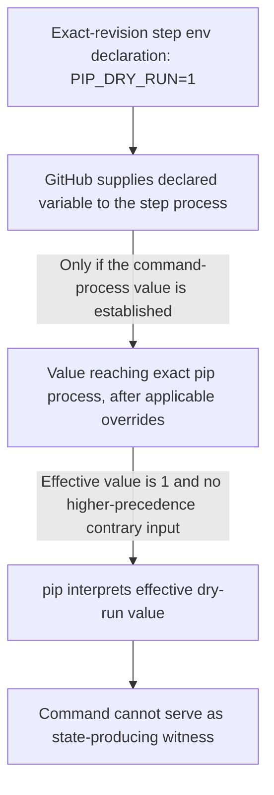
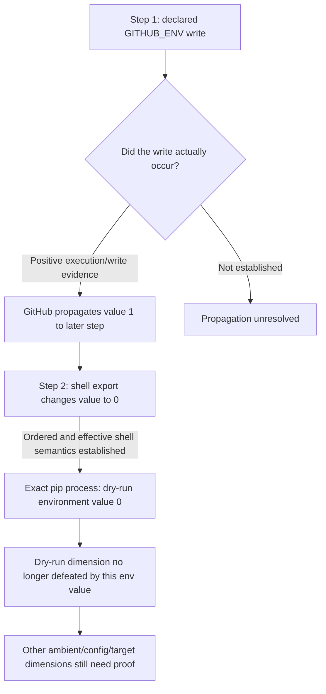

# B4 — Environment evidence/data-flow learning note — 2026-09-22

**Status:** Supplemental B4 investigation / teaching record; **not** a new live-state owner, new cycle, or selected build.
**Active cycle record:** [`2026-09-21_runtime-install-command-semantic-eligibility.md`](2026-09-21_runtime-install-command-semantic-eligibility.md). B4 remains open for Ali's understanding/design review.
**Branch/workstream:** Main product workstream; parallel product-simulation research remains on its separate branch. This note does not adopt its future findings in advance.

## Why model relationships?

Ali suggested using graphs to reason about the current environment/command/state-proof problem. This is a useful **analysis/teaching representation**, not an authorization to implement a generic graph engine.

The goal is to distinguish: (1) static declaration; (2) its applicability to an exact job/step; (3) a runtime write/propagation if positively evidenced; (4) the effective value at the **exact pip/uv process** after overrides; (5) the manager-specific meaning; (6) the limited proof disposition. A directed graph exposes the exact edge where evidence is missing.

## Graph A — simple step-local declaration

```yaml
steps:
  - name: Install
    env:
      PIP_DRY_RUN: "1"
    run: python -m pip install -r requirements.txt
```



The static workflow can establish **declaration and scope** for an exact step. It must not automatically assert that the exact pip process received the same value if a shell assignment, wrapper, invocation-specific CLI option, or other material effect remains unknown. If an effective dry-run defeater is positively established, the inference from this command to installation-state proof is defeated; this does **not** prove package absence.

## Graph B — a previous-step write and a later within-step override

```yaml
steps:
  - name: Configure pip
    run: echo 'PIP_DRY_RUN=1' >> "$GITHUB_ENV"
  - name: Install
    run: |
      export PIP_DRY_RUN=0
      python -m pip install -r requirements.txt
```



A static `run:` string that declares a write is **not** automatically evidence that the write occurred. GitHub's documented `GITHUB_ENV` rule concerns values actually written by a step, becoming available to subsequent steps in the same job. The later shell assignment can override the inherited value for the subsequently launched process in the admitted shell model. No detected write, without a complete mutation history, does not prove the value was absent.

**Important current implementation limit:** in this second example the pip invocation is the *second* command in a multi-line `run` step. Existing `ci/runtime_strengthening.py` admits only a sole ordinary top-level occurrence or the **first** ordinary top-level command in the selected sequential Bash/sh class for positive command-level strengthening. Therefore a completed-successful step must not be silently converted into a positive runtime-success claim for this later pip occurrence. The graph illustrates desired data flow, not a currently proven runtime correlation.

## Minimal evidence-relationship vocabulary (conceptual only)

- `declared_for`: a literal value is declared at workflow/job/step scope.
- `precedes`: a source step/command occurs before the consumer in the relevant ordering model; source order alone is not runtime execution proof.
- `written_to`: a positively established runtime write affected `GITHUB_ENV`.
- `propagates_to`: GitHub's bounded subsequent-step environment rule applies to an established write.
- `overrides`: a later applicable or higher-precedence value replaces a previous value **for the relevant semantic dimension**.
- `received_by`: value is established for the exact package-manager process, not just for its enclosing job/step.
- `interpreted_as`: the dependency/pip-or-uv owner interprets that value's package-manager meaning.
- `supports_or_defeats`: CI/state-proof composition applies the typed semantic fact to its exact proposition.

These are explanation labels, **not** selected schema fields, graph-edge enums, implementation classes, or a new independent evidence producer.

## Owner/proof split

```text
GitHub/provider + shell/source analysis
→ declared env facts, bounded scope/order/propagation/override evidence

dependency/pip-or-uv semantics
→ package-manager meaning of the effective value

CI/runtime composition
→ exact occurrence/execution proof and proposition-relative state-proof limit
```

Two independent gates must not be merged:

```text
Did this environment fact reach the exact process?
!=
Did this exact package-manager command execute successfully?
```

Even if `PIP_DRY_RUN=0` is positively established for the process, **only that one semantic dimension** is resolved; other effective pip settings, destination relation, and later mutations remain separate. No observed defeater is not proof of complete effective semantics. A direct target-owned state witness, if independently established later, is a distinct possible proof path.

## B4 learning outcome and stop line

Use small evidence/data-flow graphs to expose missing edges in concrete cases. Keep the first accepted B3 implementation slice command-local; **do not** select a graph engine, full `GITHUB_ENV` propagation resolver, arbitrary action interpretation, or broad ambient configuration reconstruction on the strength of these examples alone. Product-simulation research may later provide discriminating real-case pressure for a bounded resolver.

**Open discussion for Ali:** In Graph B, what can we conclude from seeing the source code of the `GITHUB_ENV` write, and what additional evidence would be required to establish that `PIP_DRY_RUN=1` actually reached the later step before its shell override? B4 remains in progress; this learning note does not close it or authorize coding.

## B4 follow-up — can a successful step establish the exact GITHUB_ENV write?

Ali correctly identified that a declared write with no execution evidence leaves propagation unresolved. The next two cases distinguish exact-occurrence evidence from enclosing-step success.

### Case C — sole ordinary top-level write command

```yaml
- name: Configure pip
  run: echo "PIP_DRY_RUN=1" >> "$GITHUB_ENV"
```

A bounded positive inference is possible **if** all of these independent premises are positively established: the exact workflow revision/job/step/command occurrence; a parser-admitted sole ordinary top-level shell command under an admitted execution profile; an exact completed-successful runtime step with no applicable masking; an admitted interpretation of the shell `echo` and append-redirection semantics, including the relevant runner-provided `GITHUB_ENV` destination; and successful processing of the written environment-file entry under the GitHub runner contract. Only then may the provider/environment owner produce an evidence-backed write/propagation fact. Source visibility plus step success without those premises is not by itself a write or effective-process-state witness.

Current UpgradePilot has parts of the *execution* premise via `ci/runtime_strengthening.py` and `ci/workflow_runtime_correlation.py`. It does **not** currently interpret `GITHUB_ENV` write semantics or propagate effective environment state. Treat the case as a feasibility/design example, not existing product capability.

GitHub documentation: https://docs.github.com/en/actions/reference/workflows-and-actions/workflow-commands — a value actually written to `GITHUB_ENV` is available to subsequent steps in the same job, not the writing step.

### Case D — step succeeds without write execution

```yaml
- name: Configure pip
  run: |
    if false; then
      echo "PIP_DRY_RUN=1" >> "$GITHUB_ENV"
    fi
    echo "Configuration finished"
```

The enclosing step may complete successfully while the conditional write never executes. Therefore step success cannot be promoted to exact write-command success. A graph edge from `write declared` to `write executed` remains unproved, so the downstream propagation fact remains unestablished. This is not proof that the value was absent: another source could still set it.

### Ownership and implementation consequence

Do not build a second permissive execution-correlator for `GITHUB_ENV` writes. If a later selected real case justifies a bounded write recognizer, compose its semantic evidence with the existing exact-occurrence/runtime-strengthening contract, then separately establish destination/write/runner-propagation and later effective-process overrides. Do not claim the later pip occurrence succeeded solely from success of a multi-command step; existing runtime-strengthening admits only its bounded occurrence-position families.

This follow-up is learning/design evidence only. B4 remains open; neither an environment resolver nor a graph engine is selected for implementation.


## B4 follow-up — what a proven GITHUB_ENV write actually proves

Ali correctly identified the execution problem: a successful enclosing step is insufficient when shell structure allows the write occurrence not to execute.

Assume instead that the exact write occurrence is positively established:

```yaml
- name: Configure pip
  run: echo "PIP_DRY_RUN=1" >> "$GITHUB_ENV"

- name: Install
  run: python -m pip install -r requirements.txt
```

GitHub's workflow-command contract states that a value actually written to `GITHUB_ENV` becomes available to subsequent steps in the same job, and not to the step that performs the write.

The strongest safe intermediate proposition is therefore:

```text
exact GITHUB_ENV write positively established
+ consumer is a subsequent step in the same job
→ PIP_DRY_RUN=1 is established as an inherited environment baseline for that later step
```

Do not jump directly to:

```text
→ exact pip process received PIP_DRY_RUN=1
```

because later effective-value transformations remain possible.

### Effective-value chain

For a package-manager-relevant environment variable, reason through the chain in order:

```text
1. previous positively established GITHUB_ENV writes
2. later writes to the same variable before the consumer step
3. workflow/job/step env declarations applicable to the consumer
4. shell-local assignments/exports/wrappers inside the consumer step
5. package-manager command-line options and their precedence
6. manager-specific interpretation of the resulting effective value
```

The exact list is not yet an implementation schema. It is the proof checklist exposed by the cases.

### Example — later shell override

```yaml
- run: echo "PIP_DRY_RUN=1" >> "$GITHUB_ENV"

- run: |
    export PIP_DRY_RUN=0
    python -m pip install -r requirements.txt
```

If the write is established, GitHub propagation can establish the inherited baseline `1` for the second step. If the ordered shell assignment is also positively established for the exact pip process, the effective environment value for the dry-run dimension becomes `0`. The earlier baseline remains historical evidence but no longer controls that dimension.

### Example — package-manager CLI dominates environment value

```text
inherited PIP_DRY_RUN=0
+
python -m pip install --dry-run -r requirements.txt
```

Pip documents command-line options as higher precedence than environment variables and configuration. Therefore an explicitly recognized `--dry-run` remains a decisive local defeater even when the inherited environment value is non-dry-run.

This demonstrates why B3 command-local semantics are still valuable even when ambient evidence is later added.

### Scope boundary

A `GITHUB_ENV` write only establishes propagation to subsequent steps in the same job under GitHub's documented environment-file contract. It does not by itself prove:

- availability to the writing step;
- propagation to a different job;
- propagation through a reusable-workflow boundary;
- the final value seen by a nested/wrapped package-manager process;
- the absence of later overrides;
- successful execution of the later pip/uv command;
- resulting package state.

### B4 design consequence

Preserve at least the conceptual distinction:

```text
propagated_to_step
!=
received_by_exact_process
!=
interpreted_effectively_by_package_manager
```

A future bounded environment resolver, if justified by real product pressure, should produce positive evidence for these relationships rather than a generic `ambient_safe` boolean.

This finding strengthens rather than replaces the current B4 fail-closed rule: unknown material transformations between the inherited step baseline and the exact package-manager process keep that semantic dimension unresolved.
